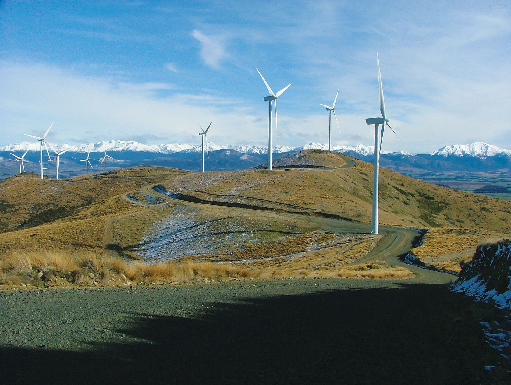
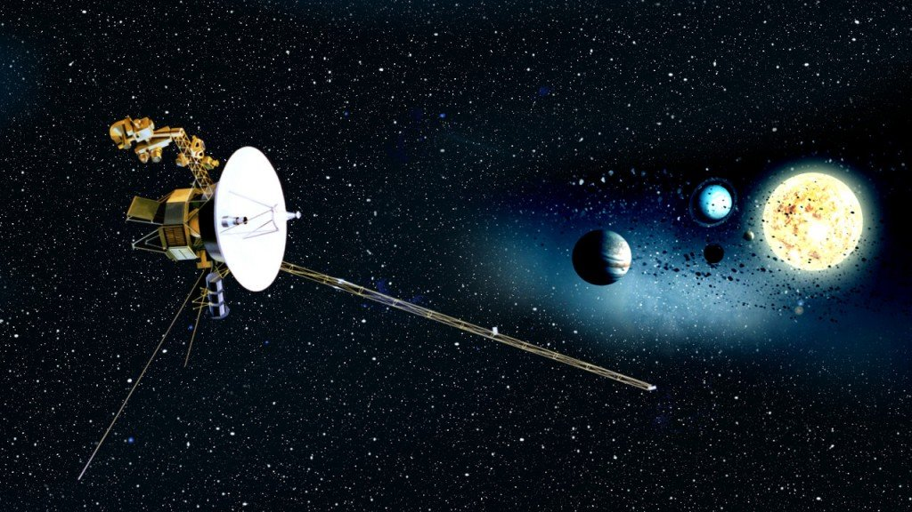
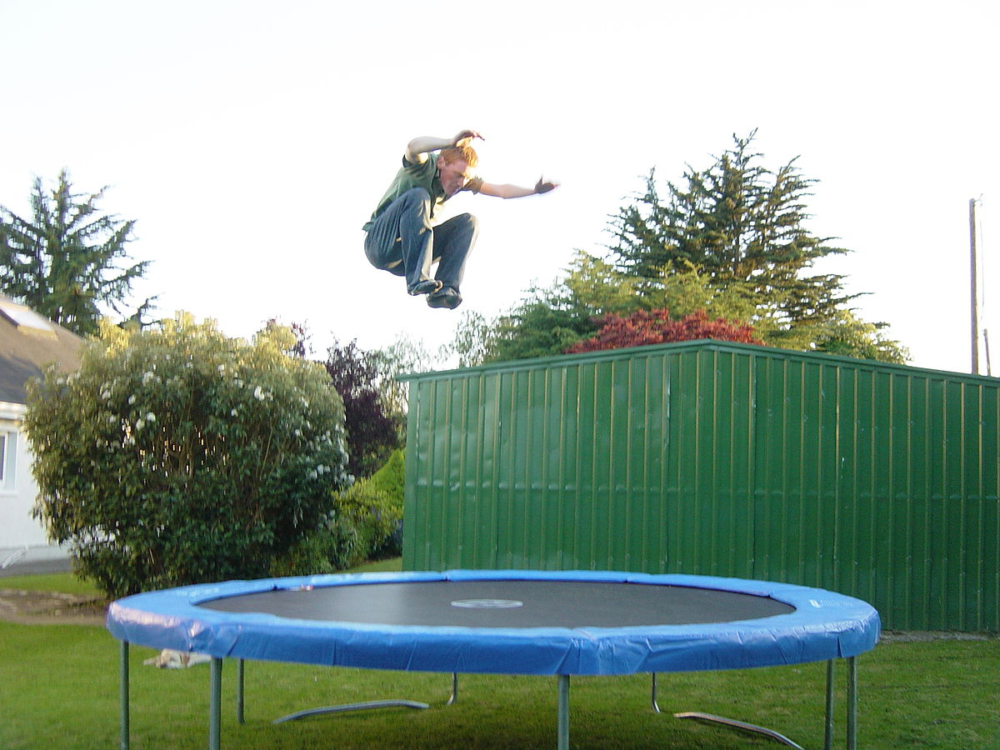
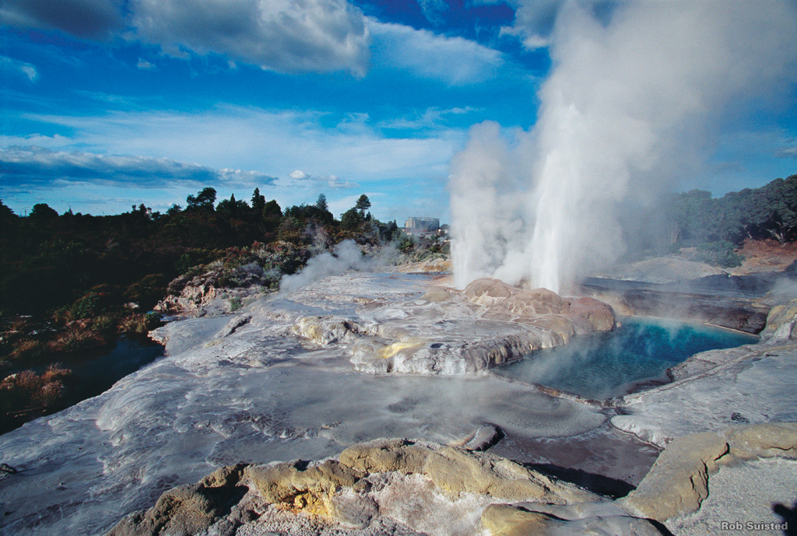
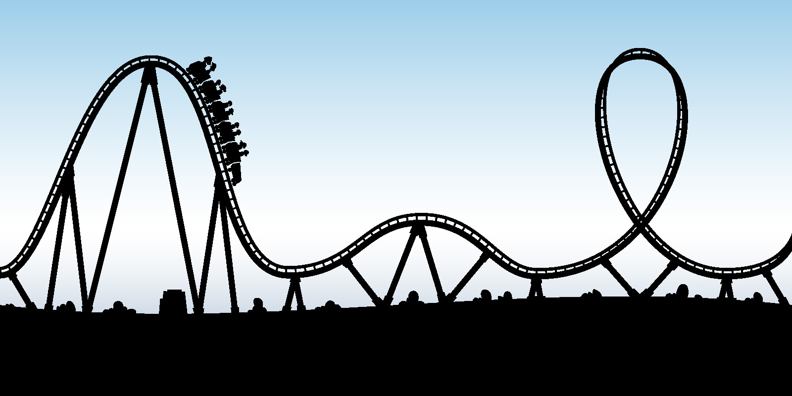
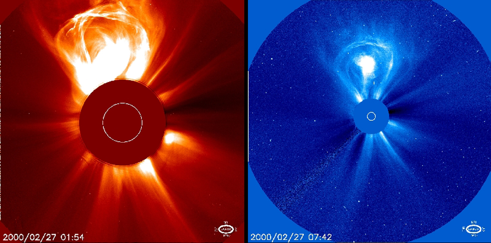

## Ngā Whāinga Ako

- Be able to describe the law of conservation of energy
- Be able to give examples of the law of conservation of energy
    
---

## Types of Energy

Recall from last class the different types of energy:

1. Active
2. Potential

---

| Potential     | Active   |
|:--------------|:---------|
| Chemical      | Kinetic  |
| Gravitational | Heat     |
| Elastic       | Radiant  |
| Nuclear       | Electric |
| Magnetic      | Sound    |

---

For each of the following pictures, write down what the picture is showing you and the type of energy associated with it.

---

---

__NB:__ Not a real photo

---

---

---

---

---

---

## Law of Conservation of Energy

If you can remember it, write it down in your book without looking, otherwise go to the next kiriata!

---

> Energy cannot be created or destroyed, only transferred or transformed from one type to another.

---

<iframe width="560" height="315" src="https://www.youtube.com/embed/xXXF2C-vrQE" frameborder="0" allow="accelerometer; autoplay; encrypted-media; gyroscope; picture-in-picture" allowfullscreen></iframe>

---

## The Pendulum

- The bowling ball has some gravitational potential energy before it is released,
- because energy is not created or destroyed, as long as he does not _push_ the ball it can never get higher than it started,
- this means that it will never hit him in the face

---

Another good tauria of the conservation of energy is in hydroelectric power generation. Watch this video to find out about one portion of New Zealand's hydroelectric scheme.

<iframe width="560" height="315" src="https://www.youtube.com/embed/ollXO0UDLFs" frameborder="0" allow="accelerometer; autoplay; encrypted-media; gyroscope; picture-in-picture" allowfullscreen></iframe>

---

## Hydroelectric Power Generation

- When water is high up a hill it has __gravitational potential energy__, that is, it has the potential to flow downhill
- By allowing the water to flow downhill (gravitational -> kinetic) through turbines we can spin some generators __transforming__ that kinetic energy into electrical energy
- By turning some of that kinetic energy into electrical energy, the water loses kinetic energy and thus, slows down
- When we use electricity to boil the jug we are converting electrical energy into heat energy!

---

## What Is Energy?

- Energy is the ability to do work, the ability or potential to effect some change on the environment or surroundings
- E.g. the ability to lift something up, to heat something up, to push back (trampoline), to fall etc.

---

<iframe width="560" height="315" src="https://www.youtube.com/embed/CW0_S5YpYVo" frameborder="0" allow="accelerometer; autoplay; encrypted-media; gyroscope; picture-in-picture" allowfullscreen></iframe>

---

## Perpetual Motion?

You may have heard of perpetual motion machines - machines that create infinite energy!

<iframe width="560" height="315" src="https://www.youtube.com/embed/4b8ZsFszE8I" frameborder="0" allow="accelerometer; autoplay; encrypted-media; gyroscope; picture-in-picture" allowfullscreen></iframe>

---

These machines appear to run forever, producing energy forever without consuming any energy.

Unfortunately, they are always a scam! People have been trying to make them since the dark ages but can all be shown to not work due to the __law of conservation of energy__!

