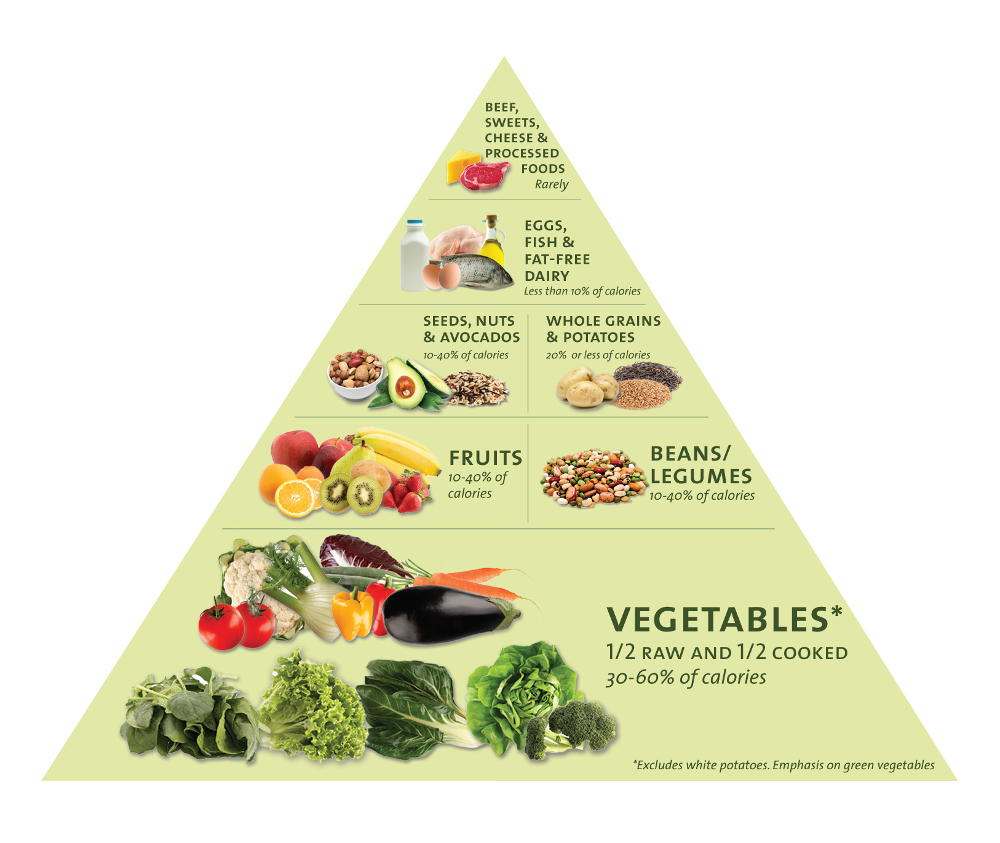

## Mahi Tuatahi

1. Name two foods that you have eaten today that contain carbohydrates.
2. What does your body use proteins for?
3. Name two foods that contain heaps of fats.

---

## Learning Outcomes

- Be able to create a healthy diet

---

## Life Functions

All animals and plants need food. Food gives us the energy to carry out our life processes. To help us remember what the life processes are we use:

__MRS C GREN__

---

- __M__ ovement
- __R__ espiration
- __S__ ensitivity
- __C__ irculation
- __G__ rowth
- __R__ eproduction
- __E__ xcretion
- __N__ utrition

---

<iframe width="560" height="315" src="https://www.youtube.com/embed/cQPVXrV0GNA" frameborder="0" allow="accelerometer; autoplay; encrypted-media; gyroscope; picture-in-picture" allowfullscreen></iframe>

---

---

## Task

Use a full page of your book to make a poster explaining a special diet you have created.

- Include specific foods that are allowed/disallowed
- Perhaps a food pyramid
- The type of nutrients being focussed on in the diet
- Example meal plans
