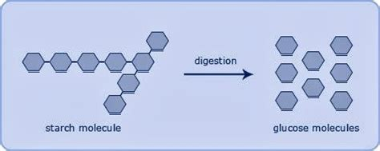
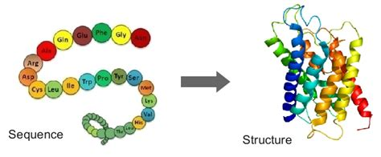
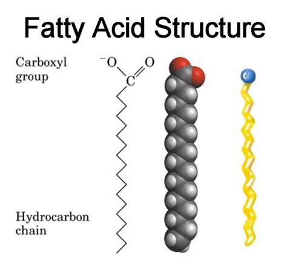
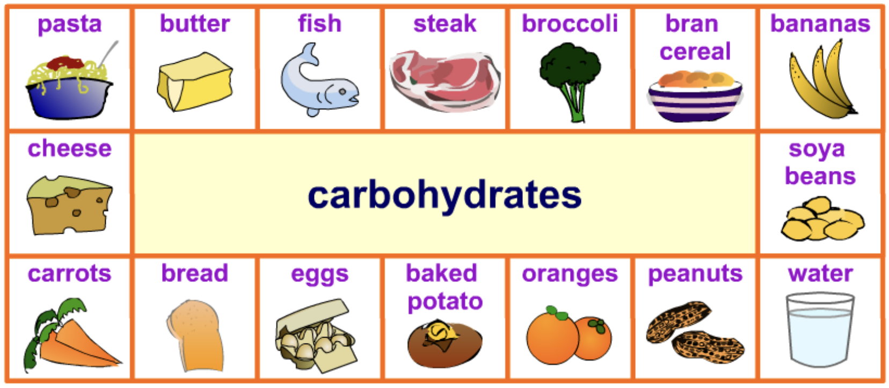
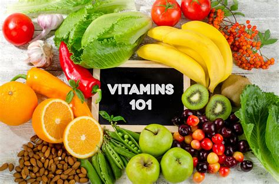
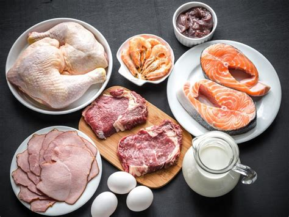
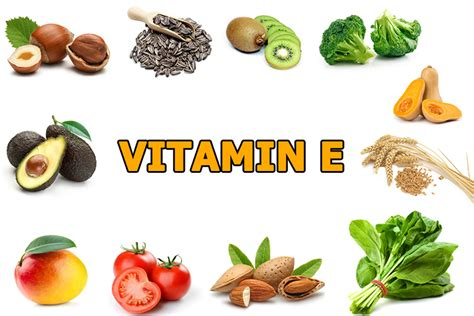
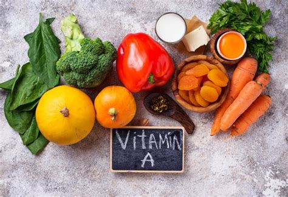
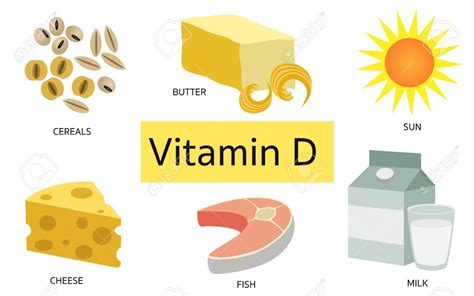
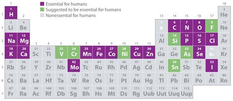

## Learning Outcomes

- Be able to list the major nutrients found in food
- Be able to say what each nutrient is used for

---

Food is a daily necessity.

Without food organisms will eventually die!

__The process of acquiring, digesting and using food is called nutrition__

---

## Nutrients

There are four main nurtients the body needs:

1. Carbohydrates,
2. proteins,
3. lipids,
4. vitamins & minerals

---

### Carbohydrates

- __Carbohydrates are sugars and starches which are mostly found in plant tissues__
- They provide an immediate source of energy.

---

- __Sugars__ are small molecules found in fruits
- __Starches__ are long molecules found in cereals, potatoes and rice
- Starches are long repeating chains of sugars

---

- The long chains of carbohydrates are broken down into the smaller sugar mocules by the body
- The small (sugar) molecules from carbohydrates are used by the body to release __energy__ and make the body work

---

### Proteins

- __Proteins are long chain molecules made of amino acid units__
- Proteins are used in the construction of new cells for growth and repair
- They also control reactions in our body (enzymes)

---

### Lipids

- Lipids include fats and oils and are made of _fatty acids_
- Our bodies store energy as lipids
- Lipids help keep the body warm and are used in making cell membranes

---

Which foods are rich in each nutrient?

---

### Vitamins

- Vitamins are substances that your body needs to grow and develop normally
- Some vitamins can be made in our body (vitamin D and K) but most are acquired through our diet

---

#### Vitamin C (ascorbic acid)

- Found in citrus fruits, green peppers, strawberries, tomatoes, broccoli, sweet and white potatoes
- Promotes a healthy immune system, helps wounds heal, maintains connective tissue and aids in the absorption of iron

---

#### Vitamin B12

- Found in eggs, milk, cheese, shellfish, meat and poultry
- It is important for metabolism, the formation of red blood cells and the maintenance of the central nervous system which includes brain and spinal cord

---

#### Vitamin E

- Found in corn, nuts, olives, green leafy vegetables, vegetable oils and wheat germ
- Protects cell membranes and tissues from damage, aids in the formation of red blood cells

---

#### Vitamin A

- Found in animal sources such as eggs, meat and diary products
- Beta-carotene, a precursor of vitamin A comes from green leafy vegetables and intensely colored fruits and vegetables
- Use in maintenance of tissue in the eyes, growth and healthy of skin and mucous membranes, development of teeth and skeletal tissue

---

#### Vitamin K

- Found in cabbage, cauliflower spinach and other green leafy vegetables as well as cereals
- Helps blood clotting

<iframe width="560" height="315" src="https://www.youtube.com/embed/yAJrsd0jW6U" frameborder="0" allow="accelerometer; autoplay; encrypted-media; gyroscope; picture-in-picture" allowfullscreen></iframe>

---

#### Vitamin D

- The body makes vitamin D when exposed to the sun
- Found in cheese, butter, margarine, fortified milk, fish and fortified cereals
- Promotes absorption of calcium, essential to development of healthy bones and teeth

---

### Minerals

Dietary minerals are the chemical elements required by living organisms other than C, H, O and N.

---

---

### Fibre

- Fibre refers to the indigestible portion of plant foods. 
- Pushes food through the digestive system, absorbs water and eases defecation.

---

__Task:__ Match these up!

| Nutrient      | Use                                      |
|---------------|------------------------------------------|
| Minerals      | Small amounts for cells to work properly |
| Proteins      | Energy and to make cell membranes        |
| Carbohydrates | In small amounts to make chemicals       |
| Water         | Energy                                   |
| Vitamins      | Growth and repair                        |
| Fibre         | Chemical reactions and for transport     |
| Fats          | To keep the bowels working properly      |

---

__Task:__ Who has the most nutritious snack?

Find a wrapped snack in your bag with a food label - have a look at the ingredients, move around the classroom and try find the person with the most nutritious snack!
