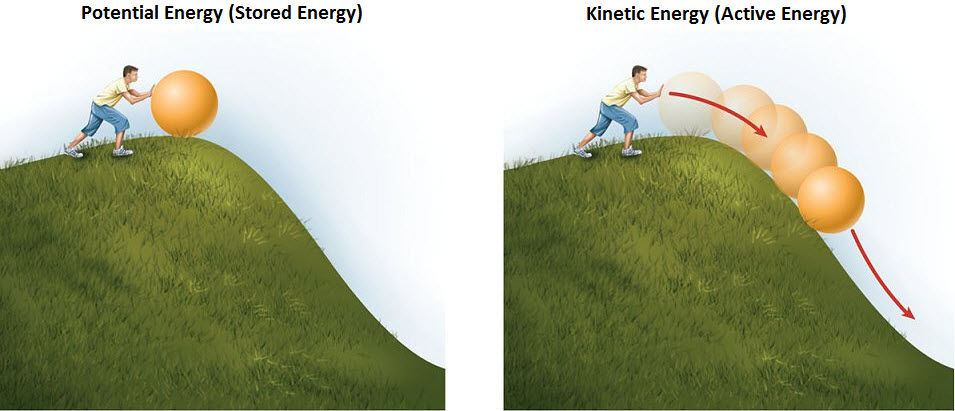
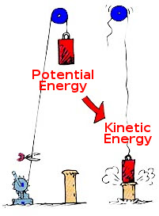
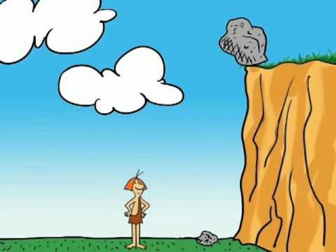
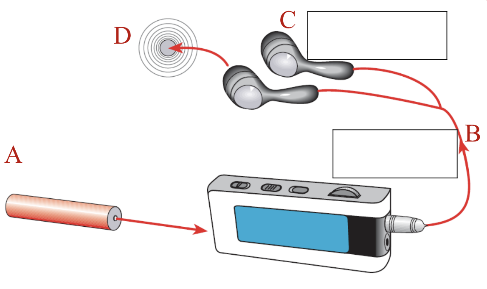

## Ngā Whāinga Ako

- Be able to identify different forms of energy
- Be able to describe different forms of energy
- Be able to give examples of different forms of energy

---

## Types of Energy

For each of these types of energy, think of and write down one example:

1. Heat
2. Magnetic
3. Radiant

---

4. Sound
5. Nuclear
6. Gravitational

---

7. Kinetic
8. Chemical
9. Elastic
10. Electrical

--- 

## Active vs. Potential Energy

We split these 10 types of energy into two broad categories.

{width=50%}

---

### Active Energy

Energy that is actually doing something that can be observed and measured.

---

### Potential Energy

Energy that is stored some way

---

### Active Energy Examples

Kinetic, sound, radiant, heat and electrical

{width=50%}

---

### Potential Energy Examples

Gravitational, nuclear, chemical, elastic and magnetic

{width=50%}

---

Match these types of energy and their definitions up in your book:

|               |            |                                |                                 |
|:--------------|:-----------|:-------------------------------|:--------------------------------|
| Thermal       | Light      | Light Bulbs, a Bunsen flame    | talking, TV, radio              |
| Gravitational | Kinetic    | hot water, a hot radiator      | Nuclear bombs, power stations   |
| Nuclear       | Sound      | Anything that is moving        | Food, batteries, burning things |
| Elastic       | Electrical | book on a shelf, bungee jumper | a wind-up-toy, rubber band      |
| Computer      | Chemical   |                                |                                 |

---

## Conservation of Energy

The __Law of Energy Conservation__ is true throughout the universe, from the biggest to the smallest, and we have not yet found an exception.

\begin{align*}
    & \text{Energy in} = \text{Energy out}
\end{align*}

---

This means that we can state the law like this:

> Energy cannot be created or destroyed, only transformed from one type to another.

---

### Example

Think of a skydiver falling to Earth.

1. What kind of energy do they have before they jump out of the plane? Active or potential?
2. What about after they start falling?

---

They have __gravitational potential energy__, and all of it gets transformed to __kinetic energy__ because they start to move!

---

### Example

- Chemical energy in food is transformed to heat energy and kinetic energy by our bodies
- Gravitational energy in a ball is converted to kinetic energy when it falls to the ground

---

What energy transformations are happening at the boxes?

---

1. Chemical potential energy in the battery is transformed into electrical energy moving along the earphones wire
2. Electrical energy in the wire causes the earphone unit to move transforming it into sound energy
