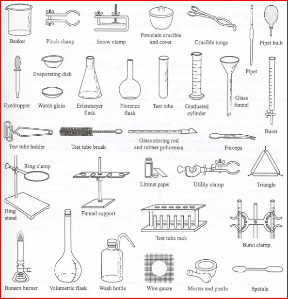
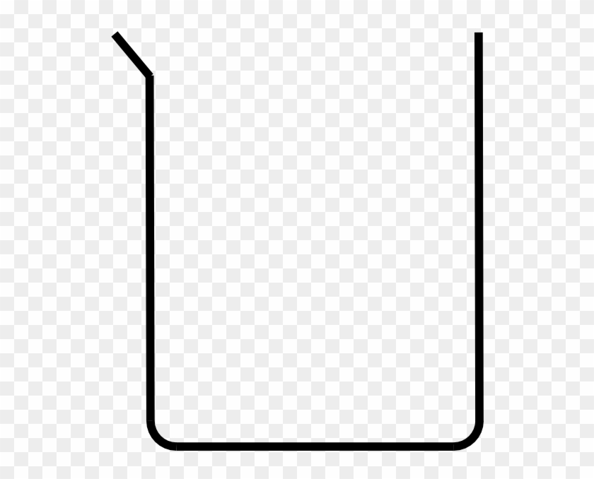
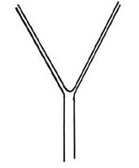
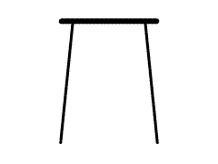
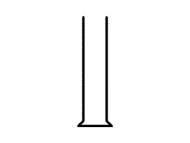
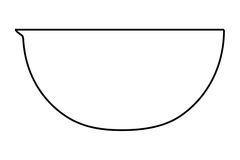
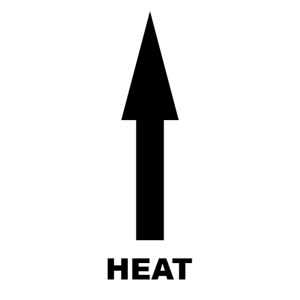
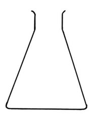

## Learning Outcomes

- Describe, locate and draw the main pieces of equipment used in Science lessons.

---

## Mahi Tuatahi

Take a look at the apparatus on the front desk and in pairs try and figure out the name and use for each of them.

We will go over the answers soon!

---

---

## Drawing Diagrams

In Science we prefer to use _diagrams_ instead of _drawings_ as they are much simpler and easier to understand.

The images on the previous slide are drawings. We will simplify these into 1-dimensional drawings!

---

### Beaker

---

### Filter Funnel & Paper

---

### Gauze Mat

---

### Test Tube

---

### Tripod

---

### Measuring Cylinder

---

### Evaporating Dish

---

### Heat

---

### Conical Flask

---

## Quizlet

https://quizlet.com/nz/479062590/apparatus-diagrams-flash-cards
