## About the Unit

In plants as producers we will be learning about lots of really cool things!

- How plants reproduce
- How plants create energy
- What plant and animal cells look like (and their differences)!

---

### __Task__: Draw a nice "Plants as Producers" title in your book while this video plays.

<iframe width="948" height="533" src="https://www.youtube.com/embed/8IlzKri08kk" frameborder="0" allow="accelerometer; autoplay; encrypted-media; gyroscope; picture-in-picture" allowfullscreen></iframe>

---

## __Task__: Cell Circuit

- Plants and animals are both made of cells and they are quite similar, but there are some differences!
- Glue in the diagrams of plant and animal cells and get ready for the activity.
- __Move around the room using each station to define each _organelle_ and to label the diagrams__

---

### Cell Membrane (Plasma Membrane)

Separates the interior of the cell from the outside. It is semipermeable which means that it can allow the transport of water, nutrients and waste through it.

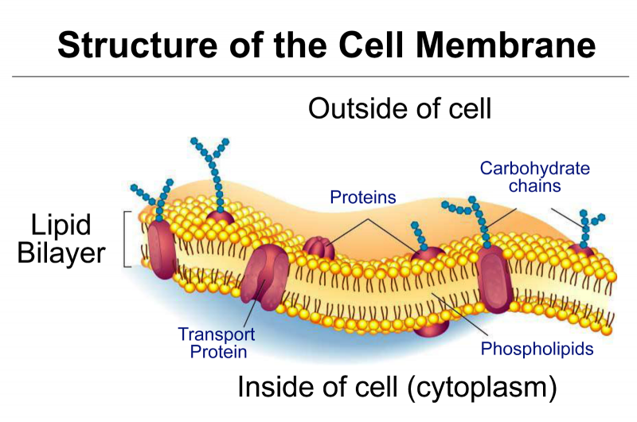

---

### Nucleus

A membrane-bound organelle that contains the genetic material (DNA).

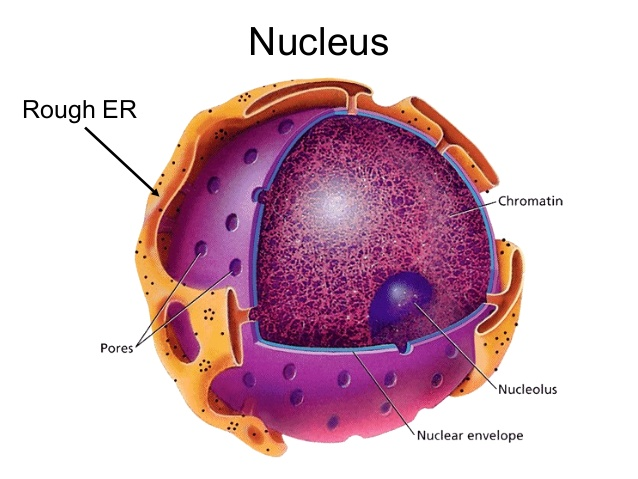

---

### Endoplasmic Reticulum

Comes in two types: rough and smooth. Proteins are synthesised (made) here and used throughout the cell.

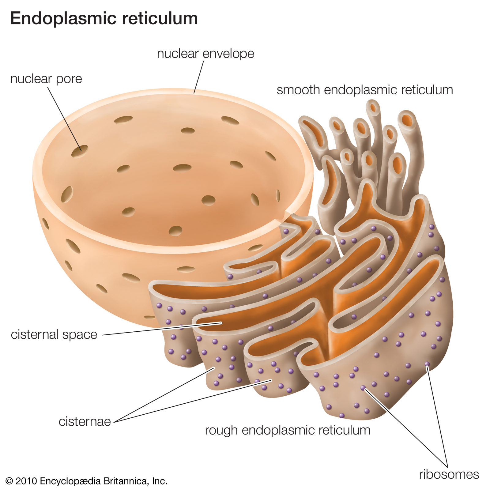

---

### Ribosomes

Small living machines that create biological proteins on the endoplasmic reticulum.

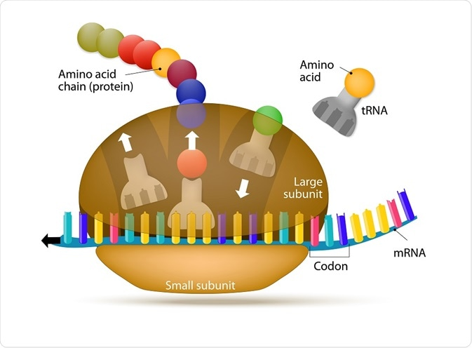

---

### Golgi Bodies

A group of vesicles and membranes within the cytoplasm involved in intracellular transport.

---

### Lysosomes

A spherical container that holds many enzymes which can break down large molecules.

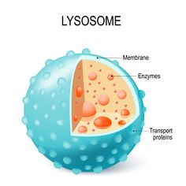

---

### Vacuoles

A storage container which may hold water, waste products, or materials that could be harmful to the cell.

---

### Mitochondria

Organelles in which respiration occurs and energy is produced in the form of adenosine triphosphate (ATP).

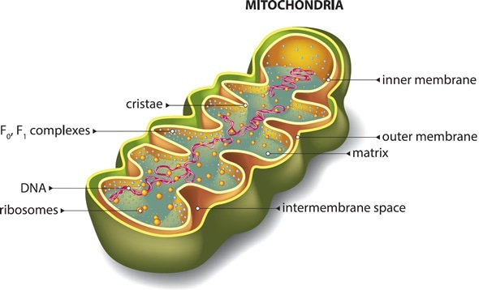

---

### Cell Wall (Plants Only)

A structural layer outside the cell membrane which is often tough and rigid to provide shape to the cell.

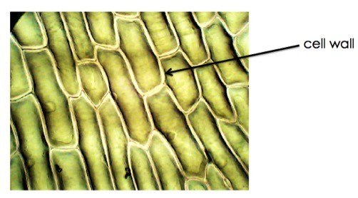

---

### Centrioles (Animals Only)

Clusters of tiny microtubles which help the cell when it is dividing during growth.

---

### Chloroplasts (Plants Only)

The food producers of the cell - they are where photosynthesis occurs to gain energy from sunlight.

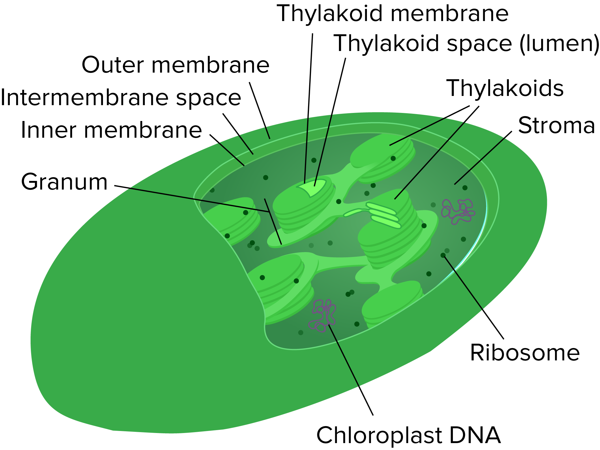

---

## Starter

1. Use the diagrams around the room to __collect any unfinished notes__ and __label your plant and animal cell diagrams__ (use pencil!)

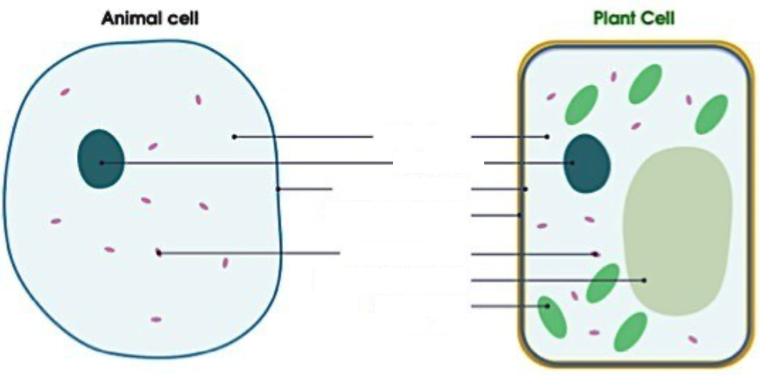

---

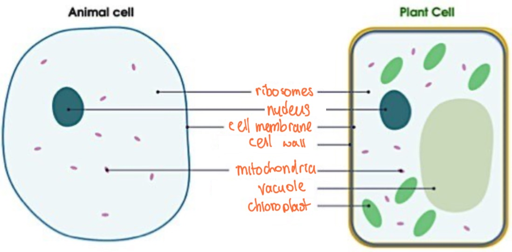

---

## Quizziz Time!

Go to [joinmyquiz.com](https://quizizz.com/admin/quiz/5a5f4eb1326b42000ff15aa4/cells)

---

## Microscopes

There are a few different types of microscopes, but the one that we are going to be using is called a __light microscope__.

That means that it uses visible light!

---

## Glue in your diagram & watch this video

<iframe width="1680" height="756" src="https://www.youtube.com/embed/tVcEEw6qbBQ" frameborder="0" allow="accelerometer; autoplay; encrypted-media; gyroscope; picture-in-picture" allowfullscreen></iframe>

---

__Task__: Use the Education Perfect task to help you identify the different parts of the microscope.

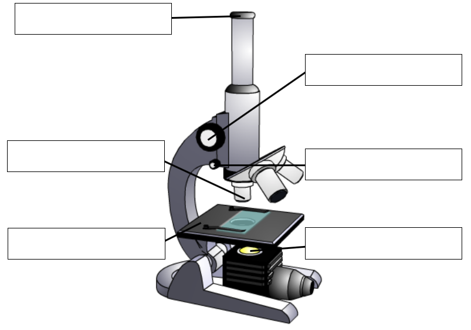

---

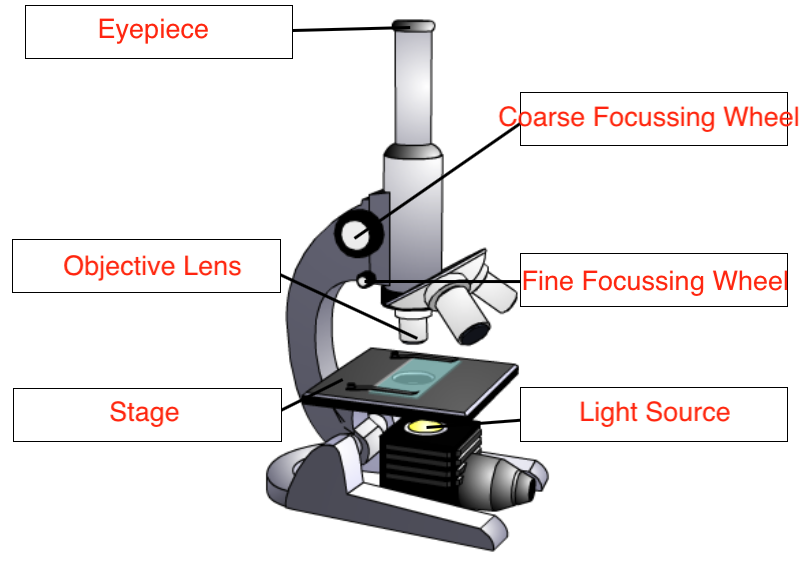

---

### Preparing a Slide

Open the microscope experiment document on Google Classroom and scroll down to __Steps to make a good slide:__.

__Task__: Copy these four steps into your exercise book and then read the section __Using a microscope__.

---

### Formation of Cell Theory

Read the document on Google Classroom about the formation of cell theory and answer the questions at the bottom in your exercise book.

