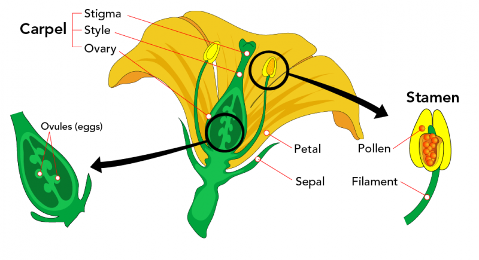
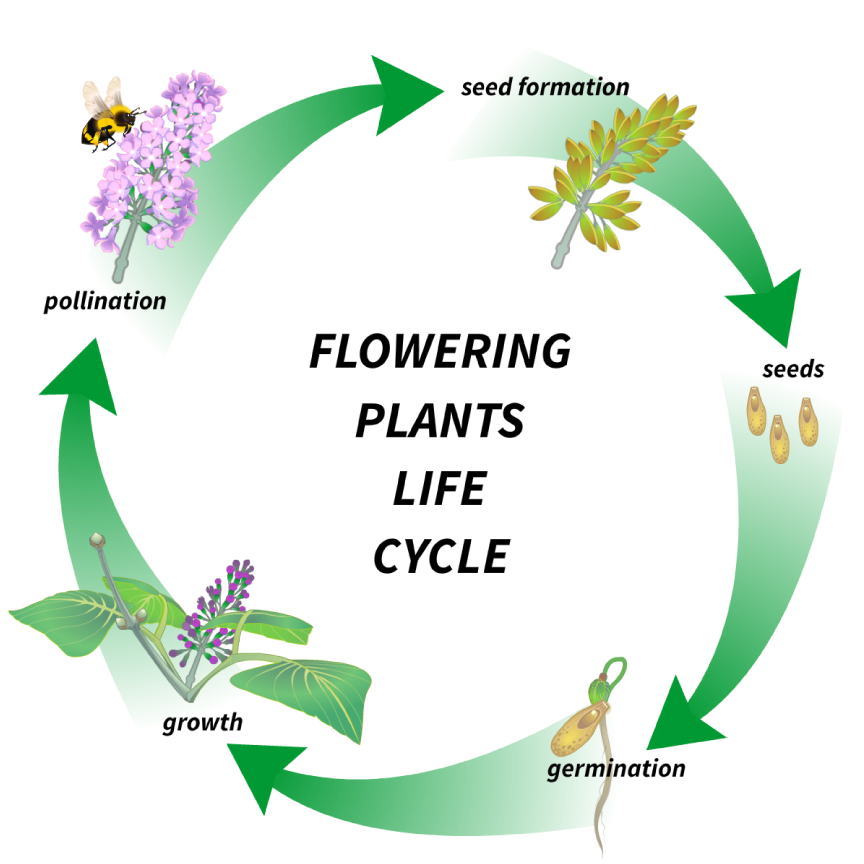

## Learning Outcomes

- Describe plant growth, reproduction, dispersal and why bees are so important.

---

## Mahi Tuatahi

1. What are some organelles that only __plant__ cells have?
2. What are some organelles that both __plant__ and __animal__ cells have?

---

Plants, like animals, need to reproduce to survive. Without reproduction there would be no more plants.

But how do they do it?!

---

### Reproductive Cycle

1. Plants produce pollen
2. This pollen can be carried away from the plant by animals, wind or rain
3. Once on a different plant, this pollen can fertilise the flower by landing on its stigma
4. The pollen may _germinate_ (grow down into) the ovule of the plant
5. This can result in the growth of seeds or fruit

---

The seeds from the fruit can then grow through mitosis once in the ground to form new plants!

---

### Self and Cross-Pollinating

- __Self-Pollinating__: The plant can fertilise itself
- __Cross-Pollinating__: The plant needs to get pollen from another flower of the same species

---

### Task

1. Glue in your flower diagram
2. Glue in your reproductive cycle diagram

---

- __Anther__: The top of the stamen where the pollen is stored "male" reproductive parts
- __Filament__: Supports the anther
- __Stamen__: The appendage containing anther and filament

---

- __Petal__: The aesthetic part of a flower; attracts pollinators
- __Sepal__: Protects the flower when not in bloom; supports the petals when in bloom

---

- __Stigma__: Receives (captures) pollen to be used in reproduction
- __Style__: A hollow tube through which pollen can grow to reach the ovary
- __Ovary__: Contains the ovules (eggs; female reproductive parts)

---

---

### Task

1. Watch the video linked on Google Classroom.
2. Pause the video to answer the questions on the associated document __in your book__.
	- The questions follow the order of the video.
