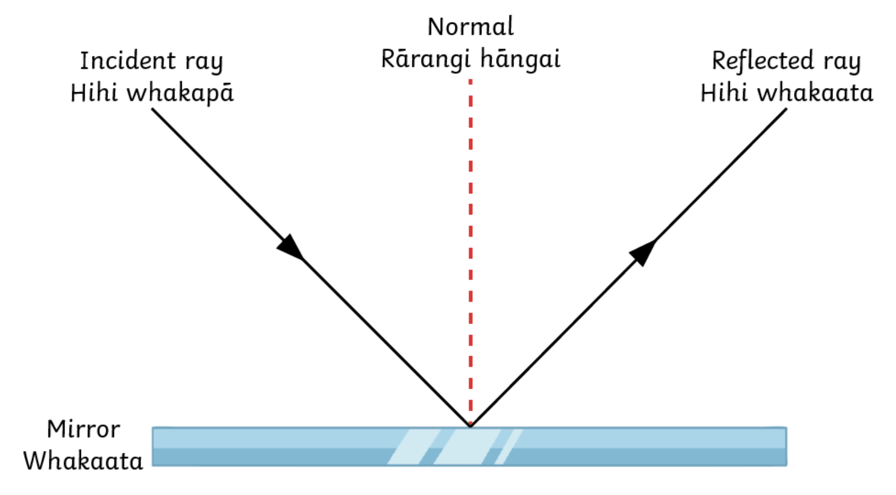

## Akoranga 7 Mahi Tuatahi

1. [Quizlet](https://quizlet.com/nz/526266053/electromagnetic-spectrum-flash-cards/)!

---

## Ngā Whāinga Ako

1. I can describe regular reflection and give some examples of its use.

Write the date and ngā whāinga ako in your book

---

<iframe width="762" height="571" src="https://www.youtube.com/embed/eiK3tcjJXiA" frameborder="0" allow="accelerometer; autoplay; clipboard-write; encrypted-media; gyroscope; picture-in-picture" allowfullscreen></iframe>

---

## Pātai Tahi: Why do some objects reflect light?

](https://cdn.shopify.com/s/files/1/0712/9151/products/Bubble_Mirror_Swag_Design_896x1184.jpg?v=1587687841)

---

### Whakatika Tahi

Because they do not absorb much light, instead they reflect almost all of it away!

---

## Reflection/_Whakaata_ {.c2}

- Everything we see reflects light!
- Coloured objects reflect mostly that colour light
- Mirrors reflect all colours of light

](https://sites.google.com/site/mrwilkinsonphysics/_/rsrc/1481106647778/classes/s1-s2-science/light---reflection/Types%20of%20Reflection.png)

---

### Pātai Rua: Why do some reflections form images?

---

### Whakatika Rua

- Smooth surfaces reflect light __regularly__
- This means the light rays are reflected in the same "order", forming an image

](https://sites.google.com/site/mrwilkinsonphysics/_/rsrc/1481106647778/classes/s1-s2-science/light---reflection/Types%20of%20Reflection.png)

---

---

---

## Tūhura: Reflection/Whakaata

- In your groups of 3:
    - Use a ray box to shine an incident ray at the mirror
    - Sketch what is ocurring on the paper
    - Measure the angles of reflection that matches each angle of incidence

---

## The Law of Reflection

> The angle of reflection is equal to the angle of incidence 

> He ōrite te koki whakaata ki te koki whakapā o te aho

---

### Uses of Reflection {.c2}

- A fibre optic cable works by reflection. 
- Light rays travel down the cable and reflect off the inside walls of the cable even when it is bent. 

](https://itel.com/wp-content/uploads/2015/09/Total-Internal-Refraction.jpg)

---

- Endoscopes use optical fibres. 
- A doctor can insert a bundle of optical fibres into the body to see the inside of the body clearly – and help them diagnose diseases or see what they are doing during keyhole surgery.

](https://en.wikipedia.org/wiki/File:Mani_Zadeh_MD_Endoscopic_Sinus_Surgery.jpg)

---

](../assets/undersea-cables.png)

---

## Whakakite: Hologram Pig

<iframe width="560" height="315" src="https://www.youtube.com/embed/P4-bXBWQyXg" frameborder="0" allow="accelerometer; autoplay; clipboard-write; encrypted-media; gyroscope; picture-in-picture" allowfullscreen></iframe>

---

### How does it work?

](https://skullsinthestars.files.wordpress.com/2016/05/mirascopegeometric2.jpg)
