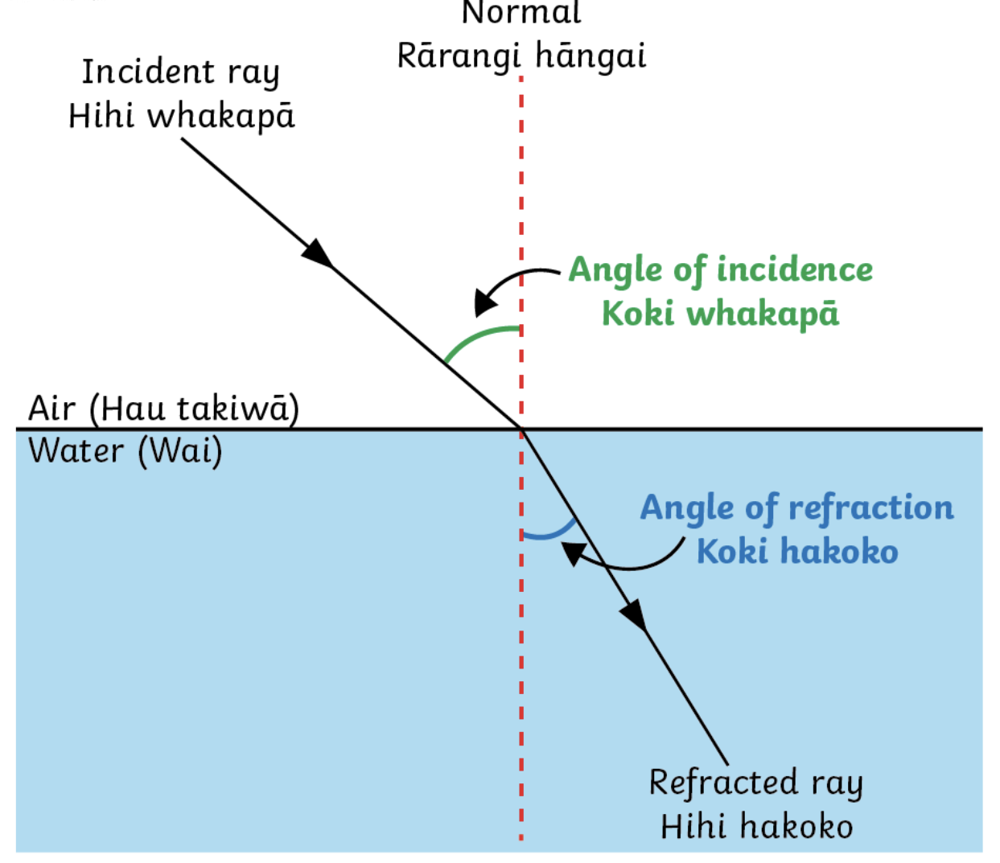

## Ngā Whāinga Ako

1. I can explain what refraction is
2. I have made observations on the behaviour of light rays when they move from air to glass/water
3. I can explain why a coin will disappear in a cup when we pour water into it

Write the date and ngā whāinga ako in your book

---

## Tūhura

1. Put a splint in an empty beaker
    - Look at it from different angles. What do you observe?
2. Half fill the beaker with water
    - Look at it from different angles. What do you observe?

Write your observations in your book.

---

## Refraction/_Hakoko o te Aho_

> When light travels into a more dense medium it _slows down_ and bends towards the normal. When it moves into a less dense medium, it speeds up and bends away from the normal.

---

---

](https://upload.wikimedia.org/wikipedia/commons/8/85/Refraction_photo.png)

---

](http://munnscience.weebly.com/uploads/3/8/0/6/38066171/published/168582653_1.jpg)

---

<iframe width="892" height="678" src="https://www.youtube.com/embed/ZHXS3f-JtYk" frameborder="0" allow="accelerometer; autoplay; clipboard-write; encrypted-media; gyroscope; picture-in-picture" allowfullscreen></iframe>

---

### Refraction in Practice

](http://munnscience.weebly.com/uploads/3/8/0/6/38066171/158235059_1.jpg)

---

](https://materialford.files.wordpress.com/2014/05/refraction-and-reflection.jpg)

---

## Tūhura

1. Put a coin in an empty cup
2. Move the cup forwards so that the coin _just_ disappears
3. Keep your eye at the same height and have your partner fill up the cup with water
4. What do you observe?!
