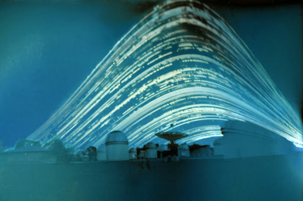

__Starter__: Using the whiteboards, brainstorm what you know about how day/night and the seasons work!

---

## Learning Outcomes

1. Describe how day and night are caused by rotation
2. Identify prominent features on the Earth and Moon

---

## Earth {.c2}

- Blue is caused by the oceans
- Green/brown by the continents
- White mainly by the clouds (except at the poles)

---

## Day and Night {.c2}

- Glue in your diagram!
- Earth rotates on its axis
- The axis goes from North to South poles
- This causes the Sun to _appear_ to move across the sky
- It appears to move from east to west

---

## Day and Night {.c2}

- It takes 24 hours for Earth to rotate once!
- The rotation causes different parts of Earth to face the sun at different times of the day

---

## Where is the Sun in this GIF?

---

## Discuss

- Why is the day/night cycle not caused by Earth rotating around the Sun?
- What is measured by Earth rotating around the Sun?

---

## Earth's Orbit {.c2}

- Earth orbits the sun every 365.256 days
- Thus, every four years (approximately) we need to add a day - a leap day!

---

## Ellipses {.c2}

- Earth's orbit is an ellipse - an oval instead of a perfect circle
- __Aphelion__: Furthest point the Sun (152,100,000km)
- __Perihelion__: Closest point to the sun (147,300,000km)

---

---

Open this link on your laptop: [https://theskylive.com/3dsolarsystem](https://theskylive.com/3dsolarsystem)

---

<iframe width="1280" height="720" src="https://www.youtube.com/embed/IJhgZBn-LHg" frameborder="0" allow="accelerometer; autoplay; encrypted-media; gyroscope; picture-in-picture" allowfullscreen></iframe>

---

## Anallema

---

## Solargraph

> [http://www.star.ucl.ac.uk/~apod/apod/ap120121.html](http://www.star.ucl.ac.uk/~apod/apod/ap120121.html)