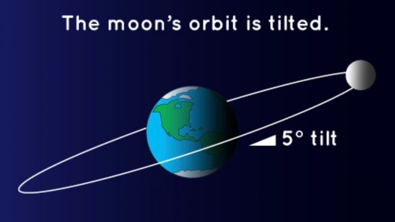
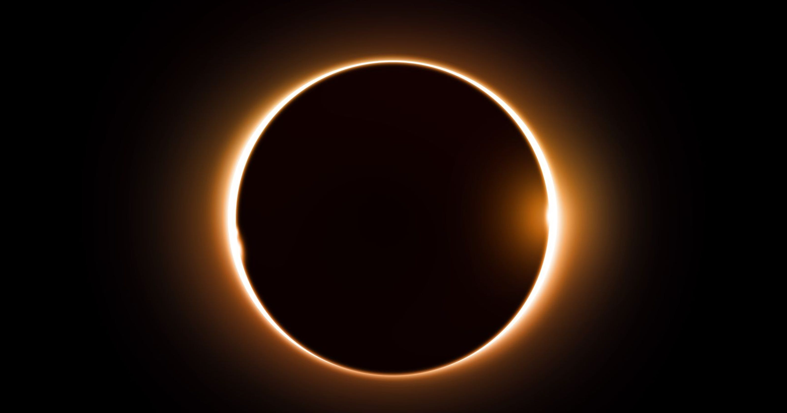

## Mahi Tuatahi

Brainstorm on the board what you know about eclipses! Diagrams, dates, what objects are involved in the solar system? Where do they occur? etc.

---

## Learning Outcomes

- Explain how the different types of eclipses form

---

<iframe width="1138" height="640" src="https://www.youtube.com/embed/VW2xRR75lKE" frameborder="0" allow="accelerometer; autoplay; encrypted-media; gyroscope; picture-in-picture" allowfullscreen></iframe>

---

## 1. Lunar Eclipses {.c2}

- Take place only at full moon
- When the Earth blocks out most (or all) of the direct sunlight to the moon
- Full moons occur once every 29 days
- __Discuss with the person next to you__: why don't we get an eclipse every 29 days?

---

## Lunar Eclipses {.c2}

- The moons orbit is on an incline of $5^{\circ}$ to Earth's orbit around the sun
- This means the moon is often below or above Earth at the full moon
- Eclipses only occur when the moon is directly behind Earth at the full moon

---

## Lunar Eclipses {.c2}

- Total lunar eclipses occur when the whole moon passes through the __umbra__
- Partial lunar eclipses occur when part of the moon passes through the __umbra__
- Penumbral lunar eclipses occur when the moon passes through the __penumbra__

---

## Task

1. Draw a diagram showing how penumbral and total lunar eclipses form
2. Write 4-5 sentences explaining how total lunar eclipses form using the notes you just made

---

<iframe width="1138" height="640" src="https://www.youtube.com/embed/G10m2ZZRH4U" frameborder="0" allow="accelerometer; autoplay; encrypted-media; gyroscope; picture-in-picture" allowfullscreen></iframe>

---

## 2. Solar Eclipses {.c2}

- Occur when the moon's shadow falls somewhere on Earth
- They are uncommon because of the moon's orbital tilt
- Only occur at new moon; when the sun is directly behind the moon

---

## Solar Eclipses {.c2}

- Because of the geometry, only a small area can see a solar eclipse, while the whole night-time half of the planet can see a lunar eclipse

---

## Solar Eclipses {.c2}

- The moons orbit is an ellipse, and it can appear 12% bigger in our sky
- This means sometimes it will cover the whole sun causing a total solar eclipse
- And other times it will not cover the whole sun, causing an annual eclipse

---

---

## When is the next solar eclipse?

The next total solar eclipse in New Zealand will occur in Central Otago on 22/07/2028 at 4.15pm. Put it your calendar on your phones!

---

<iframe width="1138" height="640" src="https://www.youtube.com/embed/oNH3akWXaV8" frameborder="0" allow="accelerometer; autoplay; encrypted-media; gyroscope; picture-in-picture" allowfullscreen></iframe>

---

## Task

Compare and contrast solar and lunar eclipses is 5-6 sentences using your notes!