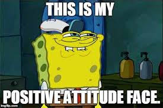
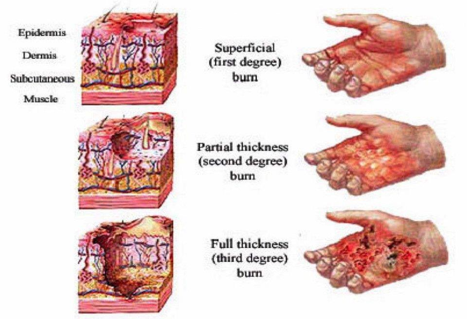

# Learning Outcomes

- Refresh lab safety
- Burns first-aid
- Refresh chemistry knowledge

---

# Mahi Tuatahi

Look up the temperature at which these fuels burn and place them in order from coolest to hottest.

- Wood, petrol, candle, LPG, coal

---

## Answer

1. Wood ($275^{\circ}$)
2. Petrol ($280^{\circ}$)
3. Candle ($390^{\circ}$)
4. LPG ($500^{\circ}$)
5. Coal ($750^{\circ}$)

---

# Lab Safety

- Must wear safety glasses
- Must tie up long hair
- Must attend to loose clothing

{ width=50% }

---

## Burns

{ width=65% }

Run under cold water for at least 20 minutes.

---

# Chemical Reactions

- When one or more substances combine to form new substances
- Atoms and molecules split, swap or decompose
- $reactact + reactant \rightarrow product + product$
- $methane + oxygen \rightarrow water + carbon dioxide$
- __Burning__ (combustion) is a type of reaction
