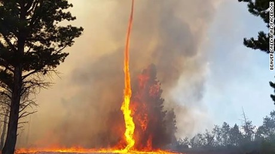
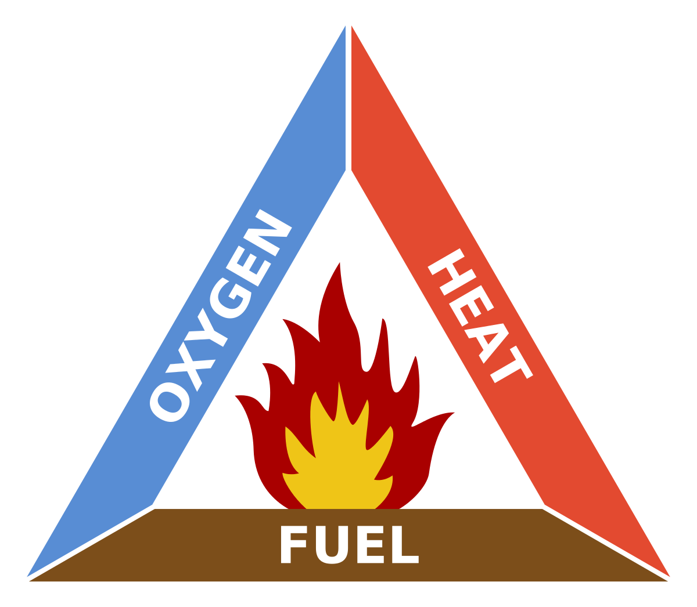

# Learning Outcomes

- To describe what is needed for burning to occur.

---

# Mahi Tuatahi

How would you put this fire out?

{ width=75% }

---

## Keywords

- __Combustion__: A chemical reaction between a __fuel__ and __oxygen__. Makes heat, light and other product
- __Fuel__: Any material that releases energy when burned

---

- __Vapour__: Many small particles of liquid in the air
- __Ignition__: Starting combustion

---

When something is burned, a chemical reaction occurs between the fuel and oxygen.

\begin{align*}
    & magnesium + oxygen \rightarrow \text{magnesium oxide} \\\\
    & carbon + oxygen \rightarrow \text{carbon dioxide}
\end{align*}

---

## Fire Triangle

{ width=40% }

If all three sides of the triangle are present, a fire could start. By removing any of the three sides you can put out a fire.

---

# Fire-Proof Paper Whakamātau

How can you set paper on fire without destroying it?

__Aim:__ Design a simple whakamātau to show how fuels burn.

---

__Materials__

| <!-- -->          | <!-- --> |
| ----------------- | -------- |
| Meths (ethanol)   | Water    |
| Paper             | Beaker   |
| Tongs             | Bunsen   |

---

- 4 groups
- 5mins to think of a method
- Students write down
- 5mins to review methods
- Select best method
- Students run whakamātau   METHS INVISIBLE
- Dip paper in 1:1 meths:water mix
- Use beakers and sink
- Light paper, let burn out
- CLEAN UP, SEATED
