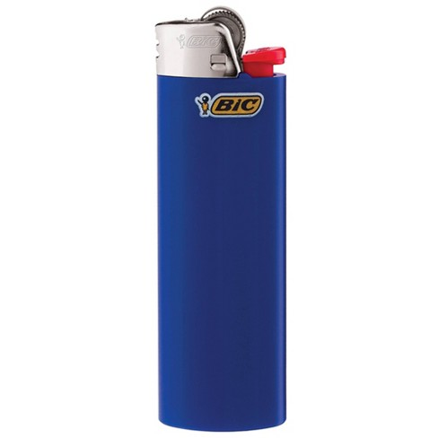
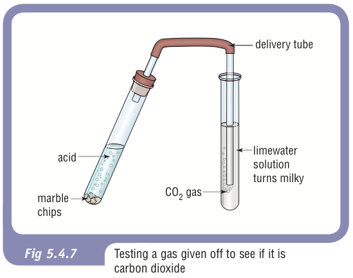

# Learning Outcomes

- Investigate and test for the products created in combustion.

---

# Starter

Research and describe the three sides of the fire triangle for a lighter.

{width=30%}

---

# Combustion

Combustion is a very predictable formula. Every time something is burned, __carbon dixoide__ or __carbon monoxide__ is produced along with __water__.

---

## Test for Carbon Dioxide

Think back to pHun Reactions: __how did we test for the presence of carbon dioxide?__

Write down your answer with a diagram in your exercise book.

---

{width=75%}

---

## Testing for Water

- Does anyone have any ideas on how we can test for water?
- In fact we can use __cobalt (II) chloride strips__
    - The paper goes pink in the presence of water
    - It can be dehydrated and re-used

---

# Practical

- Open to page 7 of your workbook: __What is produced when a candle burns?__
- Read through the experiment carefully
- Come up to the demo bench
- Form into groups of 3-5 and collect the required equipment
- Conduct the experiment (20min)
- Clean up your station
