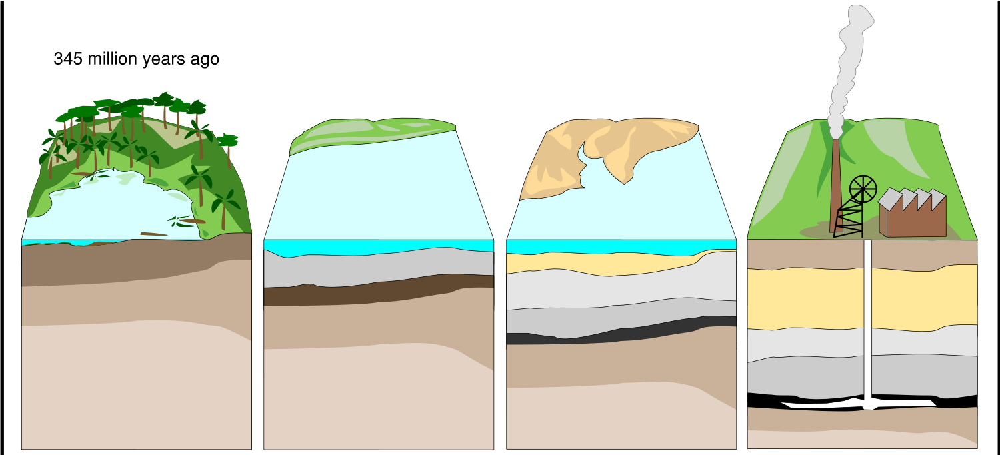

# Ngā Whāinga Ako

- Recognise that a hydrocarbon contains only C and H atoms
- Name and write the formula for the first six hydrocarbons

---

| Term              | Description                                       | Example                               |
|---------------    |-------------------------------------------------  |-----------------------------------    |
| Atom/Molecule     | The smallest unit of an element                   | One atom of H      |
| Element           | Many of the same atoms together                   | Hydrogen, Oxygen       |
| Compound          | Two or more elements chemically joined together   | Water ($H_{2}O$)     |

---

## Hydrocarbon Formation

|                                                           |                                                   |                                                                                                                                                       |
|--------------------------------------------------------   |------------------------------------------------   |-----------------------------------------------------------------------------------------------------------------------------------------------------  |
| 1. Layers of dead organic matter settle on the seabed.    | 2. Layers of sedimentary rock build up on top.    | 3. The heat and pressure from these rocks, along with the absence of oxygen mean that oil and gas (fossil fuels) are formed over millions of years.   |

---

{width=80%}

---

## Crude Oil

Crude oil is what we get directly out of the ground and is made of a mixture of lots of different hydrocarbons (molecules made of only hydrogen and carbon).

{width=50%}

---

# Hydrocarbons

{width=75%}

---

- A hydrocarbon with 4 carbons is called __butane__
- A hydrocarbon with 5 carbons is called __pentane__
- A hydrocarbon with 6 carbons is called __hexane__
- Can you guess what 7, 8, 9 and 10 are called?

---

## Hydrocarbon Formula

- Methane has 1 carbon and 4 hydrogens so it is called $CH_{4}$
- Ethane has 2 carbons and 6 hydrogens so it is called $C_{2}H_{6}$
- Propane has 3 carbons and 8 hydrogens so it is called $C_{3}H_{8}$
- What is the pattern? Try write a general formula using _n_ to represent the number of carbons..

---

### Answer

\begin{align*}
    C_{n}H_{2n+2}
\end{align*}

---

### Calculating Hydrocarbons

\begin{align*}
    C_{n}H_{2n+2}
\end{align*}

Using this formula you can calculate the formula for any hydrocarbon!

1. Find the formula for the 17th hydrocarbon
2. Find the formula for the 56th hydrocarbon
3. Find the formula for the 117th hydrocarbon

---

#### Answers

1. $C_{17}H_{36}$
2. $C_{56}H_{114}$
3. $C_{117}H_{236}$

---

## Hydrocarbon Properties

A longer chain of carbons means:

- Less ability to flow (higher viscosity)
- Less flammable
- Less volatile
- Higher boiling point

---

## Making Alkanes

__IN PAIRS OR GROUPS, WRITE FORMULA AND MAKE MODELS FOR THESE ALKANES:__

1. An alkane with one carbon molecule
2. An alkane with three carbon molecules
3. An alkane with six carbon molecules

You may need to join groups to make the larger molecules.

Hands up for check each time!

---

| Alkanes       | Formula   | Boiling point [°C]    | Melting point [°C]    | Density    |
|-------------  |---------  |--------------------   |--------------------   |----------------------------   |
| Methane       | CH4       | -162                  | -182                  | gas                           |
| Ethane        | C2H6      | -89                   | -183                  | gas                           |
| Propane       | C3H8      | -42                   | -188                  | gas                           |
| Butane        | C4H10     | 0                     | -138                  | gas                           |
| Pentane       | C5H12     | 36                    | -130                  | 0.626 (liquid)                |

---

| Alkanes       | Formula   | Boiling point [°C]    | Melting point [°C]    | Density    |
|-------------  |---------  |--------------------   |--------------------   |----------------------------   |
| Hexane        | C6H14     | 69                    | -95                   | 0.659 (liquid)                |
| Octane        | C8H18     | 126                   | -57                   | 0.703 (liquid)                |
| Icosane       | C20H42    | 343                   | 37                    | solid                         |
| Hexacontane   | C60H122   | 625                   | 100                   | solid                         |

---

# Combustion of Hydrocarbons

Try and conmplete these word and symbol equations (refer to your notes):

__Complete Combustion__

\begin{align*}
    methane + oxygen \rightarrow  \hspace{1cm} +  \hspace{1cm}\newline
    CH_{4} + \frac{1}{2}O_{2} \rightarrow \hspace{2cm} + \hspace{2cm}
\end{align*}

---

__Incomplete Combustion__

\begin{align*}
    CH_{4} + \frac{1}{2}O_{2} \rightarrow  \hspace{2cm} + \hspace{2cm}
\end{align*}

