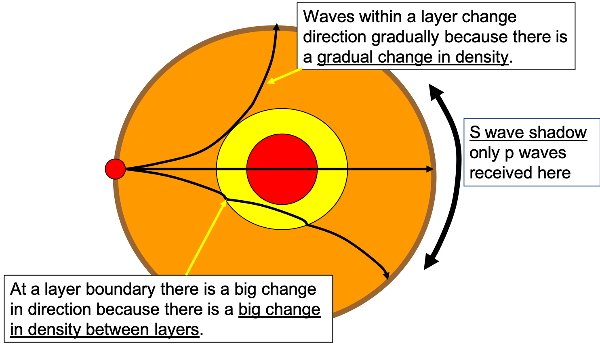

# Ngā Whāinga Ako

- To recall the layers of the Earth and distinguish between oceanic and continental crust.

---

## Mahi Tuatahi (20min)

Using a device, research one method that scientists use to measure the age of Earth, and what evidence they have used. Work in pairs and be ready to tell the class about your findings!

---

## Structure of Earth

- Earth is a large sphere of gasses, liquids and solids flying through space.
- These different components are arranged in layers.
- Each layer has a specific role in supporting life and keeping our planet in a constant state of change.

---

---

### What is Earth made of?

- If it were possible to dig to the centre of the Earth, what would you find?

---

- __Crust:__ The rocky, outer layer beneath your feet.
- __Mantle:__ The semi-liquid, very high temperature layer below the crust. The cooler section near the crust is less mobile than the section near the core (asthenosphere)
- __Core:__ The layer at the centre. This layer is divided into two sections, __the liquid outer core__ and __the solid inner core__.

---

#### The Crust

- __Oceanic Crust__ is 5-10km thick and made up mostly of denser rocks like basalt.
- __Continental Crust__ is 30-50km thick and made up mostly of less dense rocks like granite.

---

#### Outer Core

- Around 2,200km thick and made of molten nickel and iron (around 4,500C). It spins around as Earth rotates and is responsible for Earth's magnetic field.

---

#### Inner Core

- It is solid and around 1,250km thick. It is around 6,000C but is under such great pressure that it remains solid (not liquid).

---

---

## How Dense is Earth?!

Calculate the approximate density of Earth using the following information:

- Earth's mass is around $6\times10^{24}kg$
- Earth's volume is around $1\times10^{21}m^{3}$

----

### Answer

\begin{align*}
    & density = |frac{mass}{volume} \newline
    & density = \frac{6\times10^{24}kg}{1\times10^{21}m^{3}} \newline
    & density = 6000kg/m^{3} \text{ 6000kg per cubic meter}
\end{align*}

By comparison air is $1.225kg/m^{3}$ and water is $997/m^{3}$

---

### Relative Densities

- __Continental Crust__ has a density of around $2.7g/cm^{3}$ (mostly granite)
- __Oceanic Crust__ has a density of around $2.9g/cm^{3}$
- __Mantle__ has a density of around $3.3g/cm^{3}$
- Continental crust makes up about 70% of the volume of Earth's crust

---

### How do we Know?

- Earthquakes and nuclear explosions generate seismic waves that travel through Earth
- We can measure the intensity and timing of seismic waves at many locations and use this information to calculate the density inside Earth
- This is very similar to tapping on a wall to see if there is something inside

---

