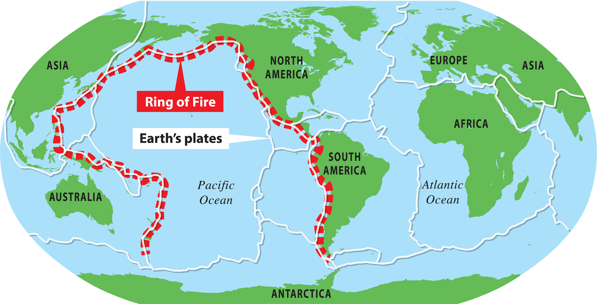
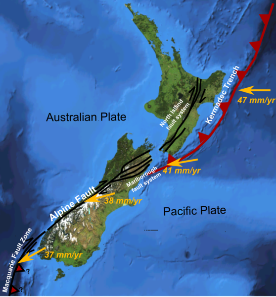
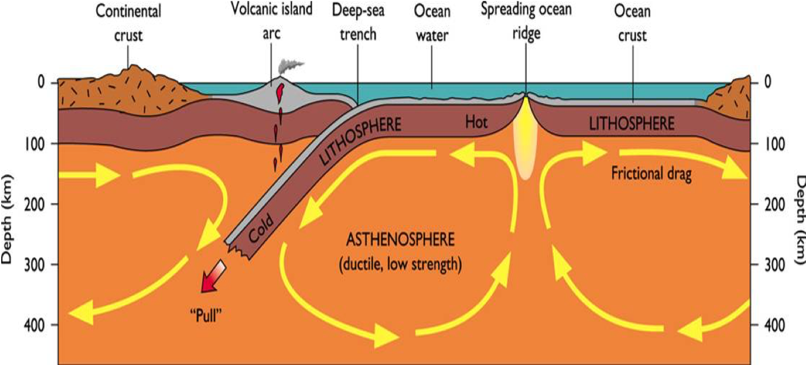
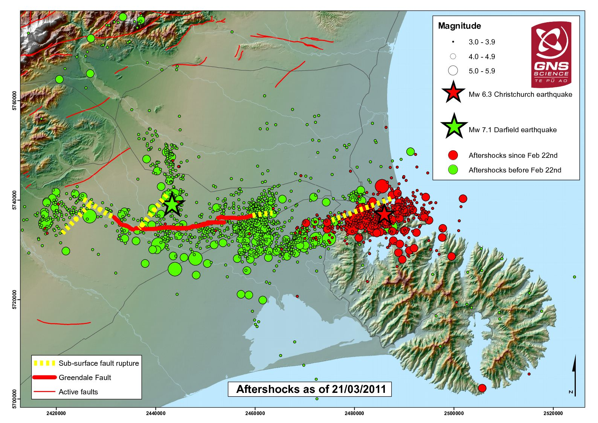
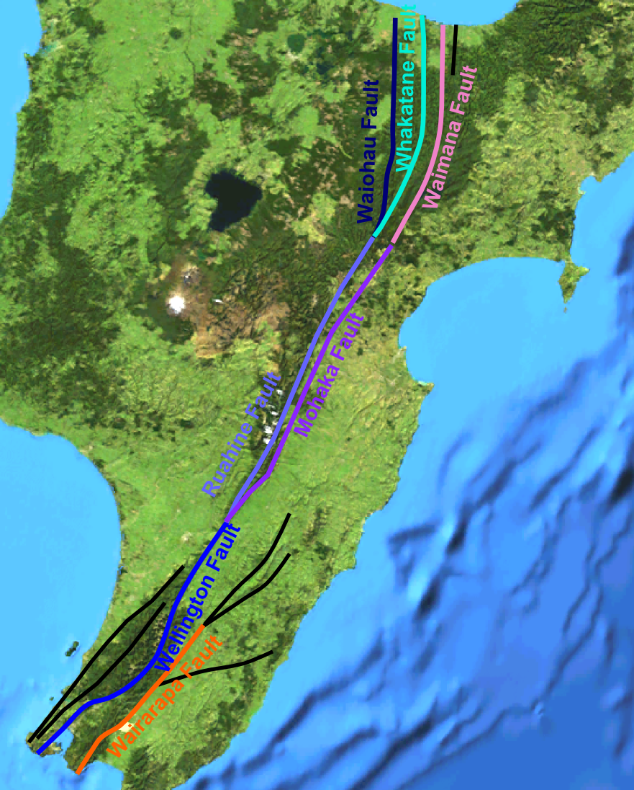
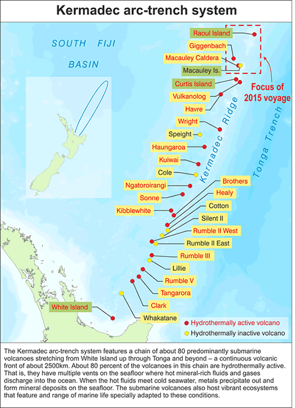

# Learning Outcomes

- Use plate tectonics to explain why and where earthquakes and volcanic eruptions happen.

---

# Mahi Tuatahi

Explore this website: [http://dinosaurpictures.org/ancient-earth#240](http://dinosaurpictures.org/ancient-earth#240)

1. How did Earth look when life first arose?
2. How about when the dinosaurs were around?
3. And the first primates?
4. Did NZ exist? Did it look as it does now?

---

### Recap: What is the theory of plate tectonics?

- The explanation for how the continents move came from observations of seafloor spreading and other effects. In 1967, these ideas were linked in the theory of plate tectonics.
- According to this theory, the Earth’s crust is like a jigsaw puzzle made up of giant sections called tectonic plates.

---

- These plates ‘float’ on top of the mantle and so can move around the Earth’s surface.
- There are 10 major tectonic plates and several minor plates.

---

---

## What is the Ring of Fire?

- It is about $40,000km$ of ocean trenches and volcanic belts where many earthquakes and volcanoes occur.
- Is has over 75% of the world's active and dormant volcanoes.
- 90% of the world's earthquakes occur on it.

---

### What plates are involved?

- There are 10 major plates and several minor plates on Earth
- Use your devices to label the plates on the map being handed out!
- What plates are part of the ring of fire?
- Use a highlighter to indicate the ring of fire on the map!

---

- Look at this URL to see a live earthquake map: [https://seismo.berkeley.edu/seismo.real.time.map.html](https://seismo.berkeley.edu/seismo.real.time.map.html)

---

## NZ Tectonics

What plates does New Zealand straddle?

---

---

Where plates move apart, new mountains form. Where plates meet, one can go under the other or they push together and form new mountains.

{width=80%}

---

We call the areas where plate boundaries __fault lines__.

- E.g. Alpine fault
- E.g. Hutt Valley, Wellington
- Lots of smaller faults (Christchurch earthquake fault)

---

{width=80%}

---

{width=50%}

---

- NZ sits on the boundary of the Pacific and Australian plate.
- On the East of the NI there is a deep trench as the Pacific Plate goes under the Australian Plate.
- In the SI the two plates slide past each other, along the Alpine Fault.
- Below the SI they think that the Australian plate goes under the Pacific plate.

---

According to information published by the Geology Department at New Zealand's, University of Otago, the Alpine transform boundary is unique because the Pacific plate is thrusting over the top of the Australian plate. This behaviour is typically only found at convergent boundaries or subduction zones, and not at transform boundaries. As a result, New Zealand's Southern Alps are increasing in height by approximately seven millimetres per year.

---

The trench visible north and south of New Zealand shows that the Pacific plate is diving below the Australian plate, creating lots of volcanoes in the north island.

---

{width=50%}

