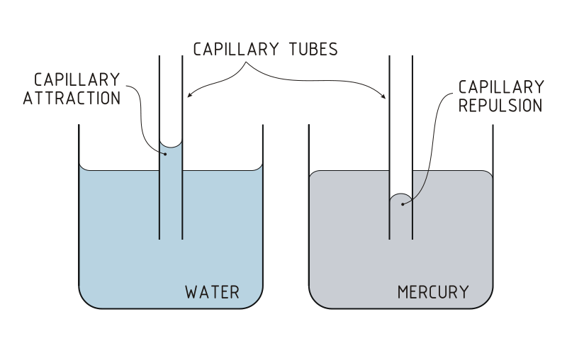
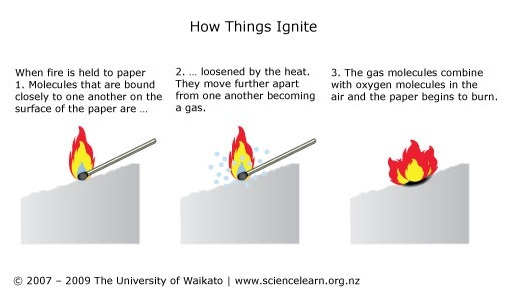

# Ngā Whāinga Ako

- To be able to explain the function of a wick

---

# What do you think a wick is for?

---

## Whakakite: Walking Water

---

### Capillary Action

- Liquids can flow into narrow spaces, even against the direction of gravity.
- E.g. paper in water, paint brushes sucking up water, a thin tube in water.
- The surface tension and adhesive forces between the liquid and container propel the water into the narrow space.

---

{ width=75% }

---

{ width=75% }

---

## Wick Whakamātau

1. Safety
2. Whakamātau read through
3. Check understanding each step
4. Explain must do Qs 1,2,3 during whakamātau
5. Timeframe (20mins)
6. Clean up check

---

### Discussion Points

1. Why didn’t the solid paraffin wax ignite?
2. Did the liquid wax ignite? Why/ why not?
3. How does the wick allow the wax to burn?
      (think about last lesson’s whakamātau)
4. Why doesn’t the wick burn?
    (clue:  evaporation and sweating)

