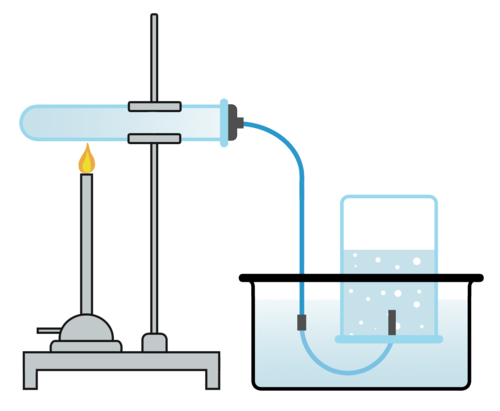
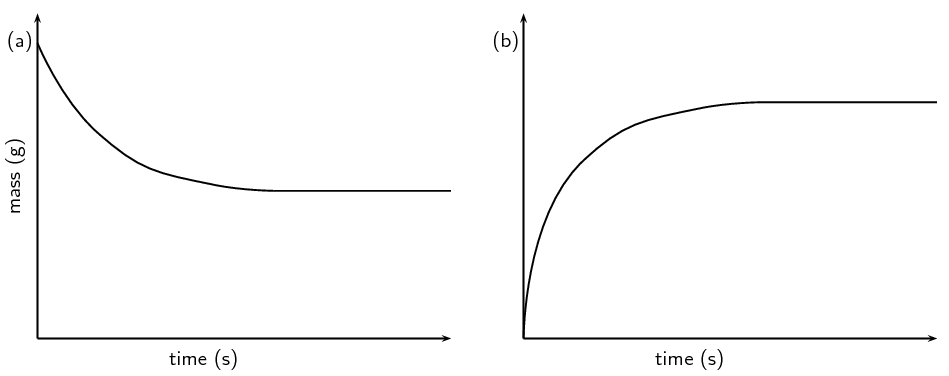

- AS90930
- 4 Credits
- Internal
- Practical & written assessment in Week 11 of Term 1

---

## The Rate of Reaction

Understanding the rate of reaction is very important in Science we need to be able to control it when performing reactions on an industrial scale.

It can be defined as the rate at which __products are produced__ OR __reactants are used up__.

---

<iframe width="1206" height="678" src="https://www.youtube.com/embed/NhdtqnEfa9w" frameborder="0" allow="accelerometer; autoplay; encrypted-media; gyroscope; picture-in-picture" allowfullscreen></iframe>

---

Here are two ways we can measure the rate of reaction:

- measuring the volume of products produced,
- measuring the weight of reactants lost

Can you think of any others?

---

## Displacement of Gas

{width=75%}

---

## Experiment: Measuring the Rate of Reaction

Method is on Google Classroom

---

## Production of Gas Method

When measuring the amount of gas produced, the volume goes up over time so the graph should look like this:

{width=50%}

---

## Loss of Mass Method

When measuring the amount of mass lost, the mass goes down so the graph should look like this:

{width=75%}

---

## Things to Note

- Sometimes a reaction will take a few seconds to start, this is due to a protective coating on some metals,
- you need 4-5 measurements of your dependent variable to draw a valid conclusion (repeated 3 times).

---

## Loss of Mass Experiment

Method is on Google Classroom - please open it up, read it and come to the demo bench!

