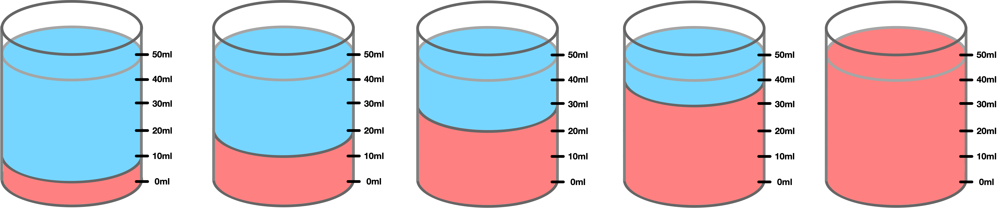

<iframe width="560" height="315" src="https://www.youtube.com/embed/-4HXaUBbv04" frameborder="0" allow="accelerometer; autoplay; encrypted-media; gyroscope; picture-in-picture" allowfullscreen></iframe>

---

## Concentration: Collision Theory

- Concentration is easily thought of like raro - the more raro particles you add to your drink, the stronger it is!
- The more particles there are, the higher the chance there is of particles bumping into each other
- The more bumps there are, the greater number of successful collisions overall
- __It does not increase the probability of successful collisions__

---

## Dilutions

- To change the concentration we must dilute __one__ of our reactants.
- __Question__: What do we dilute raro with (we use the same in chemistry)?
- __Answer__: Water! $H_{2}O$

---

### Dilutions Explained

- In Year 11 we will do dilutions in percentages. For example, 90% $HCl$, 80% $HCl$ or 30% $HCl$
- For $10ml$ of 80% $HCl$ this means 80% of the $10ml$ is $HCl$ and 20% is water!
- Calculate the $ml$ of acid and water for the above solution ^

$$\text{Volume of Acid} = \frac{percentage}{100} \times \text{total volume}$$

---

### Task: Calculate the $HCl$ and $H_{2}O$ for each solution

$$\text{Volume of Acid} = \frac{percentage}{100} \times \text{total volume}$$

| Concentration | Volume | $ml$ of $HCl$ | $ml$ of $H_{2}O$ |
|---------------|--------|---------------|------------------|
| 90%           | 100ml  |               |                  |
| 80%           | 75ml   |               |                  |
| 75%           | 50ml   |               |                  |
| 50%           | 50ml   |               |                  |
| 30%           | 50ml   |               |                  |

---

| Concentration | Volume | $ml$ of $HCl$ | $ml$ of $H_{2}O$ |
|---------------|--------|---------------|------------------|
| 90%           | 100ml  | $90ml$        | $10ml$           |
| 80%           | 75ml   |               |                  |
| 75%           | 50ml   |               |                  |
| 50%           | 50ml   |               |                  |
| 30%           | 50ml   |               |                  |

---

| Concentration | Volume | $ml$ of $HCl$ | $ml$ of $H_{2}O$ |
|---------------|--------|---------------|------------------|
| 90%           | 100ml  | $90ml$        | $10ml$           |
| 80%           | 75ml   | $60ml$        | $15ml$           |
| 75%           | 50ml   |               |                  |
| 50%           | 50ml   |               |                  |
| 30%           | 50ml   |               |                  |

---

| Concentration | Volume | $ml$ of $HCl$ | $ml$ of $H_{2}O$ |
|---------------|--------|---------------|------------------|
| 90%           | 100ml  | $90ml$        | $10ml$           |
| 80%           | 75ml   | $60ml$        | $15ml$           |
| 75%           | 50ml   | $37.5ml$      | $12.5ml$         |
| 50%           | 50ml   |               |                  |
| 30%           | 50ml   |               |                  |

---

| Concentration | Volume | $ml$ of $HCl$ | $ml$ of $H_{2}O$ |
|---------------|--------|---------------|------------------|
| 90%           | 100ml  | $90ml$        | $10ml$           |
| 80%           | 75ml   | $60ml$        | $15ml$           |
| 75%           | 50ml   | $37.5ml$      | $12.5ml$         |
| 50%           | 50ml   | $25ml$        | $25ml$           |
| 30%           | 50ml   |               |                  |

---

| Concentration | Volume | $ml$ of $HCl$ | $ml$ of $H_{2}O$ |
|---------------|--------|---------------|------------------|
| 90%           | 100ml  | $90ml$        | $10ml$           |
| 80%           | 75ml   | $60ml$        | $15ml$           |
| 75%           | 50ml   | $37.5ml$      | $12.5ml$         |
| 50%           | 50ml   | $25ml$        | $25ml$           |
| 30%           | 50ml   | $15ml$        | $35ml$           |

---

### Diagrams

Drawing a diagram is a very good way to visually show the amount of water and acid/base in your dilutions. __Perhaps this could go in your method!__

