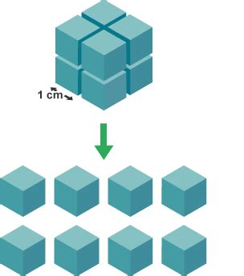

## Investigating a Change in Surface Area

- To measure the effect of surface area on the rate of reaction
- To consider fair testing and accuracy in my method
- To justify why increasing the surface area increases the rate of reaction

---

<iframe width="1206" height="678" src="https://www.youtube.com/embed/4SK4IlQjZZ4" frameborder="0" allow="accelerometer; autoplay; encrypted-media; gyroscope; picture-in-picture" allowfullscreen></iframe>

---

## Increasing Surface Area in Calcium Carbonate

To increase the surface area of calcium carbonate we can use smaller chips and even crush it into a powder.

---

---

# Reaction of Calcium Carbonate and $HCl$

- On Tuesday you will be reacting these chemicals together.
- Calcium carbonate is a white solid and $HCl$ a clear liquid.
- Measure the time until the calcium carbonate has dissolved.

---

## Whakamātau Groups

