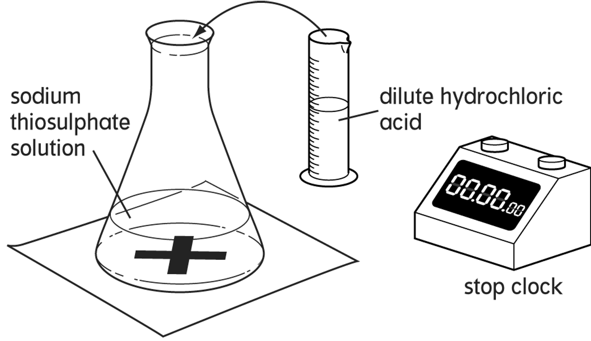
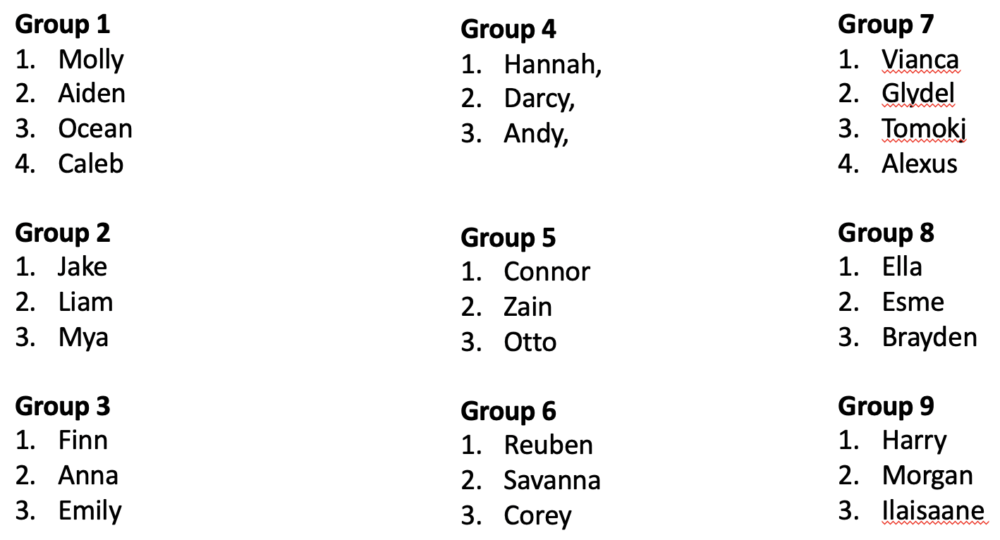

## Investigating a Change in Temperature

- To measure the effect of temperature on the rate of reaction between sodium thiosulphate and hydrochloric acid
- To consider fair testing and accuracy in my method
- To justify why increasing the temperature increases the rate of reaction

---

# Reaction of Sodium Thiosulphate and $HCl$

- On Thursday you will be reacting these chemicals together. Sodium thiosulphate has chemical symbol $Na_{2}S_{2}O_{3}·5H_{2}O$ and hydrochloric acid $HCl$.
- Both are clear liquids and when mixed together the solution goes cloudy over a period of time.
- By measuring the time until the black cross is no longer visible, you can determine the relative rate of reaction.

---

## The Setup

---

## Whakamātau Groups

---

### Step 1: Aim & Hypothesis

In your group:

1. Title your whakamātau
2. Come up with an __aim__ (what are you investigating; be specific)
3. Come up with a __hypothesis__ (what do you predict; be specific)

---

### Step 2: Variables

- __Independent Variable__: The variable that you will change. What are we changing? Include units, measurement apparatus & range of measurements.
- __Dependent Variable__: The variable being measured. What are you measuring? Include units & measurement apparatus.

---

### Step 3: Control Variables & Reliability

- __Control Variable__: Things that you are keeping __constant__. What will you not change throughout your whakamātau?
- __Reliability__: An whakamātau is reliable if the results are within x seconds of each other when the method is repeated. The same method must give the same results each time.

---

### Step 4: Method

- Give you method as a numbered list,
- List what equipment you will need (e.g. a 100ml beaker; 25ml of diluted $HCl$),
- Break things up into small steps and say when you repeat a set of steps,

---

### Step 4: Continued

- State your range of measurement for your independent variable, its units and how you will measure it,
- States some control variables and how to control them during the whakamātau.

---

### Step 5: Data/Results

- Design a table to record your results __before__ you start the whakamātau,
- You will need to think about how many trials you are going to do, how many measurements you will make and calculating an average.

---

|                        | Trial 1 | Trial 2 | Trial 3 | Average |
|:-----------------------|:--------|:--------|:--------|:--------|
| Temp 1 ($10^{\circ}C$) |         |         |         |         |
| Temp 2 ($20^{\circ}C$) |         |         |         |         |
| Temp 3 ($30^{\circ}C$) |         |         |         |         |
| Temp 4 ($40^{\circ}C$) |         |         |         |         |

