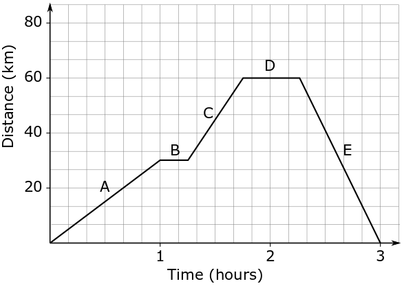

## Distance-Time Graphs {.c2}

- We can plot a graph with __time on the x-axis__ and __distance on the y-axis__ to help us visualise data.
- __Distance-time__ graphs tell us about the velocity of the object!

---

## Interpreting Distance-Time Graphs  {.c2}

- __Positive gradient__: Moving away
- __Flat gradient__: Stationary
- __Negative gradient__: Moving towards

---

## Interpreting Distance-Time Graphs {.c2}

In pairs, __describe__ the velocity of the object at A, B, C, D and E?

---

## Calculating Velocity From Graphs {.c2}

\begin{align*}
    & v = \frac{\Delta d}{\Delta t} = \frac{d_{f} - d_{i}}{t_{f} - t_{i}} \\
    & v = \frac{rise}{run}
\end{align*}

---

## Interpreting Distance-Time Graphs {.c2}

In pairs, __calculate__ the velocity of the object at A, B, C, D and E? _Make sure you show working._

---

## Homework

| Due Today                                                | Due Monday August 31st                            |
|:---------------------------------------------------------|:--------------------------------------------------|
| Q2, Q3, Q1                                               | Q5, Q6                                            |
| Come show me!                                            | A5 tomorrow if you need help (or ask me in class) |
| Those without homework, A5 tomorrow lunch time to do it! | __Answer all questions in your exercise book__    |

---

## sciPAD P11 Q1, P14 Q1
