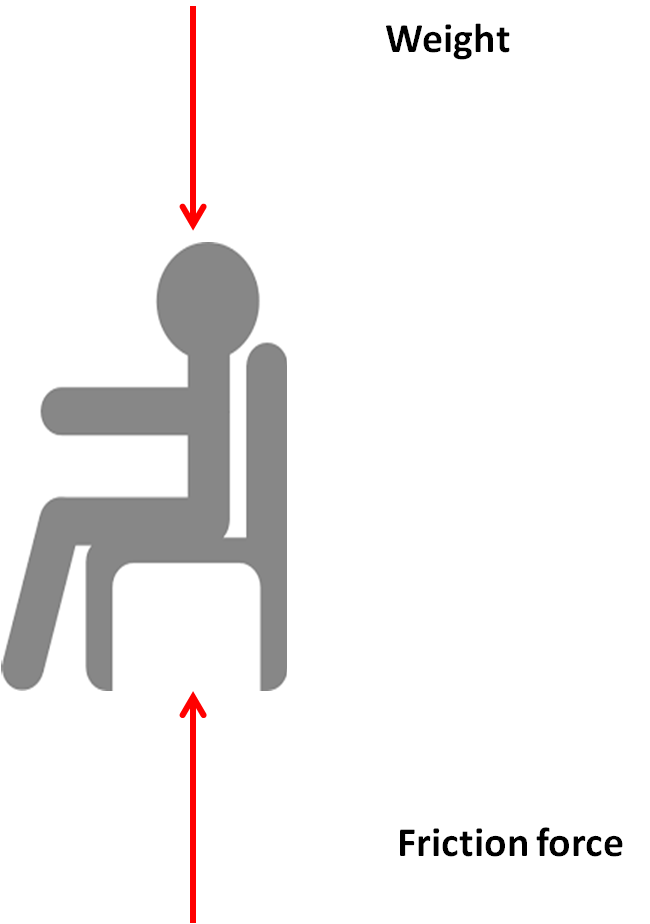
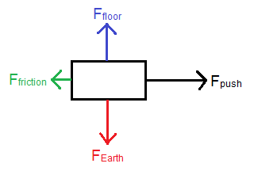
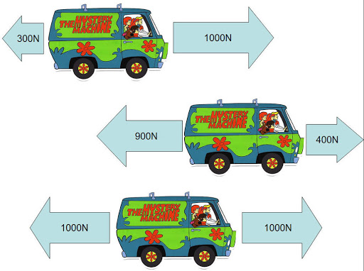
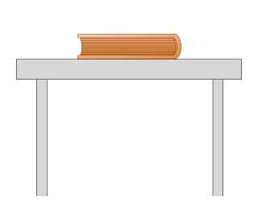
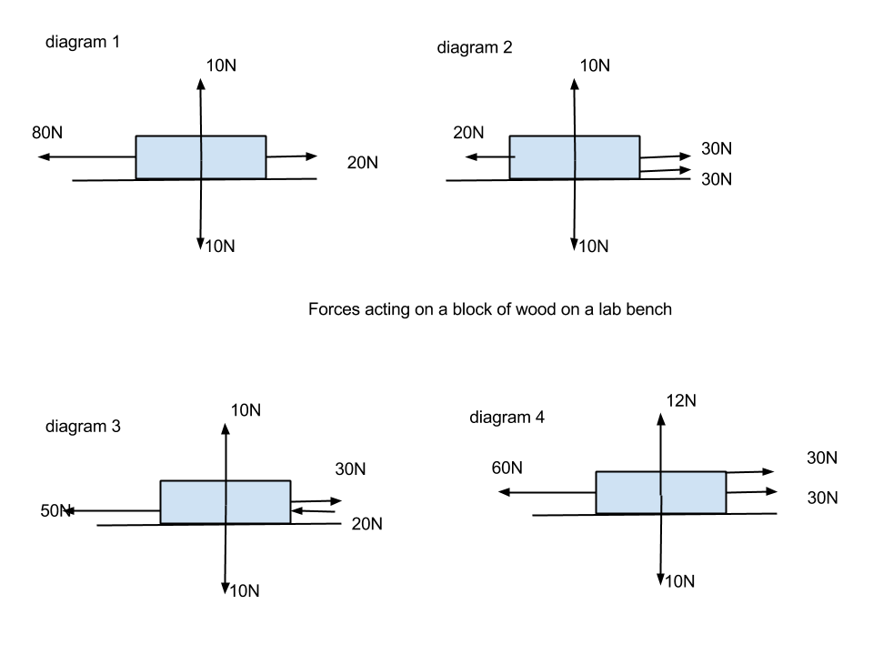

# Starter

Brainstorm situations where force is involved, things that cause force and how it can be used in a __Physics__ context on the board!

---

# Force

Force has lots of applications in our world! Everything from cars, to aeroplanes, tug-of-war, sports and even bio-mechanics!

---

<iframe width="1206" height="678" src="https://www.youtube.com/embed/OmOEnfQk3bw" frameborder="0" allow="accelerometer; autoplay; encrypted-media; gyroscope; picture-in-picture" allowfullscreen></iframe>

---

## Defining Force

Force is a __push__ or a __pull__ and is measured in __Newtons (N)__.

Forces have a size (1, 2, 3, 4) and a direction (left, right, up, down, $40^{\circ}$).

---

## How Forces Act

Consider you sitting on your seat. What forces are acting upon you?

Draw a box to represent yourself, with arrows coming out of the box to represent the forces. Make sure to label them!

---

---

## Force Diagram {.c2}

- Longer arrows indicate __more force__, and vice versa
- The arrow points in the direction the force is acting
- Arrows should be labelled $F_{name}$

---

## Balanced Forces

Think and discuss with the people around you:

Sitting on your chair, are the forces acting on you balanced or unbalanced? How do you know? What does it feel like?

---

## Balanced Forces

- If a force is balanced, the object is in equilibrium and __does not accelerate__
- If the forces are unbalanced, the object is not in equilibrium and __does accelerate__

---

---

---

<iframe width="1280" height="720" src="https://www.youtube.com/embed/YyJSlcIbd-s" frameborder="0" allow="accelerometer; autoplay; encrypted-media; gyroscope; picture-in-picture" allowfullscreen></iframe>

---

### Vertical and Horizontal Forces

- Vertical and horizontal forces are separate. They do not affect each other.
- We can _balance_ them to find out the __net force__ in the vertical and horizontal directions.
- If we compare them and they are the same, then forces are balanced. If they are different, forces are unbalanced.

---

---

<iframe width="1206" height="678" src="https://www.youtube.com/embed/GJ4Qp2xeRds" frameborder="0" allow="accelerometer; autoplay; encrypted-media; gyroscope; picture-in-picture" allowfullscreen></iframe>

---

# sciPAD Page 33-35

---

## Force & Weight {.c2}

\begin{align*}
    Force = mass \times acceleration \\
    F = ma
\end{align*}

- Force acting upon a mass will create an acceleration
- An acceleration acting upon a mass is felt as a force
- ^ Gravity (acceleration) acting upon mass (you) is felt as a force (weight)
- Weight is a force

---

## Weight vs Mass

| Mass                        | Weight                            |
|:----------------------------|:----------------------------------|
| Measured in $kgs$           | Measured in Newtons               |
| Is constant                 | Changes with acceleration/gravity |
| Cannot be measured directly | Can be measured using a scale     |

---

<iframe width="560" height="315" src="https://www.youtube.com/embed/DMKcO-T5Y4o" frameborder="0" allow="accelerometer; autoplay; encrypted-media; gyroscope; picture-in-picture" allowfullscreen></iframe>

---

## Your Weight

- The acceleration due to gravity on Earth is $10\frac{m}{s^{2}}$.
- Calculate your weight on Earth using $F=ma$
- Use this website to visualise your weight on other planets: https://exploratorium.edu/ronh/weight/

---

## Starter

Complete the questions on the last page of the worksheet from last period!

---

## Types of Forces {.c2}

- __Down__: Weight (due to gravity)
- __Up__
    - Lift (planes, birds, things with wings)
    - Bouyancy (floating in water)
    - Support (rigid physical connections)
- __Faster__: Push/thrust forces (rockets, rugby)
- __Slower__: Generally called _resistive_ forces
    - Drag (water/air)
    - Friction (hard materials)

---

## Force Diagrams

- Equal and opposite forces should be the same length
- Greater forces have longer arrows
- Accelerating means unbalanced forces
- Balanced (zero net force) means no acceleration (constant velocity)

---

---

## Task

1. sciPAD page 34
2. sciPAD page 36
3. Use the QR code at the back to find the answers and mark your work!

---

<iframe width="560" height="315" src="https://www.youtube.com/embed/pCkgAelO3og" frameborder="0" allow="accelerometer; autoplay; encrypted-media; gyroscope; picture-in-picture" allowfullscreen></iframe>

---

## Learning Outcomes

1. Describe the relationship between mass and acceleration of an object which is acted upon by a given unbalanced force (called __net force__).
2. Use the relationship $F = ma$ to calculate the net force, mass or acceleration of an object.
3. Understand forces acting during terminal velocity

---

## Net Force

- Net force is the resultant force in the x and y directions
- If the forces are equal and opposite, there is zero net force
- If there is zero net force, acceleration is zero
- We cannot know if the object is stationary or moving at a constant velocity without more information from the question

---

<iframe width="560" height="315" src="https://www.youtube.com/embed/dYw4meRWGd4" frameborder="0" allow="accelerometer; autoplay; encrypted-media; gyroscope; picture-in-picture" allowfullscreen></iframe>

---

## Terminal Velocity {.c2}

- Friction forces increase as the velocity of an object increases
- When friction and weight forces are balanced, the object stops accelerating
- This is terminal velocity!

---

## Terminal Velocity {.c2}

- The object starts from rest at the top of the jump
- Its velocity increases due to the acceleration due to gravity (weight force)
- The friction force, drag, increases with velocity until they become balanced
- The velocity becomes constant

---

## Task

Question 18 and then Question 17 from the homework booklet

---

## Starter

1. Do you recall $v=\frac{d}{t}$? calculate the velocity of a cyclist that travels $100m$ in $15s$.
2. What is the difference between mass and weight?
3. Calculate the __weight__ of a $1.5kg$ mass on Earth.
4. After $10s$ a runner has accelerated from __rest__ to $3m/s$

---

## L16: Homework Booklet Q19

- To answer this question, carefully read the question and the things that you should include in your answer.
- A good way to structure it would be for each point:
    - Draw a force diagram
    - Explain the forces (net force, balanced, unbalanced, horizontal, vertical)
    - Explain the acceleration of the rocket due to the forces, and thus its speed
    - Explain what is causing friction, and the relative size of those friction forces

---

## Homework Booklet Q20

- Right is constant velocity, left is moving to the left but slowing down.
- For each bird:
    - Describe the net force (balanced, unbalanced, direction)
    - Relate this to the acceleration of the bird and therefore the velocity
