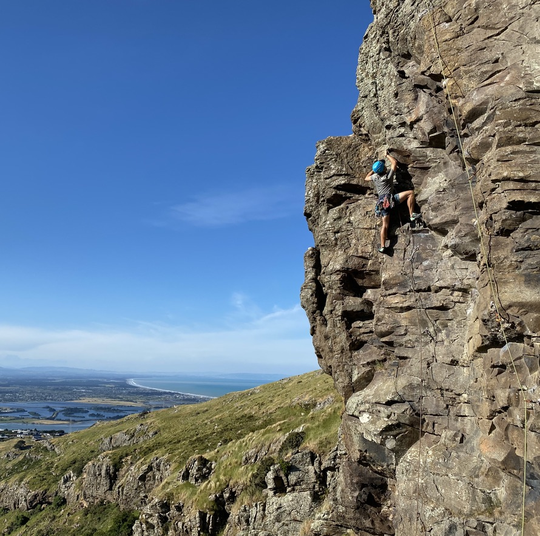

## Ngā Whāinga Ako

1. Name the metric units of __distance__, __time__ and __speed__ and give their symbols.
2. Define the term speed.
3. Calculate the __average speed__ of objects. Use $v=d/t$.

---

## What is Speed?

You know that someone who finishes a race in the shortest time is the fastest. That they have the highest speed.

> __Speed is the amount of distance covered in some amount of time__.

---

## What is Speed? {.c2}

- Cars display their speed in _kilometers per hour_
- In Physics we prefer to give speed in the __number of meters__ travelled in __one second__.
- We call this _meters per second_.

---

## Calculating Speed

In order to determine speed we need to know two things!

- __Distance__: has unit meters (m) and is represented by symbol $d$ in equations.
- __Time__: has unit seconds (s) and is represented by symbol $t$ in equations.

---

## Speed vs Velocity

- __Speed__ is a measure of distance covered in a certain amount of time.
    - e.g 13 meters per second
- __Velocity__ includes a direction
    - e.g. 13 meters per second __east__

---

## How to Calculate Velocity

\begin{align*}
    velocity &= \frac{\text{change in distance}}{\text{change in time}} \newline
    v &= \frac{\Delta d}{\Delta t} \newline
\end{align*}

It is measured in meters per second, also shown as $\frac{m}{s}$ or $ms^{-1}$.

---

## How Do We Solve Problems?

1. Knowns
2. Unknowns
3. Formula
4. Substitute
5. Solve

---

## Question 1: Velocity {.c2}

A rock climber climbs 15 meters in 5.48 seconds. What velocity was he travelling?

---

## Question 1: Answer

1. __Knowns:__ $\text{distance (d)}=15m$, $\text{time (t)} = 5.48s$
2. __Unknowns:__ $\text{velocity (v)}$
3. __Formula:__ $v = \frac{\Delta d}{\Delta t}$
4. __Substitute:__ $v = \frac{15}{5.48}$
5. __Solve:__ $v = 2.74\frac{m}{s}$

---

## Question 2 {.c2}

- Mr Le Sueur ran 4.61km in 21 minutes and 16 seconds. How fast did he run?
- __Hint:__ Convert the time and distance to Standard International Units

---

## Question 2: Answer

1. __Knowns:__ $\text{distance (d)} = 4.61km = 4610m$, $\text{time (t)} = 21min, 16s = 1276s$
2. __Unknowns:__ $\text{velocity (v)}$
3. __Formula:__ $v = \frac{\Delta d}{\Delta t}$
4. __Substitute:__ $v = \frac{4610}{1276}$
5. __Solve:__ $v = 3.61\frac{m}{s}$

---

## Question 3 {.c2}

- Mr Le Sueur ran at $1.51\frac{m}{s}$ for 1hr, 18min and 11 seconds. How far did he run?
- __Hint:__ Convert the time to Standard International Units

---

## Question 3: Answer

1. __Knowns:__ $\text{velocity (v)} = 1.51\frac{m}{s}$, $\text{time (t)} = 1hr, 18min, 11s = 4691s$
2. __Unknowns:__ $\text{distance (d)}$
3. __Formula:__ $v = \frac{\Delta d}{\Delta t}$
4. __Substitute:__ $1.51 = \frac{d}{4691}$
5. __Solve:__ $1.51 \times 4691 = d = 7083.41m$

---

## Homework

Due Monday, August 24th: Homework Booklet Q2, Q3, Q1

---

## Do Now: sciPAD Page 8, 9, 10
