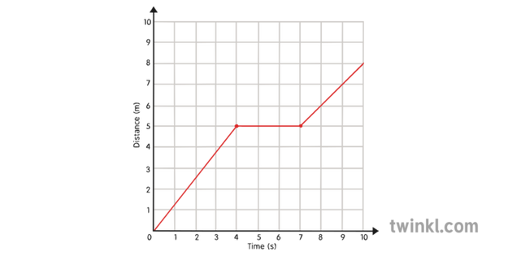

## Starter

{ width=90% }

---

# Velocity-Time Graphs

Much like we can plot a distance-time graph, we can also plot velocity-time graphs.

Velocity-time graphs are useful for determining whether an object is accelerating and for calculating the distance travelled.

{ width=60% }

---

## Calculating Acceleration

{ width=60% }

\begin{align*}
    & a = \frac{\Delta v}{\Delta t} \\\\
    & a = \frac{rise}{run} && \text{using a velocity-time graph}
\end{align*}