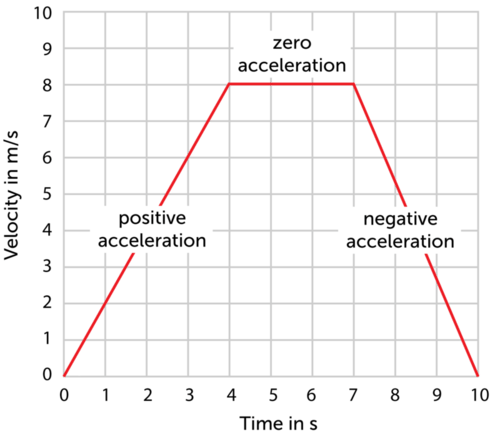

## Mahi Tuatahi

---

## Speed-Time Graphs {.c2}

- The gradient of a distance-time graph is the __velocity__
- The gradient of a speed-time graph is the __acceleration__
- The area under a speed-time graph is the __distance travelled__

---

## Calculating Acceleration {.c2}

\begin{align*}
    a &= \frac{rise}{run} \newline
    a &= \frac{\Delta v}{\Delta t} \newline
    a &= \frac{v_{f} - v_{i}}{\Delta t}
\end{align*}

---

## Finding the Distance

- Calculate the area under the __speed-time graph__ to find the distance travelled
- Break it up into rectangles & triangles to calculate the area

---

---

## Questions

sciPAD Page 14, 19 21
