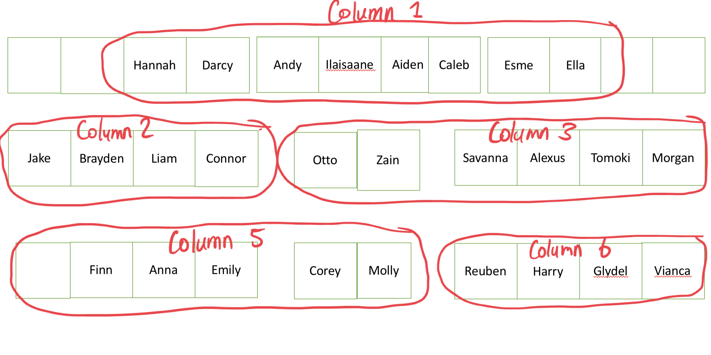
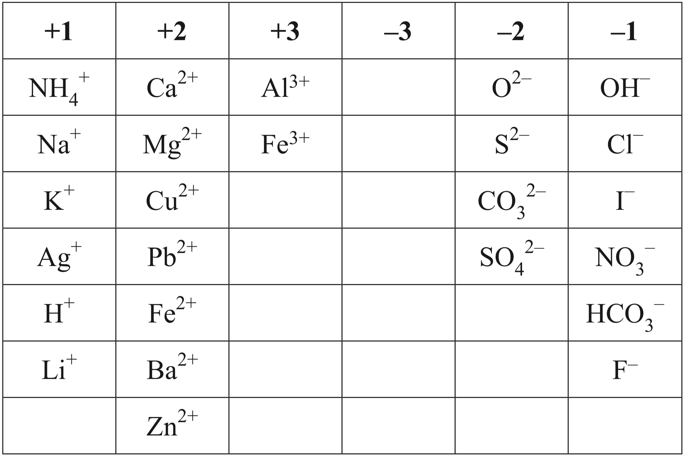
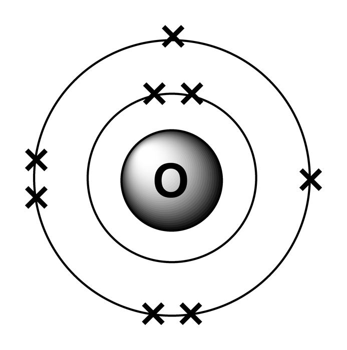

## Starter

Open your book to your __table of ions__. In groups (below), use your devices to find out the names of the __ions__ of your column, and write the names on the board.

Copy the names of the ions into your book from the other groups!

{width=75%}

---

---

## Ions

Ions are atoms that have __gained__ or __lost__ electrons in order to have a full valence shell.

> Valence: outermost

---

### Example

This is an oxygen atom. Copy the diagram into your book and give the electron shell configuration _e.g. [2,3]_

{width=50%}

---

Making an ion is like rounding:

- Atoms with a less than half-full valence shell will perfer to __lose electrons__
- Atoms with a more than half-full valence shell will prefer to __gain electrons__

---

Think again about the oxygen atom and answer these questions:

1. Will it prefer to gain or lose electrons?
2. How many electrons will it need to gain/lose to have a full outer shell?

{width=50%}

---

Copy this table into your own book and work in pairs to complete it.

|                                  | Oxygen Atom | Oxygen Ion |
|----------------------------------|-------------|------------|
| __Electron Shell Configuration__ |             |            |
| __Number of Protons__            |             |            |
| __Number of Electrons__          |             |            |
| __Overall Charge__               |             |            |

---

|                                  | Oxygen Atom | Oxygen Ion          |
|----------------------------------|-------------|---------------------|
| __Electron Shell Configuration__ | [2, 6]      | [2, 8]2- |
| __Number of Protons__            | 8           | 8                   |
| __Number of Electrons__          | 8           | 10                  |
| __Overall Charge__               | 0           | 2-                  |

---

#### Writing Ions

- Writing ions comes in two parts: the element, and the charge.
- The charge goes in a superscript like this.
- The number goes before the charge.

\begin{align*}
    O^{2-}
\end{align*}

---

### Making Ionic Compounds

- To make ionic compounds we need the numbers in the superscript to balance to zero.
- To use more than one of an ion you use a subscript like this

\begin{align*}
    Na^{+} + Cl^{-} \rightarrow NaCl \\\\
    Cu^{2+} + 2OH^{-} \rightarrow Cu(OH)_{2}
\end{align*}

---

## Game!

- Form into your table groups with a whiteboard. We are going to make some ionic compounds. It's a race!

Your answer is simply to give the compound like this:

\begin{align*}
    NaOH
\end{align*}

---

### Compound One

Sodium iodide

---

### Compound Two

Silver iodide

---

### Compound Three

Lithium fluoride

---

### Compound Four

Ammonium chloride

---

### Compound Five

Magnesium oxide

---

### Compound Six

Lead sulfate

---

### Compound Seven

Barium carbonate

---

### Compound Eight

Zinc iodide

---

### Compound Nine

Aluminium chloride

---

### Compound Ten

Aluminium nitrate

---

### Compound Eleven

Aluminium sulfate

---

### Compound Twelve

Iron (II) oxide

---

### Compound Thirteen

Iron (III) oxide

---

### Compound Fourteen

Sodium bicarbonate

---

### Compound Fifteen

Lead bicarbonate

---

## Game Answers

| 1-5        | 6-10             | 11-15                |
|------------|------------------|----------------------|
| $NaI$      | $PbSO_{4}$       | $Al_{2}(SO_{4})_{3}$ |
| $AgI$      | $BaCO_{3}$       | $FeO$                |
| $LiF$      | $ZnI_{2}$        | $Fe_{2}O_{3}$        |
| $NHCl_{3}$ | $AlCl_{3}$       | $NaHCO_{3}$          |
| $MgO$      | $Al(NO_{3})_{3}$ | $Pb(HCO_{3})_{2}$    |

---

## Quizziz!

[Click](https://quizizz.com/admin/quiz/5ee9f2c8fb1f8c001b986746/naming-ionic-compounds)
