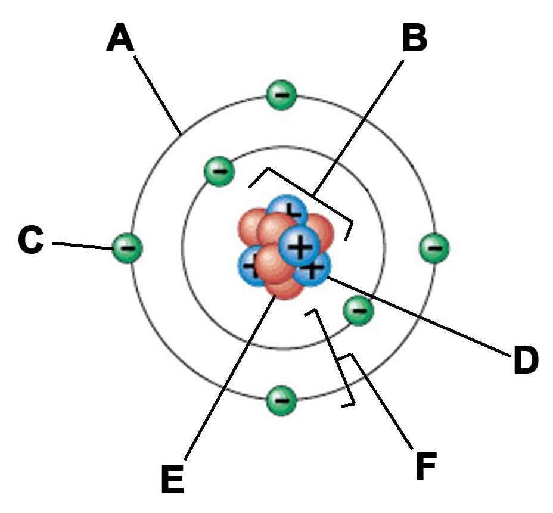
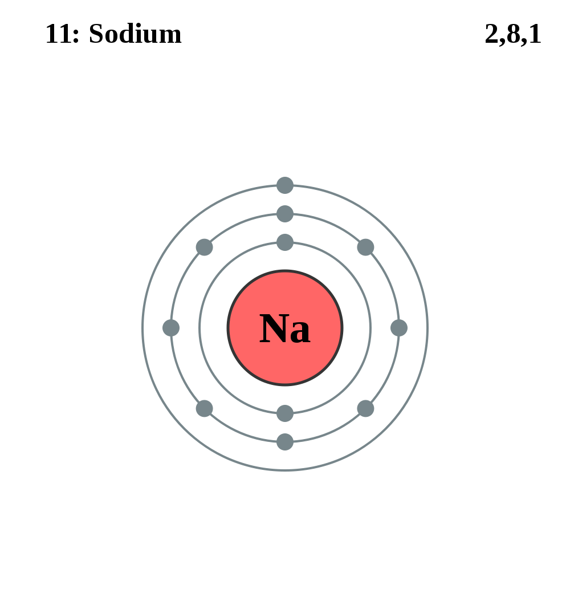
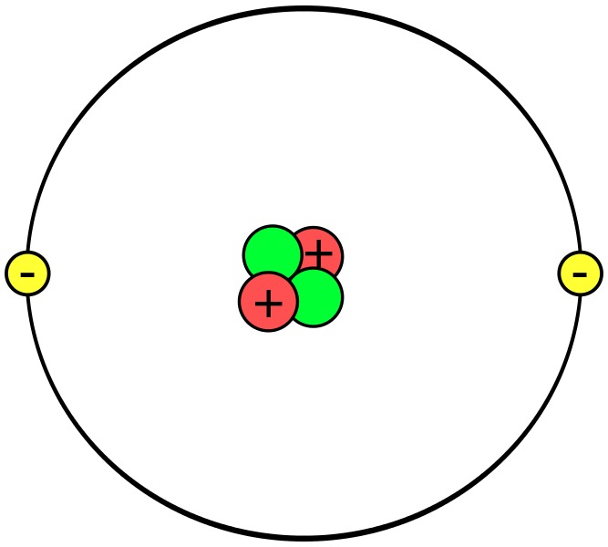
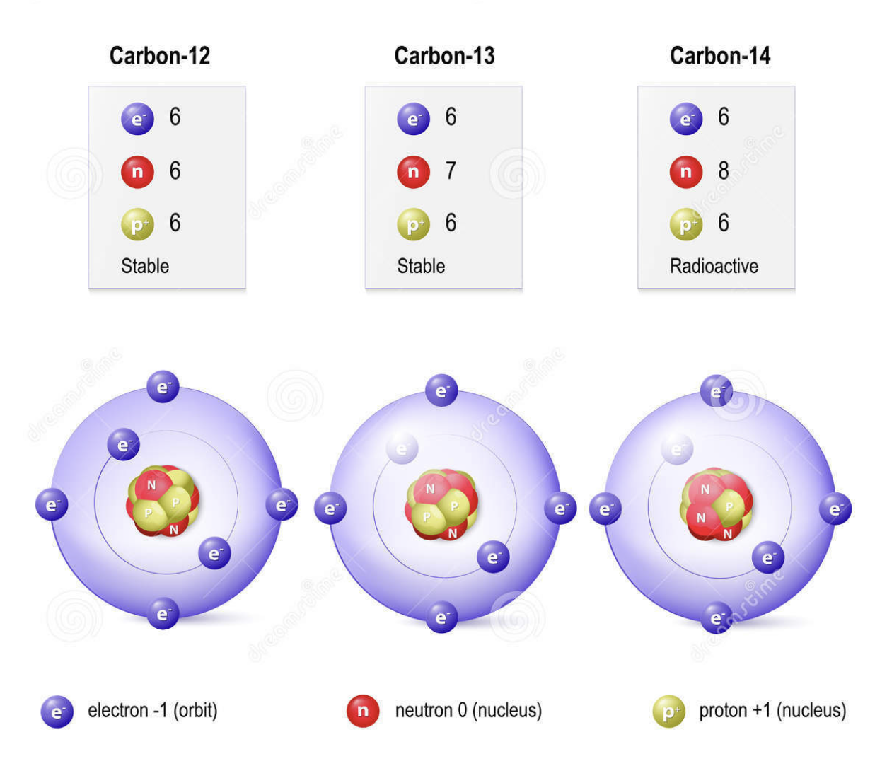

## About The Unit

- Chemical Reactions
- Internal
- 4 Credits
- __Assessment Date__: Term 3, Week 3 (August 3rd)

---

# Learning Outcomes

- Review the structure of the atom

---

Copy this diagram into your book.

---

## Overview

An atom is made up of two distinct parts. The __nucleus__ and __electrons__.

- The __nucleus__ is the centre of the atom (__B__).
- The __electrons__ (__C__) move around the nucleus in a shell (__A__)
- If one orbit is a shell, all the shells together are called the __electron shells__ (__F__)

---

## The Nucleus

- The nucleus holds most of the atoms mass and is made of two particles
- The __proton__ (__D__) and the __neutron__ (__E__)

---

### The Three Particles

The three particles have different electrical charges. Copy this table into your book and fill it out if you know the answers!

|              | Location | Electric Charge | Mass |
|--------------|----------|-----------------|------|
| __Proton__   | Nucleus  | +1              | 1    |
| __Electron__ | Orbits   | -1              | 0    |
| __Neutron__  | Nucleus  | 0               | 1    |

---

> ## Atomic Number
> The number of protons inside the nucleus.

> ## Mass Number
> The number of protons + neutrons inside the nucleus.

__NB:__ In a _neutral_ atom, the number of protons is equal to the number of electrons. Why?
---

### Practice

This is sodium. How many electrons does it have? How many protons does it have? What is its atomic number?

---

### Practice

Make a table to describe this atom.

| Question  | Answer  |
|---|---|
| __Number of Protons__  |   |
| __Number of Neutrons__  |   |
| __Number of Electrons__  |   |
| __Atomic Number__  |   |
| __Mass Number__  |   |

---

## Isotopes 

An isotope is when the element is the same but __the number of neutrons__ has changed.

