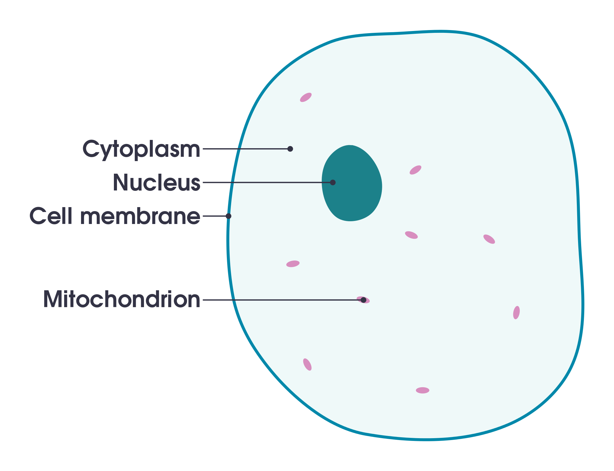
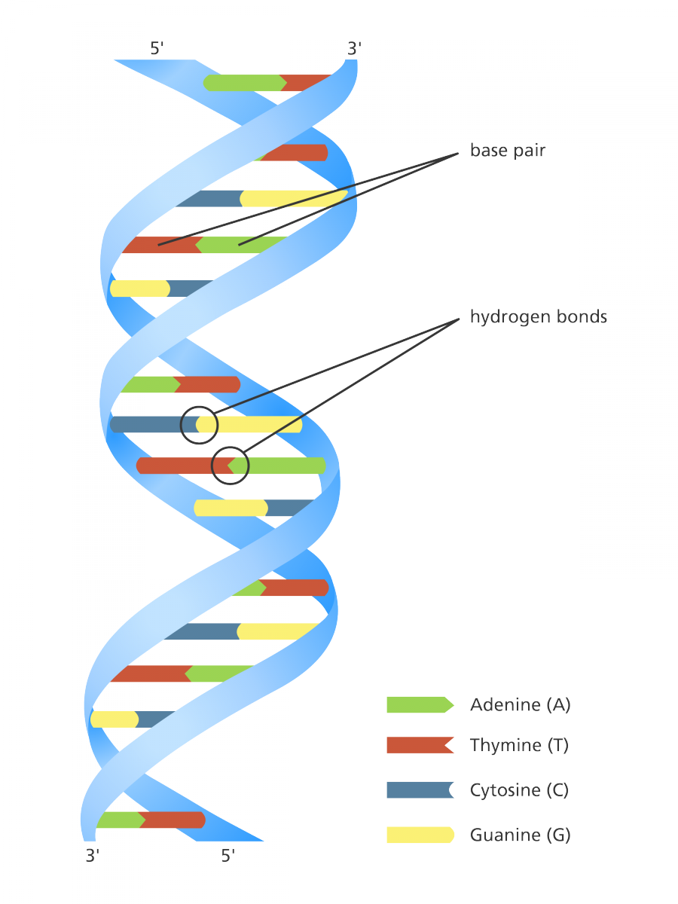
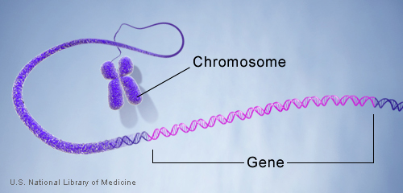
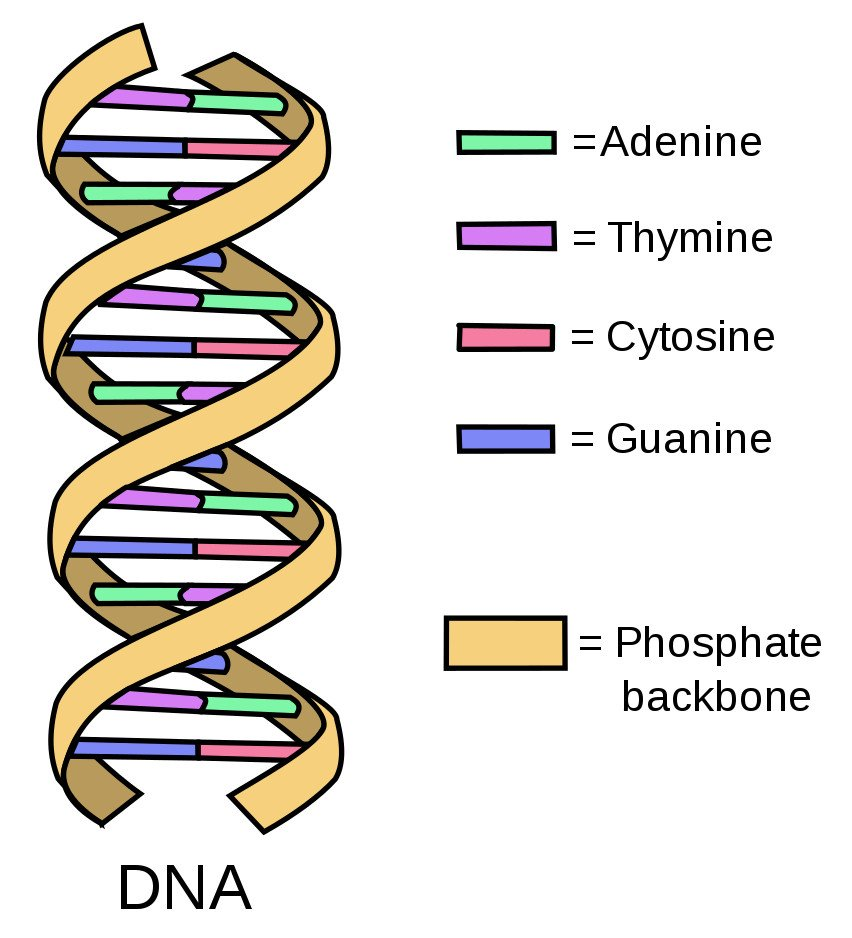

# Learning Outcomes

- Understand the relationship between cells, nuclei, chromosomes, genes, alleles and DNA.
- Understand the role DNA plays in carrying instructions to the next generation and determining phenotype.

---

Think, pair and share what do you know about __DNA__, __genes__, __chromosomes__, __cells__, __nucleus__, __organisms__ and can you put them in order of magnitude?

---

## What are we made of?

Organisms are made of cells, each cell contains a nucleus, the nucleus contains chromosomes made up of DNA, and DNA contains many genes.

{width=60%}

---

### Cells

All organisms on Earth are made of one or more cells

{width=50%}

---

### Nucleus

Inside each cell is a nucleus. The nucleus holds genome of the cell in the form of chromosomes.

---

### Chromosomes

Chromosomes are located inside the nucleus and are made up of long chains of DNA.
Humans have 23 pairs of chromosomes, giving us 46 in total!

{width=40%}

---

### Deoxyribonucleic Acid (DNA)

DNA is a very long chain of _base pairs_ which forms chromosomes.

{width=50%}

---

### Genes

A gene is a small segment of DNA made of _base pairs_ and are what determine everything about us! Each chromosome carries __many__ genes. Humans have around 25000 genes. That is a lot of genes per chromosome!

{width=50%}

---

### Alleles

Each gene has two __alleles__, one __allele__ comes from each parent. E.g. brown hair from mum, blonde from dad.

---

### Starter: Review!

Discuss with the people around you and create a diagram relating cells, nuclei, DNA, chromosomes, DNA and alleles to each other. Try and do it without using your notes (but look if you need to!).

---

## Allele

A gene has two alleles: one from each parent. The allele is on a chromosome and we call two chromosomes of the same shape a __homologous pair__.

---

### Homozygous and Heterozygous

If you have two of the same allele (e.g. brown and brown) this is _homozygous_. If you have different alleles (e.g. brown and blue) this is _heterozygous_.

---

## Structure of DNA

:::notes
Adenine, cytosine, guanine, thymine. As with Ts and Gs with Cs.
:::

---

- We call this __complementary base pairing__.
- Which bases pair with which bases and what are they called? Label them on your diagram!

---

### Questions

Answer question 1 and 2 on page 9 of your sciPAD.

---

## Exercise: Building DNA!

on sciPAD pages 8-9, cut out the DNA pieces and build some DNA and stick it on the previous page!

Look to page 10 for a hint!
