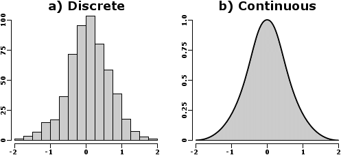
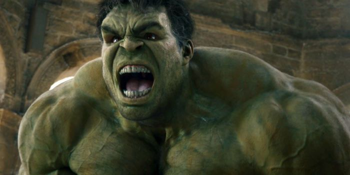
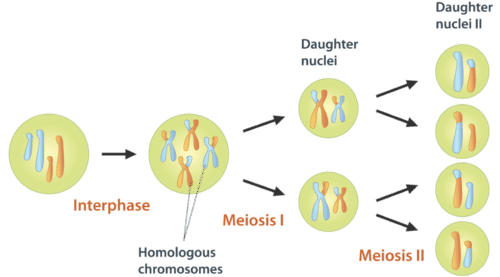

# Learning Outcomes

- Understand variation in terms of it being continuous or not continuous

---

1. Select one colour bead to represent the dominant allele and the other the recessive allele.
2. Place 20 (10 of each )two different colours into a beaker.
3. Take turns closing your eyes and picking two beads at random.
4. Write down what alleles you got and what colour eyes the offspring have.
5. Add your results to the board when you are done!

---

Eye colour is one way that we vary as humans. What are some other ways that we vary?

__Come write them on the board!__

---

## Continuous vs Discontinuous

- We can split variation up into two different groups. Continuous and discontinuous.
- Continuous implies that it exists on a smooth continuum.
- Discontinuous distributions are split into distinct groups.

---

{width=80%}

---

### Split our example traits from earlier into continuous and discontinuous groups.

---

### Experiment: sciPAD Page 50

---

## Where Does Variation Come From?

There are four main sources of variation that we are interested in:

- Mutation
- Sexual reproduction
- Fertilisation
- Environment

---

### Mutation

- Random changes in the base sequence of DNA that may result in a new allele forming.
- Many things can cause mutations: think radiation (e.g. UV & skin cancer)

{width=40%}

---

### Sexual Reproduction

- Our bodies produce our sex cells (sperm and ova) through a process called _meiosis_. It results in unique combinations of alleles over time.

---

### Fertilisation

- When sperm and ova meet there it is essentially random which ones meet. There are millions of sperm which might meet the ova, so there is a lot of variation created.

---

### Environment

- In some organisms the environment alters the expression of a genotype. Food and nutrient availability, competition, light intensity and disease may modify an expected phenotype.

---

## Meiosis

- Meiosis is the process through which your body produces gametes (sex cells). These are sperm and ova in humans.
- It has a few key differences from __mitosis__: it produces four daughter cells, the cells are unique, and the cells contain half the original number of chromosomes (haploid).

---

{width=100%}

---

- Read page 55 and complete page 55, 56 and 57.
- Read page 58 and complete page 58.

