## Starter

1. Write down the symbol for: __alpha particle__, __beta particle__, and __gamma radiation__ if you know.
2. Describe what an alpha particle consists of.
3. Describe what a beta particle is.

---

## What is a nuclear reaction?

- It is not a physical reaction
- It is not a chemical reaction
- It is a reaction where there is __a change or rearrangement of the nucleons__ in a nucleus

---

Is it possible to turn copper into gold?

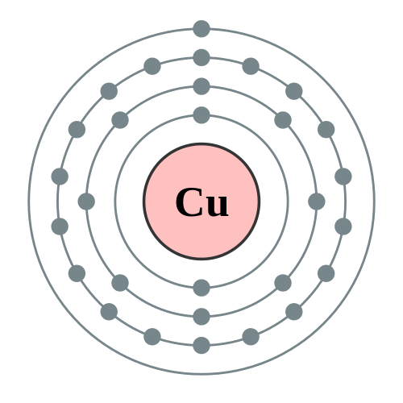{width=20%}

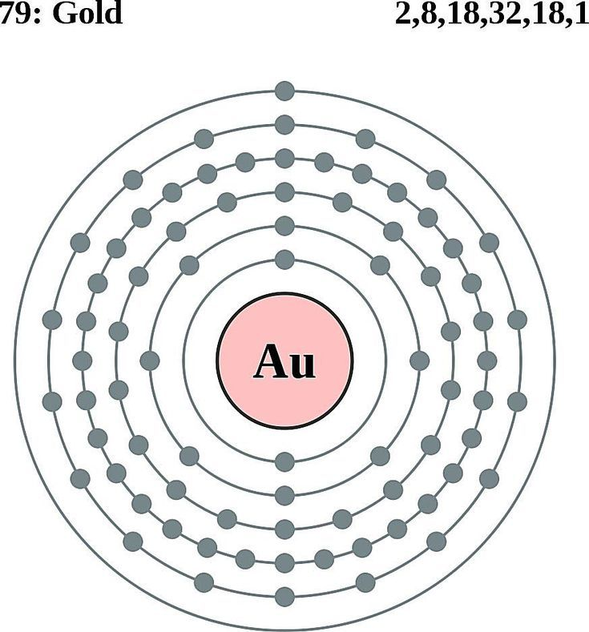{width=20%}

---

## Three Types of Nuclear Reactions

1. Radioactive decay (alpha, beta, gamma emission)
2. Fusion reaction
3. Fission reaction

---

### Radioactive Decay

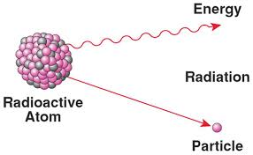{width=60%}

---

Polonium-211

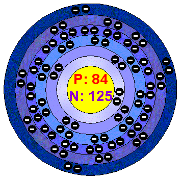{width=60%}

---

Polonium-211 is an unstable isotope and goes through __alpha decay__ to become a more stable lead-207 isotope. It does this by emitting an alpha particle and energy.

---

## Alpha Particle

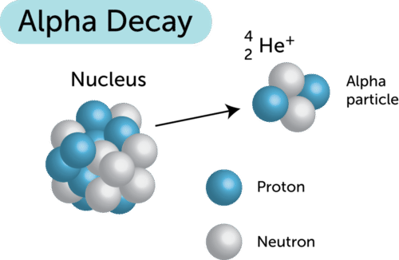{width=70%}

---

### Alpha Radiation ($\alpha$)

- Helium nuclei (positively charged)
- Made up of two protons and two neutrons
- Slow moving (up to 10% speed of light)
- Short range (up to a few cm)

---

- Least penetration ability (stopped by a sheet of paper)
- Greatest ionizing ability (cause serious harm when ingested)

---

Hydrogen-3

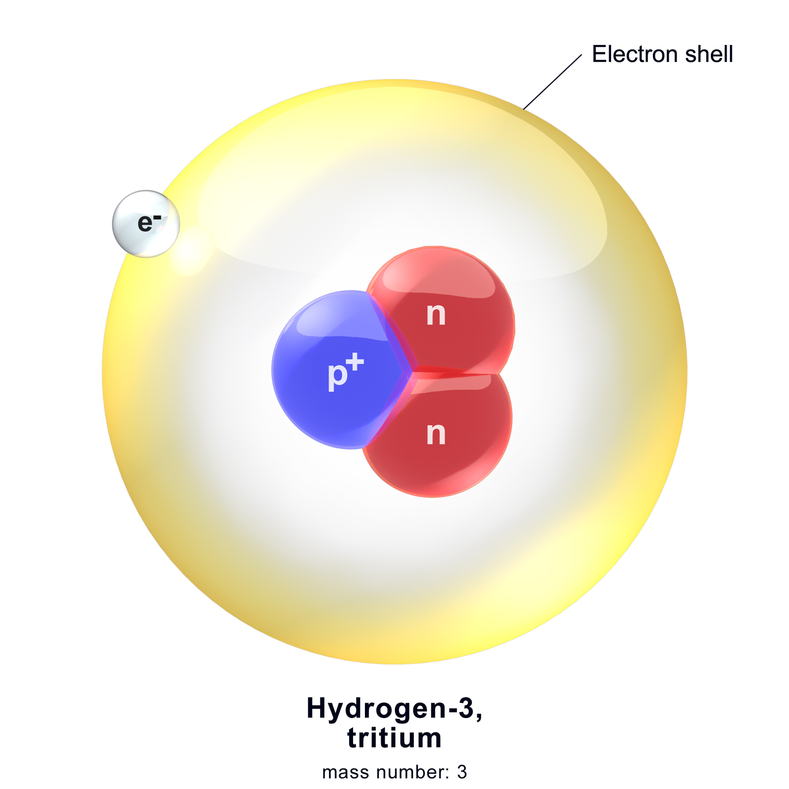{width=70%}

---

Hydrogen-3 goes through beta decay to become a more stable helium-3 atom. It does this by emitting beta particles.

---

### Beta Radiation ($\beta$)

- High-energy electron (negative charge)
- When emitted, a neutron decays into a proton inside the nucleus
- Can travel up to 90% the speed of light

---

- Medium range: about 30cm
- Medium penetration: can be stopped by a sheet of aluminium about 5mm thick

---

### Gamma Radiation ($\gamma$)

- Electromagnetic radiation with very high energy
- Occurs as a result of a nucleus being left in a very excited state after undergoing other types of radioactivity
- Fast moving, travels at the speed of light

---

- Has greatest penetration ability: can penetrate through several centimetres of lead
- Has least ionizing ability

---

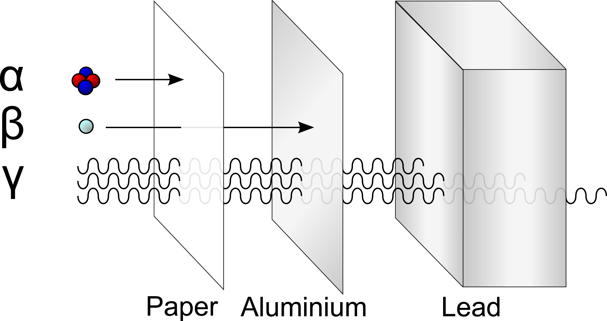{width=70%}

---

What would happen to each radiation type as it enters a magnetic field (coming out of the page) travelling from the left?

---

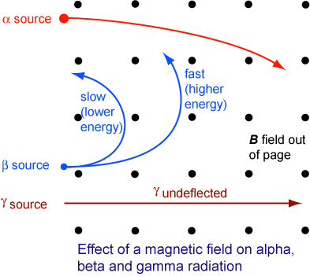{width=70%}

---

## Starter

1. List the three types of radioactive decay and how damaging the products of each decay can be
2. Give examples of the kind of protection that would need to have for each type of radiation
3. How would each type of radiation be affected when moving right to left in a magnetic field going into the page?

---

<iframe width="646" height="363" src="https://www.youtube.com/embed/TJgc28csgV0" frameborder="0" allow="accelerometer; autoplay; encrypted-media; gyroscope; picture-in-picture" allowfullscreen></iframe>

---

Recall: Alpha Radiation

{width=80%}

---

Recall: Beta Radiation

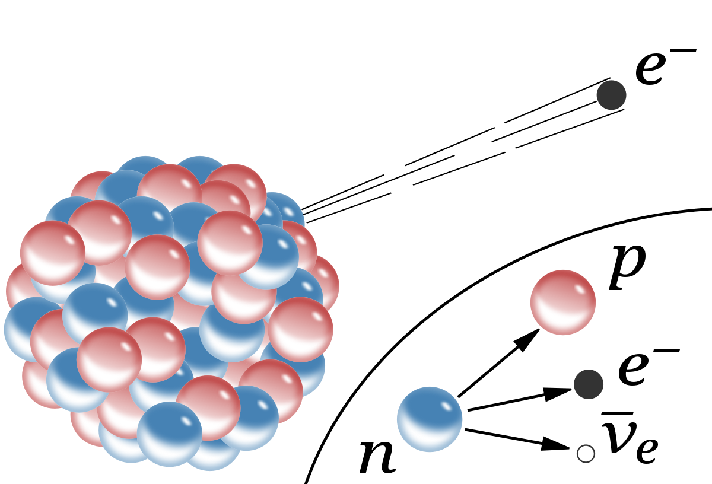{width=80%}

----

Recall: Gamma Decay

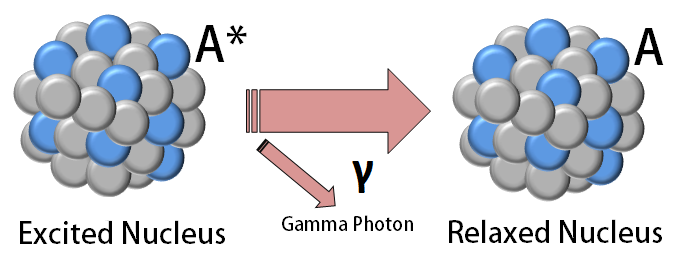{width=80%}

---

## Question: What is nuclear radiation/materials used for?

---

### Nuclear Bombs

They work through nuclear fission or fusion of such materials as plutonium and uranium.

---

### Nuclear Reactors

Our current nuclear power reactors utilise nuclear fission of plutonium to create energy. Unfortunately they also produce radioactive by-products which are hard to dispose of in a safe way.

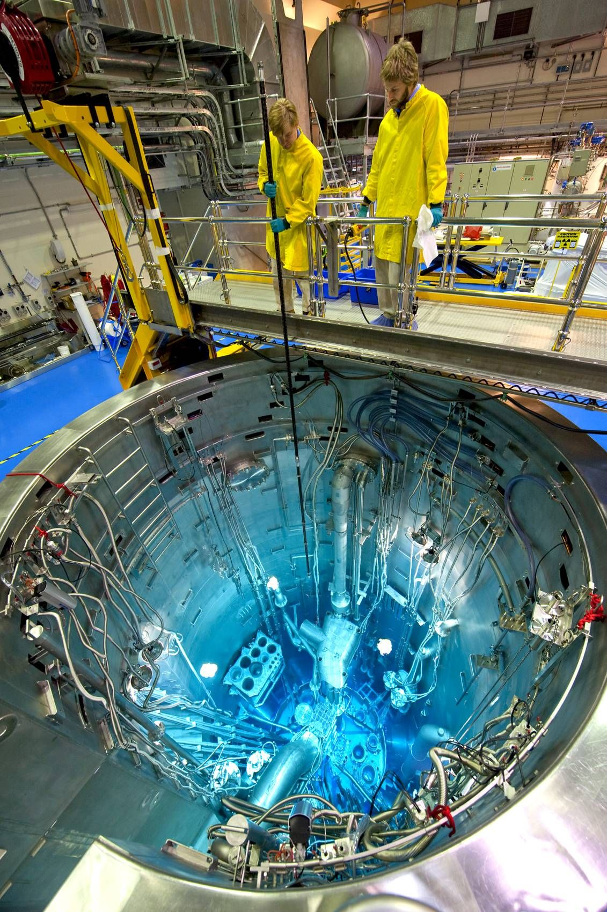{width=30%}

---

### Steralisation

It can also be used to steralise a variety of medical instruments and food.

---

### Tracers

It can also be used in medical imaging and tracers to follow the path of materials through an ecosystem.

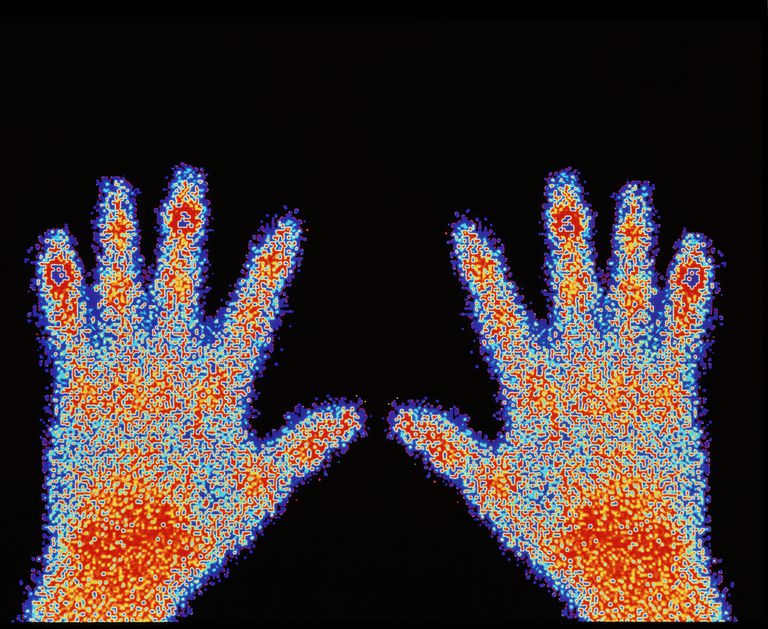{width=50%}

---

### Smoke Detectors

Inside an ionisation chamber, americium-241 decays through alpha decay. The alpha particles collide with the air molecules causing them to become ionized. Because they are now charged, current can be carried between the two plates inside the chamber.

Smoke particles interact with the ionized particles causing them to lose their charge, and therefore cause the current to decrease and the alarm to go off.

---

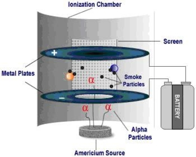{width=80%}

---

<iframe width="646" height="363" src="https://www.youtube.com/embed/SHZAaGidUbg" frameborder="0" allow="accelerometer; autoplay; encrypted-media; gyroscope; picture-in-picture" allowfullscreen></iframe>

## Homework (Due Friday, marked and corrected)

- Worksheets 1, 2 and left half of 3
- Homework Booklet: Atom Models 2004 Q1, 2005 Q2
- Homework Booklet: Radioactivity Q1, 3, 4, 5, 6

---
