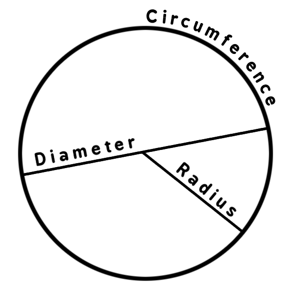
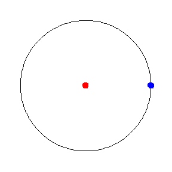
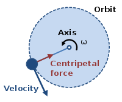
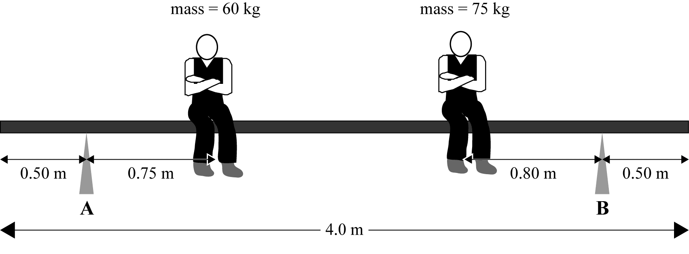

---

# Mahi Tuatahi

Aaron is painting the outside of his house. He is standing on a 3.5m long plank with a support at each end. The plank weighs 4.8kg. He is standing 0.8m from the left side and he weighs 63kg.

1. Draw a diagram to illustrate the situation
2. Calculate the support force provided by Support A (left) and Support B (right).

---

# Circular Motion

The motion of an object moving in a circular path.

e.g. Satellites in orbit, car driving around a corner, discus thrower, cricket bowler.

---

# Circles

\begin{align*}
    & Center \newline
    & Radius = r \newline
    & Diameter = d \newline
    & Circumference = 2\pi r \newline
    & Period = T \newline
    & Frequency = f \newline
    & Speed = v \newline
    & v = \frac{2\pi r}{T} \newline
\end{align*}

---

# Question

If the radius is 2m, find:

1. Circumference,
2. period,
3. frequency
4. and speed

---

# Question

Is speed constant?

Is velocity constant?

---

# Centripetal Acceleration

An object undergoing circular motion is always changing its direction towards the center of the circle.

Therefore, beacuse the direction is changing, the velocity is changing. Therefore the object is always accelerating, even if its speed is constant.

---

# Centripetal Acceleration

\begin{align*}
    & a_{c} = \frac{v^{2}}{r} \newline
\end{align*}

\begin{align*}
    & v = \frac{2 \pi r}{T} \newline
\end{align*}

---

# Okay, but what causes the centripetal acceleration?

Newton's Laws of Motion tell us that __an acceleration is always caused by an unbalanced forced (net force).__

Therefore, centripetal acceleration is caused by an unbalanced force which continuously pulls the object towards the center. __Centripetal force__.

---

# Centripetal Force

\begin{align*}
    & F_{c} = \frac{mv^{2}}{r}
\end{align*}

Centripetal force acts inwards towards the center of the circle, while the velocity acts along a tangent to the circle at all times.

---

## Question

Mathieu is swinging a bucket of water above his head. It weighs, 8kg and has a horizontal speed of $4ms^{-1}$ in a circle of radius 1m.

Calculate the force required to keep the ball moving in a circle.

---

# Mahi Tuatahi

The plank weighs 22kg and is in equilibrium.

1. Draw labelled arrows showing the forces acting upon the plank.
2. Calculate the support force of __Support A__. Use $g=10ms^{-2}$.

__Note:__ The plank's weight force acts through its center of mass, therefore the overhanging plank does not matter, other than to reduce the length of certain measurements.

---

# Question

During a hammer throw, a 7kg steel ball is swung horizontally with a speed of $10ms^{-1}$ in a circle of radius 2m.

Calculate the force required to keep the ball moving in a circle.

---

# Answer 

\begin{align*}
    & F = \frac{mv^{2}}{r} \newline
    & F = \frac{7 \times 10^{2}}{2} \newline
    & F = \text{350N inwards}
\end{align*}
