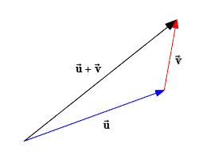
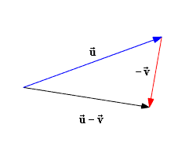

## Mahi Tuatahi

Mr LeSueur is cycling at a speed of $4ms^{-1}$ and starts to accelerate. If he accelerates at $3ms^{-2}$, how long will it take for him to reach a speed of $12ms^{-1}$?

---

## Scalar Quantities vs Vector Quantities

Think about and discuss the similarities and differences between these two situations:

- Mr Chu puts 40 apples inside a box, except Miss Nam eats two of them. What is the total number of apples inside the box?
- Mrs Carpenter lifts a plant off her desk with a force of $15N$ in the upwards direction, while the plant has a weight force of $5N$ acting down. What is the total force applied on the plant?

---

<iframe width="1680" height="762" src="https://www.youtube.com/embed/A05n32Bl0aY" frameborder="0" allow="accelerometer; autoplay; encrypted-media; gyroscope; picture-in-picture" allowfullscreen></iframe>

---

- __Scalar__ = size only
- __Vector__ = size + direction

---

## Distance vs Displacement

Ella drives to Sumner beach in the weekend because it is far too hot. She drives $5km$ south and $10km$ west to get there.

- What is the total distance travelled by Ella?
- What is the total displacement of Ella?

---

- __Distance__ is scalar because it only involves the __size__ and not the direction.
- __Displacement__ is a __vector__ quantity because it involves both __size and direction__.

---

### Scalar or Vector?

- Distance
- Displacement
- Speed
- Velocity
- Acceleration

---

- Energy
- Force
- Temperature
- Mass
- Work

---

- Power
- Momentum

---

When dealing with problems which involve vector quantities (e.g. calculating velocity, force, etc.), you must consider the size and direction.

Which means: __YOU MUST USE VECTOR CALCULATIONS  and/or VECTOR DIAGRAMS.__

---

A car is driven 3 km east for 200 seconds,  then 4 km south for 250 seconds, then 3 km west for 150 seconds.

1. What is the total distance the car has travelled?
2. What is the total displacement of the car?
3. What is the average speed of the car?
4. What is the average velocity of the car?

---

### Textbook Activity 8A

---

## Mahi Tuatahi

1. A bird flies $3km$ to the est and then $4km$ to the south. Find the resultant __displacement__ of the bird.
2. The bird takes $35min$ to complete the flight. Calculate its average __speed__ and __velocity__ in meters per second.

---

## Vectors

- Have both __direction__ and __magnitude__
- Drawn as an arrow
- Drawn with a ruler
- Drawn to scale (on a grid, typically)

---

- Drawn head-to-tail
- Can be added an subtracted
- Use pythagoras and SOH CAH TOA to find values

---

### Vector Addition

To add vectors, we simply draw a the next vector from the _arrowhead_ of the previous one.

---

### Vector Subtraction

Think about acceleration: acceleration is in the position direction while deceleration is in the negative direction.

Alternatively we can call this, negative and positive acceleration. All the __negative__ sign does is change the direction. This is the same with vectors.

---

This works because of algebra:

\begin{align*}
    & a - b = a + -b \newline
\end{align*}

---

## Vectors with $\Delta$

Velocity is a vector and a change ($\Delta$) is calculated like this: 

\begin{align*}
    & \Delta v = v_{f} - v_{i} \newline
\end{align*}

Can we turn this into __vector addition__?

---

### $\Delta$ v

\begin{align*}
    & \Delta v = v_{f} - v_{i} \newline
    & \Delta v = v_{f} + (-v_{i}) \newline
\end{align*}

What does making negative $v_{i}$ do to the vector?

:::notes
It mirrors its direction.
:::

---

#### Example

A soccer ball collides with the crossbar of a goalpost at $5ms^{-1}$. It rebounds at $4ms^{-1}$ in the opposite direction away from the crossbar. Determine the ball's change in velocity.

---

## Vector Components

Similarly to how we create a _resultant vector_ from two vectors, we can decompose a vector into its horizontal and vertical components. We use SOH CAH TOA to do this!

---

Take two minutes and find an equation for the horizontal component of the triangle using the hypotenuse and the angle.

---

To find the horizontal component:

\begin{align*}
    & a = \frac{o}{tan(\theta)} \newline
\end{align*}

---

Take two minutes and find an equation for the vertical component of the triangle using the hypotenuse and the angle.

---

To find the horizontal component:

\begin{align*}
    & o = a \times tan(\theta) \newline
\end{align*}
