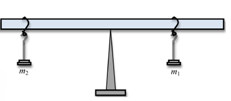
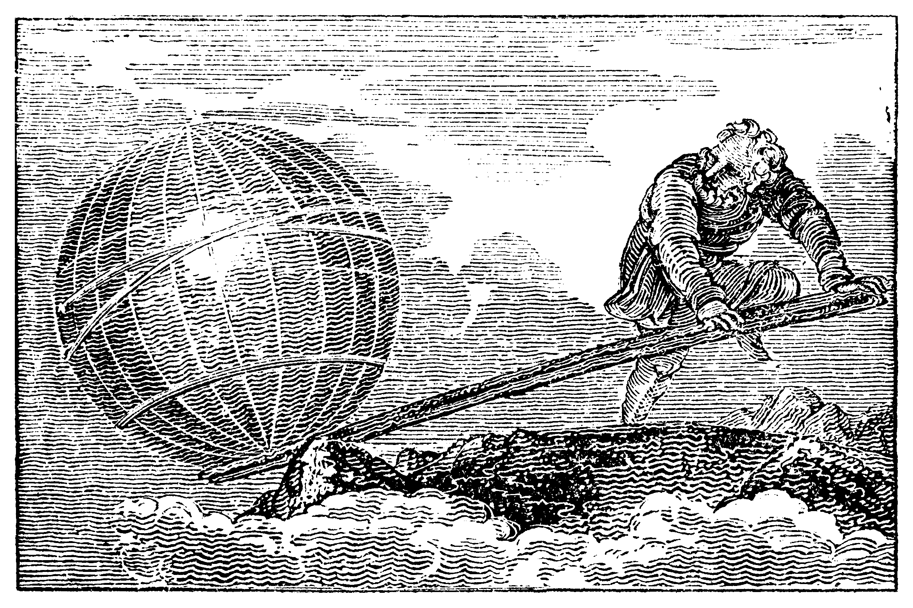

---

# Mahi Tuatahi

\begin{equation}
    F=ma
\end{equation}

1. State what each letter stands for
2. Give the units for each letter
3. Rearrange the equation for $m$ and $a$
4. Derive the SI units for F (not Newtons)

---

For a car of __mass 1500kg__ which is accelerating at $3.7ms^{-2}$:

1. What net force is needed to maintain this acceleration?
2. If the engine is producing $6000N$ of thrust, what is the difference and what happened to it?

---

# Torque ($\tau$)

Torque can be thought of as the __turning effect__ around a __pivot__.
Torque is sometimes known as __moment__ or __leverage__.

\begin{equation}
    \tau = Fd_{\bot} \\\\
    torque = Newtons \times metres \\\\
    torque = \text{Newton meters (Nm)}
\end{equation}

\begin{equation}
    F = \text{force in Newtons} \\\\
    d_{\bot} = \text{perpendicular distance of force from pivot}
\end{equation}

---

# Torque ($\tau$)

- A small force at a small distance produces a small torque,
- the same small force at a larger distance produces a larger torque.

{ width=50% }

---

# Question 1

A force of 9N acting up at a distance of 10cm is needed to lift the top off a bottle of soft drink. __Calculate the torque applied.__

---

# Question 1: Answer

A force of 9N acting up at a distance of 10cm is needed to lift the top off a bottle of soft drink. __Calculate the torque applied.__

\begin{align*}
    & \tau = Fd_{\bot} \\\\
    & \tau = 9 \times 0.1 \\\\
    & \tau = 0.9 \text{Nm anticlockwise} \\\\
\end{align*}

---

# Question 2

Calculate the torque applied if the lever is stretched to 75cm.

---

# Question 2: Answer

Calculate the torque applied if the lever is stretched to 75cm.

\begin{align*}
    & \tau = Fd_{\bot} \\\\
    & \tau = 9 \times 0.75 \\\\
    & \tau = 6.75 \text{Nm anticlockwise} \\\\
\end{align*}

---

# Question 3

Calculate the torque applied if the lever is compressed to 1cm.

---

# Question 3: Answer

Calculate the torque applied if the lever is compressed to 1cm.

\begin{align*}
    & \tau = Fd_{\bot} \\\\
    & \tau = 9 \times 0.01 \\\\
    & \tau = 0.09 \text{Nm anticlockwise} \\\\
\end{align*}

---

{ width=50% }

---

# Question 4: Does torque have a direction?

Yes, and you must always state which direction it is acting in.

__Clockwise or Anticlockwise__

---

# Torque & Equilibrium

{ width=75% }

---

# But, What Is Equilibrium?

_Newton's First Law_ tells us equilibrium is when an object is __at rest__ or __moving uniformly__.

For this to occur we need two things:

1. Sum of all forces to be 0
2. Sum of all torques to be 0

---

# Okay, So Where Do We Use It?

Building bridges, setting up scaffolding, see-saws and more!

---

# Question 1
{ width=50% }

$m_{1}=2kg$, $d_{1}=15cm$, $m_{2}=1kg$, $d_{2}=30cm$

1. Calculate the clockwise and anticlockwise torques
2. Are they in balance?

---

# Question 2
{ width=50% }

$m_{1}=7kg$, $d_{1}=65cm$, $m_{2}=13kg$, $d_{2}=35cm$

1. Calculate the clockwise and anticlockwise torques
2. Are they in balance?

---

# Question 3
{ width=50% }

The rock has mass $1100kg$ and is at distance $50cm$ from the pivot. If Ash exerts $70N$ of downward force at a distance of $8m$ from the pivot can he move the rock?

---

Archimedes once said: _"Give me a place to stand and I will move the world"_

__Question__: Assuming the mass of the Earth is $5.972\times 10^{24} kg$ at a distance of 1km from the pivot and Archimedes' mass is $75kg$, how long would his lever have to be?

{ width=50% }

---

# Mahi Tuatahi

{ width=50% }

1. Calculate the clockwise torque
2. Calculate the anticlockwise torque
3. Is it balanced?

---

# Torque & Equilibrium

The plank may not be massless. You may need to take it into account.

{ width=50% }

- The mass of the plank acts through its __center of gravity__
- Because the plank is uniform, this is the middle of the plank

---

# How To Solve A Torque Problem

1. Draw and label all forces on a diagram
2. Draw and label the distances between all forces and the __pivot__
3. Calculate all clockwise torque
4. Calculate all anticlockwise torque
5. Balance torques & forces

---

# Question

{ width=50% }

$d_{1}=30cm$, $d_{2}=70cm$, $m_{1}=900g$, $m_{2}=300g$, seesaw mass = $100g$.

1. Calculate the total anticlockwise moment
2. Calculate the total clockwise moment
3. Is it balanced?

