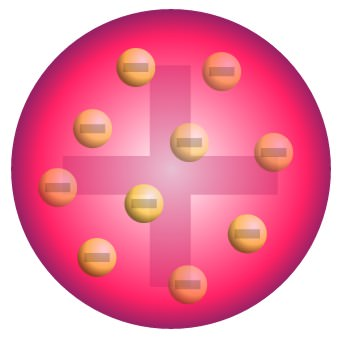
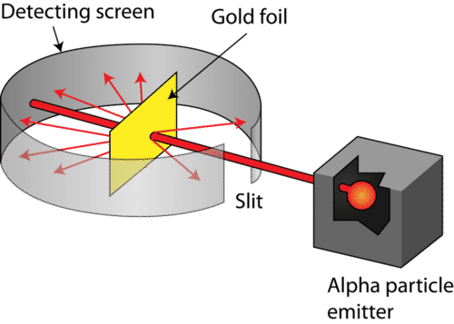
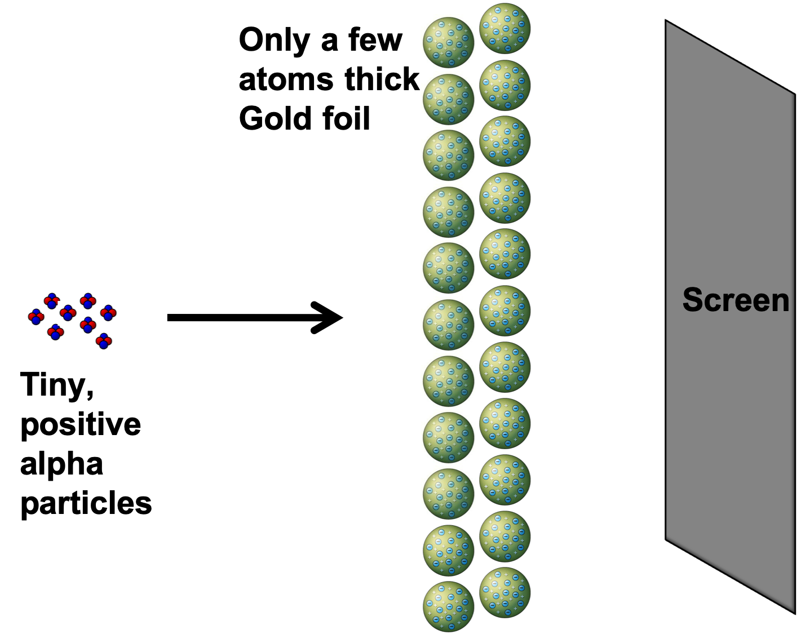
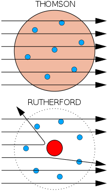

## Akoranga 2 Mahi Tuatahi

1. Put the date in your book
2. Define the following: __atomic number__, __mass number__, __nucleons__, __isotopes__.
3. Use a periodic table to find out the number of protons, electrons and neutrons in an __aluminium atom__.

---

## Te Whāinga Ako

- Understand the history and process of how we came to our current atomic model

---

<iframe width="1309" height="745" src="https://www.youtube.com/embed/xazQRcSCRaY" frameborder="0" allow="accelerometer; autoplay; clipboard-write; encrypted-media; gyroscope; picture-in-picture" allowfullscreen></iframe>

---

## John Dalton (1766 - 1844)

- An English chemist who revived the ancient Greek’s idea of matter and proposed the following:
- “All matter is made up of atoms. Atoms are the smallest particles of matter and cannot be broken down into smaller units”
- The Greek word _atomos_ means indivisible

---

## Joseph Thomson (1856–1940)

- A British physicist who discovered and experimented with cathode rays. It was found that these rays consisted of what are later called electrons by Thomson.
- “An atom is a ball of positive charge with electrons dotted evenly through it like currants in a plum pudding. Overall, the atom is neutral”.

---

---

## Rutherford's Atomic Structure

- The central region is called the nucleus. It is made up of protons and neutrons which are strongly bound together by nuclear force.
- Protons and neutrons are called nucleons.
- Electrons are constantly moving around the nucleus in a probabilistic way.

---

- Protons have positive charge, electrons have negative charge and neutrons are neutral.
- The nucleus is very small compare to the size of the whole atom, but has 99.95% of the mass (because electrons are very light).

---

## Ernest Rutherford (1871-1937)

- This New Zealand physicist attempted to prove Thomson’s model of the atom was correct and designed a whakamātau.

---

### Gold Foil Whakamātau

---

---

---

#### The Results

- Most alpha particles went straight through the foil
    - The atom consists of mostly empty space
- A few particles were deflected
    - There is a charged mass within the nucleus
- Very few bounded back or were deflected at large angles
    - The charged mass is very small
    - The charged mass is very dense

---

1. The atom consists of mostly empty space

- Most alpha particles were found to go straight through the foil, therefore indicating that most of the atom is empty.

---

2. There is a charged mass within the nucleus

- Some alpha particles experienced a small angle of deflection indicating that they did not impact it, but rather were deflected through repulsion of charges.

---

3. The charged mass is very small

- Very few alpha particles were deflected meaning that the charged mass is very small.

---

4. The charged mass is very dense

- Those alpha particles that impacted the mass could be bounced off at a very large angle indicating that is has a mass much greater than the alpha particles.

---

## James Chadwick (1891-1974)

- In 1932, he performed a whakamātau to discover the third type of sub-atomic particle that is not deflected by an electric or magnetic field – the “neutron”.

---

## Akoranga 3 Mahi Tuatahi

1. Explain why the gold foil whakamātau had to be carried out in a vacuum.
2. Explain why it was necessary for the gold foil to be a few atoms thick.

---

## Whakatika Tahi

- If the alpha particles had not been travelling through vacuum, they would have been affected by the molecules in the air. Then the results (the deviation in the particles’ paths) would not be dependent only on the atoms of the gold foil.

---

## Whakatika Rua

- Rutherford was aiming to see how alpha particles would behave as they went through the foil. Alpha particles are stopped very easily. If the gold foil was thicker it would have stopped the particles completely and not let any to go through.

---

<iframe width="1136" height="639" src="https://www.youtube.com/embed/1EdTw4I6L0U" frameborder="0" allow="accelerometer; autoplay; clipboard-write; encrypted-media; gyroscope; picture-in-picture" allowfullscreen></iframe>

---

## Ngohe

1. Glue in your periodic table
2. Complete homework booklet Q2, Q4
