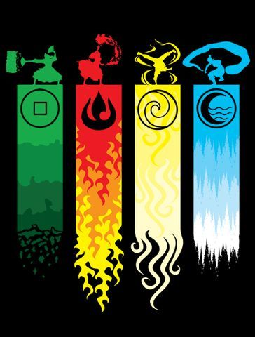
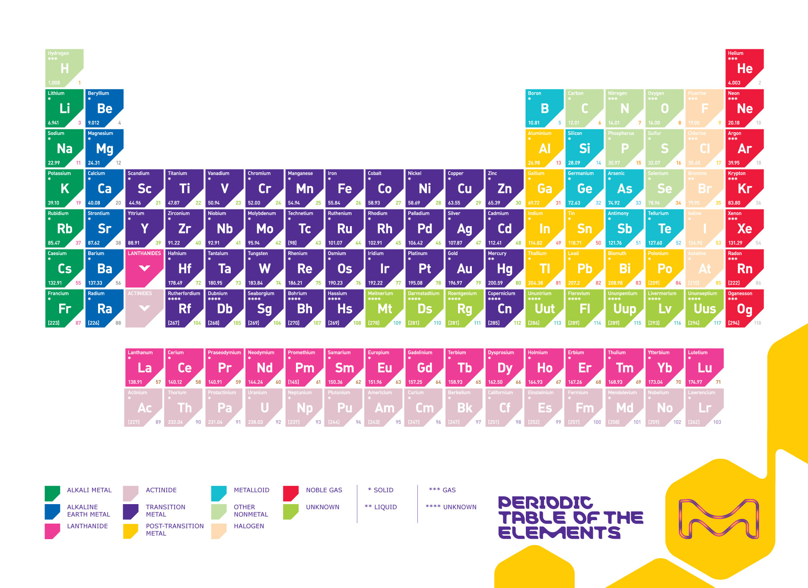
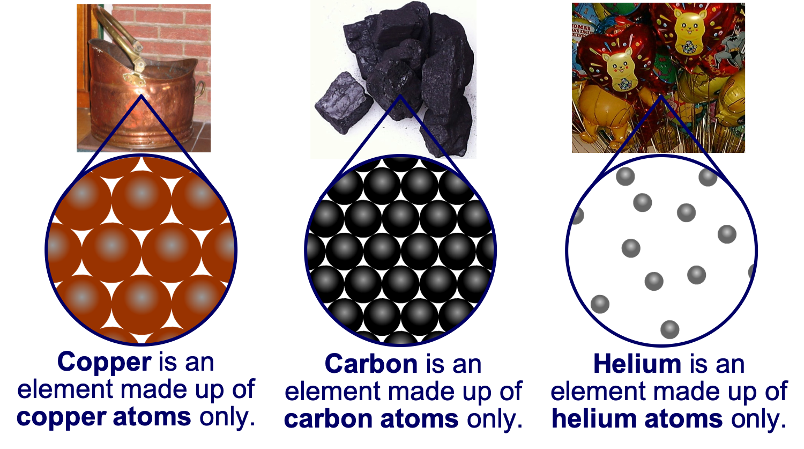

# The Assessment

- Internal
- 3 credits
- Assessed on Friday Week 2, Term 4

---

## Learning Outcomes

1. Learn about the structure of the atom
2. Learn about isotopes
3. Learn about other models of the atom

---

## Question: What is everything made up of?

- Elements!

---

<iframe width="1206" height="678" src="https://www.youtube.com/embed/d1EnW4kn1kg" frameborder="0" allow="accelerometer; autoplay; encrypted-media; gyroscope; picture-in-picture" allowfullscreen></iframe>

---

- Aristotle and the Greeks in 450BC thought that everything was made of water, earth, air and fire

---

In the modern day, we now know that everything is made up of about 119 elements.

{width=75%}

---

## Question: What makes the elements different from each other?

- The number of protons contained inside them

---

We know that each element is made up of a unique type atom

---

# Atoms

- Atoms are made of three subatomic particles.
- __Write their names, charges and a diagram of their location in your books__

---

## Rutherford's Atomic Structure

- The central region is called the nucleus. It is made up of protons and neutrons which are strongly bound together by nuclear force.
- Protons and neutrons are called nucleons.

---

- Electrons are constantly moving around the nucleus in a probabilistic way.
- Protons have positive charge, electrons have negative charge and neutrons are neutral.
- The nucleus is very small compare to the size of the whole atom, but has 99.95% of the mass (because electrons are very light).

---

](https://cdn.britannica.com/s:700x500/09/149209-050-CA687C2F/Bohr-model-nitrogen-atom.jpg)

---

## Pātai Tahi

Give the number of protons, neutrons, electrons and nucleons for __oxygen__, __sodium__, __aluminium__ and __copper__.

|           | Nucleons | Protons | Neutrons | Electrons |
|:----------|:---------|:--------|:---------|:----------|
| Oxygen    |          |         |          |           |
| Sodium    |          |         |          |           |
| Aluminium |          |         |          |           |
| Copper    |          |         |          |           |

---

### Whakatika Tahi

|           | Nucleons | Protons | Neutrons | Electrons |
|:----------|:---------|:--------|:---------|:----------|
| Oxygen    | 16       | 8       | 8        | 8         |
| Sodium    | 23       | 11      | 12       | 11        |
| Aluminium | 27       | 13      | 14       | 13        |
| Copper    | 64       | 29      | 35       | 29        |

---

## Atomic and Mass Numbers

- Atomic number = the number of protons
- Mass number = the number of nucleons (protons AND neutrons)
- The number of protons in an atom (i.e. the atomic number) defines which type of atom it is. (e.g. an atom that has 6 protons MUST be a carbon atom, and cannot be any other)

---

Now add the atomic and mass numbers to __oxygen__, __sodium__, __aluminium__ and __copper__.

|           | Nucleons | Protons | Neutrons | Electrons |
|:----------|:---------|:--------|:---------|:----------|
| Oxygen    | 16       | 8       | 8        | 8         |
| Sodium    | 23       | 11      | 12       | 11        |
| Aluminium | 27       | 13      | 14       | 13        |
| Copper    | 64       | 29      | 35       | 29        |

---

## Atoms vs Ions

- Every atom is neutral (has no overall charge). This is because they have the same number of protons and electrons. The positive charge of protons and the negative charge of electrons cancel each other out.

---

- However, an atom may lose (or gain) one or more electrons, in which case they become ‘ions’ – having a positive (or negative) charge. Losing or gaining electron(s) is called ionisation.
- Atoms are neutral, ions are charged.

](https://static-cdn.imageservice.cloud/3528258/igcse-chemistry-2017-140-draw-dot-and-cross-diagrams-to-show-the.jpg)

---

# Isotopes

- Isotopes are the atoms that have the same number of protons (i.e. same element) but different numbers of neutrons.
- They have the same atomic number but different mass numbers.
- e.g. Carbon-12, Carbon-13, Carbon-14
- (the numbers 12, 13, 14 are mass numbers)

---

## Pātai Rua

For Carbon-12, Carbon-13 and Carbon-14, give the number of protons, neutrons and electrons.

|           | Nucleons | Protons | Neutrons | Electrons |
|:----------|:---------|:--------|:---------|:----------|
| Carbon-12 |          |         |          |           |
| Carbon-13 |          |         |          |           |
| Carbon-14 |          |         |          |           |

---

### Whakatika Rua

For Carbon-12, Carbon-13 and Carbon-14, give the number of protons, neutrons and electrons.

|           | Nucleons | Protons | Neutrons | Electrons |
|:----------|:---------|:--------|:---------|:----------|
| Carbon-12 | 12       | 6       | 6        | 6         |
| Carbon-13 | 12       | 6       | 7        | 6         |
| Carbon-14 | 12       | 6       | 8        | 6         |
