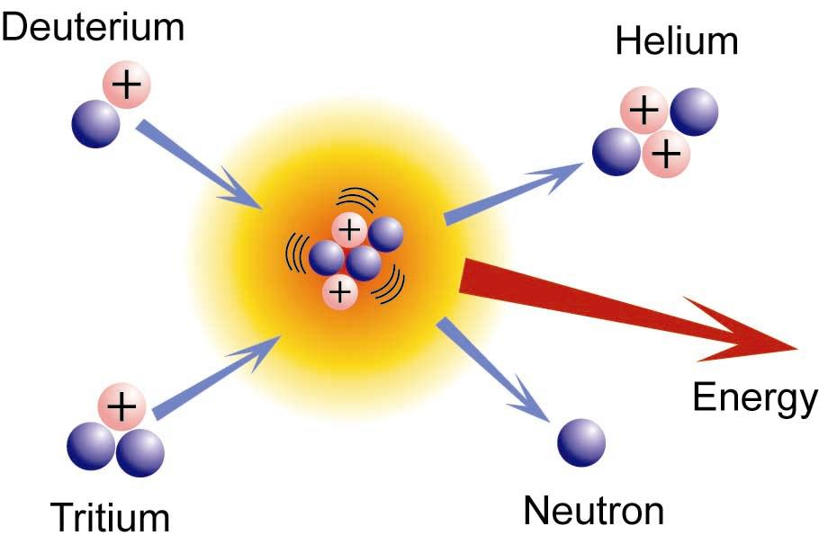
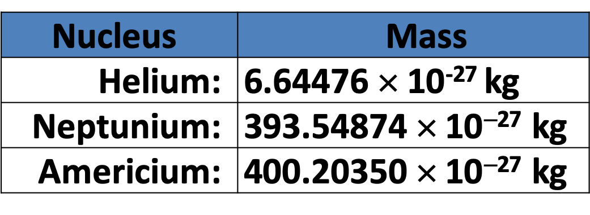
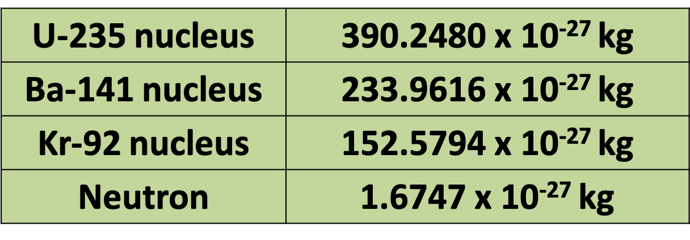

## Ngā Whāinga Ako

- Understand the difference between nuclear fission and fusion
- Use $E=mc^{2}$
- Use $P=\frac{E}{t}$

---

## Recall

There are three types of nuclear reactions

1. Radioactive decay ($\alpha$, $\beta$, $\gamma$)
2. Nuclear fission
3. Nuclear fusion

---

## Fission

{width=80%}

---

### Question

If the protons are positively charged, why don't they repel each other and the nucleus break apart?

{width=80%}

---

### Electrostatic Force vs. Nuclear Force

- When nucleons are extremely close together, a very strong force called the Nuclear Force comes into effect.
- It is the nuclear force that holds the nucleons together and is stronger than the electrostatic force/repulsion between the protons.

---

### Radioactive Isotopes

- Some isotopes, such as polonium-211, have unnaturally large numbers of nucleons in their nuclei.
- In these isotopes, the nuclear force holding the nucleons together is not enough to overcome the electrostatic repulsion between them (because there are too many) – making them _unstable_ or _radioactive_

---

### Absorption of a Nucleon

- If a fast moving nucleon can get extremely close to a nucleus of an atom, then the nuclear force will come into effect and it will be incorporated into the nucleus.
- This is however, much easier to do with a neutron because neutrons have no charge so they do not experience any electrostatic repulsion (i.e. will not be repelled by protons).

---

{width=80%}

---

## Nuclear Fusion

{width=70%}

\begin{align*}
    & {}^{3}_{1}H + {}^{2}_{1}H \rightarrow {}^{4}_{2}He + {}^{1}_{0}n
\end{align*}

---

\begin{align*}
    & {}^{3}_{1}H + {}^{2}_{1}H \rightarrow {}^{4}_{2}He + {}^{1}_{0}n
\end{align*}

- Tritium (${}^{3}_{1}H$) $= 5.00641 \times 10^{-27} kg$
- Deuterium (${}^{2}_{1}H$) $= 3.3436 \times 10^{-27} kg$
- Helium (${}^{4}_{2}He$) $= 6.64466 \times 10^{-27} kg$
- Neutron (${}^{1}_{0}n$) $= 1.67493 \times 10^{-27} kg$

1. Calculate the total mass of the reactants.
2. Calculate the total mass of the products.

---

## Theory of Relativity, $E = mc^{2}$

- Mass is a form of energy
- Mass can turn into energy and energy can turn into mass (in nuclear reactions).

---

During the fusion process, the total mass is not conserved because some of the mass of the fusing nuclei is converted to energy.

\begin{align*}
    & E = mc^{2}
\end{align*}

- $E =$ energy
- $m =$ mass
- $c =$ speed of light ($3\times10^{8}ms^{-1}$)

---

A type of smoke detector uses a radioactive material called Americium-241. When a nucleus of this material decays it emits an alpha particle.

1. Write down the nuclear equation for the alpha decay of a nucleus of Americium-241.
2. Calculate the quantity of energy released when a nucleus of Americium-241 decays.

{width=50%}

---

In a fission reaction, an U-235 nucleus combines with a neutron, then splits into a Ba-141 nucleus, a Kr-92 nucleus and three neutrons. It also emits gamma radiation.

1. Write down the nuclear equation
2. Calculate the amount of energy released

{width=60%}

---

## Tips for the Assessment

1. EXPLAIN your answers.
2. Watch out for the numbers NOT in standard forms (e.g. $\times 10^{-27}$)
3. Half-life – Draw a graph!!!
4. Nuclear Equations – double check the atomic numbers and the mass numbers
5. $E = mc^{2}$ – SHOW CLEAR WORKING

