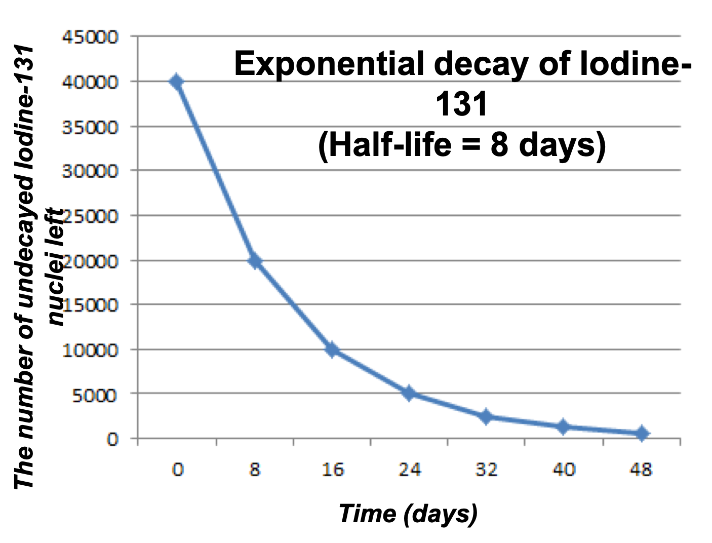
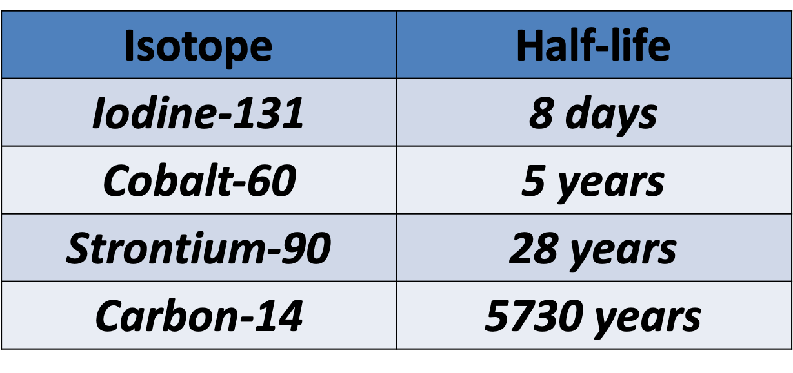

## Learning Outcomes

- Be able to make half-life graphs
- Be able to interpret half-life graphs

---

## Mahi Tuatahi

1. A Carbon-14 nucleus emits a beta particle, then the daughter nucleus also emits a beta particle immediately after. Write down a single nuclear equation for these reactions.
2. An Uranium-241 nucleus emits an alpha particle AND a beta particle. Write down the equation.
3. An atom of Carbon-11 absorbs a neutron. Write down the nuclear equation.

<aside class="notes">
	\begin{align*}
		{}^{14}_{6}C \rightarrow {}^{14}_{7}N + {}^{0}_{-1}\beta \\\\
		{}^{14}_{7}N \rightarrow {}^{14}_{8}O + {}^{0}_{-1}\beta
	\end{align*}

	\begin{align*}
		{}^{241}_{92}U \rightarrow {}^{237}_{87}Fr + {}^{4}_{2}\alpha + {}^{0}_{-1}\beta
	\end{align*}

	\begin{align*}
		{}^{11}_{6}C + {}^{0}_{1}n \rightarrow {}^{12}_{6}
	\end{align*}
</aside>

---

- It is impossible to predict when an unstable/radioactive atom will disintegrate (decay), because the actual timing of the decay is random.
- However, scientists have discovered that different radioactive materials disintegrate at different rates and; they disintegrate exponentially.
- Knowing this, we can predict the proportion of atoms which disintegrate in a particular time.

---

### Example

A small sample of a radioactive material iodine-131 has been observed for several days while it decayed into xenon-131.

- On the first day, the sample contained 40,000 iodine-131 nuclei.
- Eight days later, the sample only had 20,000 iodine-131 nuclei left.
- Another eight days later, the sample had 10,000 iodine-131 nuclei left.

---

{width=80%}

---

## Half-Life

- The half-life is the time taken for half of the undecayed atoms in a sample to decay.
- Radioactive materials have unique half-lives.

{width=60%}

---

The half-life of Hydrogen-3 is approximately 12.25 years. If you found a small sample of Tritium containing 5,000,000 undecayed nuclei, how many undecayed nuclei will there be after:

1. 12.25 years
2. 24.5 years
3. 49 years
4. 196 years

How long until there is less than 2500 undecayed nuclei left?

---

You found a $50 g$ sample of Cobalt-60. The half-life of Cobalt-60 is 5 years.
What would be the mass of the Cobalt-60 sample after 20 years?

1. Calculate how long it would take for the mass of the 50 g sample to fall just below $1.17 g$.
2. Sketch a mass vs. time graph of the Cobalt-60 sample over a 30-year period.
3. Use the graph to estimate the mass of the sample after 12.5 years.

---

## Homework (Due Friday, marked and corrected)

- Worksheets 1, 2 and left half of 3
- Homework Booklet: Atom Models 2004 Q1, 2005 Q2
- Homework Booklet: Radioactivity Q1, 3, 4, 5, 6
