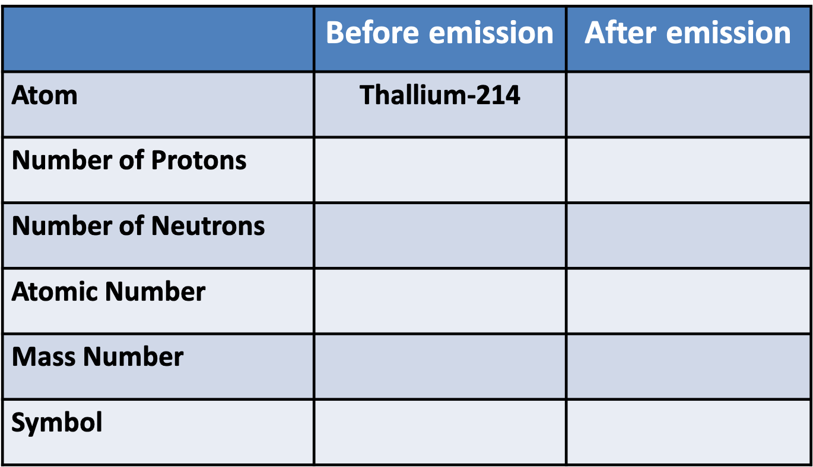

## Learning Outcomes

Be able to write equations for these nuclear reactions:

- Alpha decay/radiation/emission
- Beta decay/radiation/emission
- Gamma decay/radiation/emission

---

## Mahi Tuatahi

In alpha emission, the decaying atom loses 2 protons and 2 neutrons.

This means that the atomic number of the decaying atom is ________ by ________ and the mass number is ________ by ________.

---

{width=80%}

<aside class="notes">
    Fill out this table for alpha decay.
</aside>

---

{width=80%}

---

\begin{align*}
    & {}^{214}_{81}Tl \rightarrow {}^{210}_{79}Au + {}^{4}_{2}He \newline
    & {}^{214}_{81}Tl \rightarrow {}^{210}_{79}Au + {}^{4}_{2}\alpha \newline
\end{align*}

---

In a beta emission, a neutron turns into a proton and emits a high-speed electron.

This means that the atomic number of the decay atom is ________ by ________ and the mass number _____________.

---

{width=80%}

---

{width=80%}

---

\begin{align*}
    & {}^{218}_{84}Po \rightarrow {}^{218}_{85}At + {}^{0}_{-1}e \newline
    & {}^{218}_{84}Po \rightarrow {}^{218}_{85}At + {}^{0}_{-1}\beta \newline
\end{align*}

---

In a gamma emission, the decaying atom only loses energy, which means it has the same number of protons and neutrons afterwards.

---

{width=80%}

---

{width=80%}

---

\begin{align*}
    & {}^{201}_{79}Au \rightarrow {}^{201}_{79}Au + \gamma \newline
\end{align*}

---

Write down the equations for:

1. An alpha decay of Polonium-218
2. A beta decay of Hydrogen-3
3. A gamma decay of Carbon-14
4. An absorption of a neutron by Carbon-13

---

5. A double alpha decay of Uranium-234
6. A double alpha decay of Radon-222
7. A double beta decay of Thorium-234
8. A double beta decay of Bismuth-210

---
