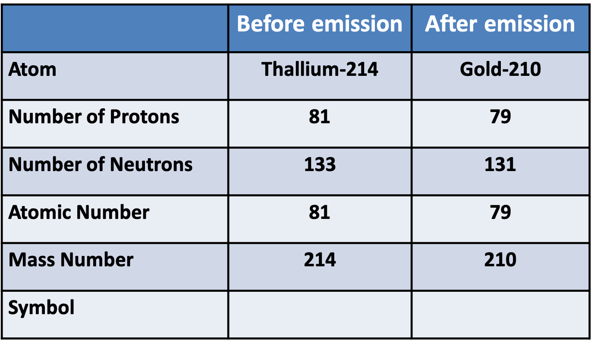
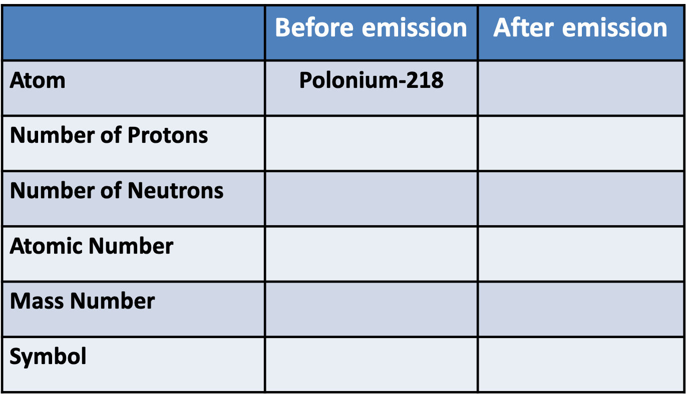
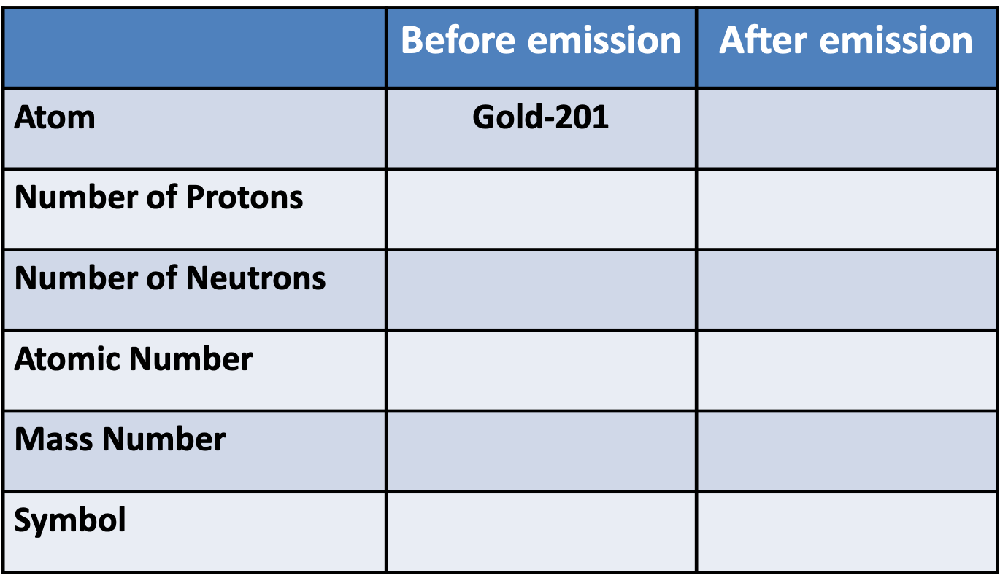

# Akoranga 6 Te Whāinga Ako

- Balance nuclear equations using the knowledge of the conservation of atomic and mass numbers.

Write the date and te whāinga ako in your books

---

## Alpha Decay

Complete this cloze

In alpha emission, the decaying atom loses 2 protons and 2 neutrons.

This means that the atomic number of the decaying atom is ________ by ________ and the mass number is ________ by ________.

---

### Pātai Tahi: Fill out this table for $\alpha$ decay

---

#### Whakatika Tahi

---

\begin{align*}
    & {}^{214}_{81}Tl \rightarrow {}^{210}_{79}Au + {}^{4}_{2}He \newline
    & {}^{214}_{81}Tl \rightarrow {}^{210}_{79}Au + {}^{4}_{2}\alpha \newline
\end{align*}

- The __mass number__ goes top left
- The __atomic number__ goes bottom left
- Use an arrow like in chemistry
- You can use either ${}^{4}_{2}He$ or ${}^{4}_{2}\alpha$

---

## Beta Decay

Complete this cloze

In a beta emission, a neutron turns into a proton and emits a high-speed electron.

This means that the atomic number of the decay atom is ________ by ________ and the mass number _____________.

---

### Pātai Rua: $\beta$ Decay

---

#### Whakatika Rua

---

### Pātai Toru: Write a nuclear equation

---

#### Whakatika Toru

\begin{align*}
    & {}^{218}_{84}Po \rightarrow {}^{218}_{85}At + {}^{0}_{-1}e \newline
    & {}^{218}_{84}Po \rightarrow {}^{218}_{85}At + {}^{0}_{-1}\beta \newline
\end{align*}

---

## Gamma Decay

Complete this cloze

In a gamma ($\gamma$) emission, the decaying atom only loses ________, which means it has the ________ number of protons and neutrons afterwards.

---

### Pātai Whā: Gamma Decay

---

#### Whakatika Whā

---

### Pātai Rimu: Write a nuclear equation

---

#### Whakatika Rimu

\begin{align*}
    & {}^{201}_{79}Au \rightarrow {}^{201}_{79}Au + \gamma \newline
\end{align*}

---

## Ngā Pātai: Write the following equations:

1. An alpha decay of Polonium-218
2. A beta decay of Hydrogen-3
3. A gamma decay of Carbon-14
4. An absorption of a neutron by Carbon-13

---

### Ngā Whakatika 1-4

\begin{align*}
    & {}^{218}_{84}Po \rightarrow {}^{214}_{82}Pb + {}^{4}_{2}He \newline
    & {}^{3}_{1}H \rightarrow {}^{3}_{2}He + {}^{0}_{-1}\beta \newline
    & {}^{14}_{6}C \rightarrow {}^{4}_{6}C + \gamma \newline
    & {}^{13}_{6}C + {}^{1}_{0}n \rightarrow {}^{14}_{6}C
\end{align*}

---

5. A double alpha decay of Uranium-234
6. A double alpha decay of Radon-222
7. A double beta decay of Thorium-234
8. A double beta decay of Bismuth-210

---

### Ngā Whakatika 5-8

\begin{align*}
    & {}^{234}_{92}U \rightarrow {}^{226}_{88}Ra + 2{}^{4}_{2}He \newline
    & {}^{222}_{88}Ra \rightarrow {}^{216}_{84}Po + 2{}^{4}_{2}He \newline
    & {}^{234}_{90}Th \rightarrow {}^{234}_{92}U + 2{}^{0}_{-1}\beta \newline
    & {}^{210}_{83}Bi \rightarrow {}^{210}_{85}At + 2{}^{0}_{-1}\beta
\end{align*}
