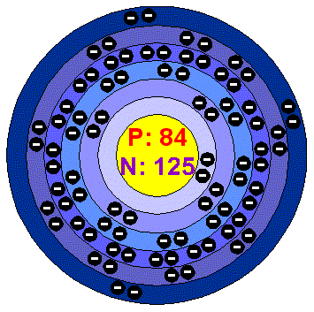
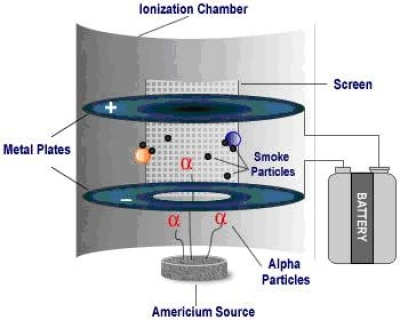

# Akoranga 4: Mahi Tuatahi

Is it possible to turn copper into gold? Discuss with the person next to you!

---

## Te Whāinga Ako

- Describe the three forms of radioactivity – Alpha, Beta and Gamma radiation.

---

## Pātai: What is a nuclear reaction?

- It is not a physical reaction
- It is not a chemical reaction
- It is a reaction where there is __a change or rearrangement of the nucleons__ in a nucleus

---

## Three Types of Nuclear Reactions

1. Radioactive decay (alpha, beta, gamma emission)
2. Fusion reaction
3. Fission reaction

---

### Radioactive Decay

---

### Pātai: But why?

- __Whakatika__: There is an electrostatic force pushing the nucleons apart, but the strong nuclear force is holding them together. When the electrostatic force overpowers the strong nuclear force, the atom breaks apart --> radioactive decay!
- This occurs because as the nucleus gets bigger, the strong nuclear force has to act over a larger volume and therefore exerts a weaker force!

---

Some principles apply!

- conservation of energy
- conservation of momentum (linear and angular)
- conservation of charge
- conservation of nucleon number

---

Polonium-211

---

Polonium-211 is an unstable isotope and goes through __alpha decay__ to become a more stable lead-207 isotope. It does this by emitting an alpha particle and energy.

---

## Alpha Particle

---

### Alpha Radiation

- Helium nuclei (positively charged), symbol $\alpha$
- Made up of two protons and two neutrons
- Slow moving (up to 10% speed of light)
- Short range (up to a few cm)

---

- Least penetration ability (stopped by a sheet of paper)
- Greatest ionizing ability (cause serious harm when ingested)

---

Hydrogen-3

---

Hydrogen-3 goes through beta decay to become a more stable helium-3 atom. It does this by emitting beta particles.

---

# Akoranga 5 Mahi Tuatahi

1. Write the date in your books
2. Try and remember, without using your books, what are three _things_ that are conserved during radioactive decay?

---

## Te Whāinga Ako

1. Describe the three forms of radioactivity – Alpha, Beta and Gamma radiation.

---

<iframe width="1280" height="720" src="https://www.youtube.com/embed/UtZw9jfIxXM" frameborder="0" allow="accelerometer; autoplay; clipboard-write; encrypted-media; gyroscope; picture-in-picture" allowfullscreen></iframe>

---

### Beta Radiation

- High-energy electron (negative charge), symbol $\beta$
- When emitted, a neutron decays (changes) into a proton inside the nucleus
- Can travel up to 90% the speed of light
- Medium range: about 30cm
- Medium penetration: can be stopped by a sheet of aluminium about 5mm thick

---

### Gamma Radiation

- Symbol $\gamma$
- Electromagnetic radiation with very high energy
- Occurs as a result of a nucleus being left in a very excited state after undergoing other types of radioactivity
- Fast moving, travels at the speed of light

---

- Has greatest penetration ability: can penetrate through several centimeters of lead
- Has the least ionizing ability

---

---

What would happen to each radiation type as it enters a magnetic field (coming out of the page) traveling from the left?

---

---

<iframe width="646" height="363" src="https://www.youtube.com/embed/TJgc28csgV0" frameborder="0" allow="accelerometer; autoplay; encrypted-media; gyroscope; picture-in-picture" allowfullscreen></iframe>

---

## Pātai: What is nuclear radiation/materials used for?

---

### Nuclear Reactors {.c2}

Our current nuclear power reactors utilise nuclear fission of plutonium to create energy. Unfortunately they also produce radioactive by-products which are hard to dispose of in a safe way.

---

### Steralisation {.c2}

It can also be used to steralise a variety of medical instruments and food.

](https://www.azernews.az/media/pictures/sterilization.jpg)

---

### Tracers {.c2}

It can also be used in medical imaging and tracers to follow the path of materials through an ecosystem.

---

### Smoke Detectors {.c2}

Inside an ionisation chamber, americium-241 decays through alpha decay. The alpha particles collide with the air molecules causing them to become ionized. Because they are now charged, current can be carried between the two plates inside the chamber.

---

<iframe width="646" height="363" src="https://www.youtube.com/embed/SHZAaGidUbg" frameborder="0" allow="accelerometer; autoplay; encrypted-media; gyroscope; picture-in-picture" allowfullscreen></iframe>

