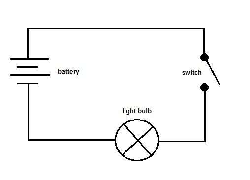
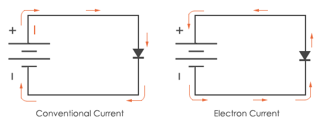

# Question: What are some common carriers of charge?

---

## Answer

__Electrons__ are the charge carriers in metals, ions in solution, electrically charged gas in plasma.

---

# Conductors

A conductor is a material through which charge can move freely.

__e.g. electrons move through metal__

---

# Insulators

- A material through which electrons cannot easily flow
- The electrons encounter a large friction force when trying to move
- This friction causes heat to build up and the material to melt/catch on fire
- e.g. wood if current is applied

---

<iframe width="560" height="315" src="https://www.youtube.com/embed/cm8Ok1oJjRw" frameborder="0" allow="accelerometer; autoplay; encrypted-media; gyroscope; picture-in-picture" allowfullscreen></iframe>

---

## Current

- Current is the flow of charge (often electrons).
- It is the measure of the rate at which the charge flows (Amperes).
- __Recall:__ $1C$ of charge is $6.25\times10^{18}$ electrons

---

\begin{align*}
    & I = \frac{q}{t} \\\\
    & \text{I = current measured in what?} \\\\
    & \text{q = charge measure in what?} \\\\
    & \text{t = time measured in what?}
\end{align*}

---

### Examples

1. If $10A$ flows through a wire, how much charge passes a point in $5s$?
2. A total charge of $0.12C$ passes a point in $5s$. What is the current?
3. $20C$ of charge passed through a light bulb in $4s$. What was the current?
4. $0.02C$ of charge passed through a resistor in 1 minute. What was the current?
5. If the current is $0.3A$, how much charge will pass a point in 10 minutes?

---

### What Direction Does Current Flow?

{ width=50% }

---

### Conventional Current

- Back in the old days they thought current was the flow of _positive_ charge, but these days we know it is the flow of _negative charge_
- This is because protons (positive) are fixed inside the nucleus of an atom and atoms cannot move, whereas electrons (negative) can move freely in some materials

---

- Conventional current is the direction that positive charges move in a circuit. From the positive terminal to the negative terminal.
- However, electrons actually move from the negative terminal to the positive terminal, which is __opposite__ to _conventional current_.

---

