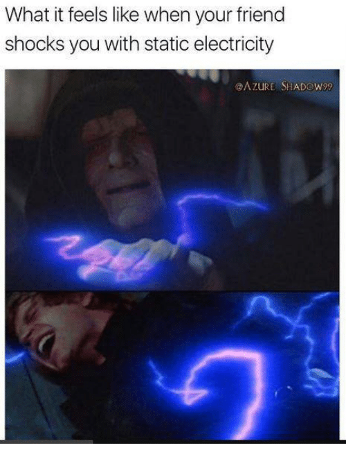
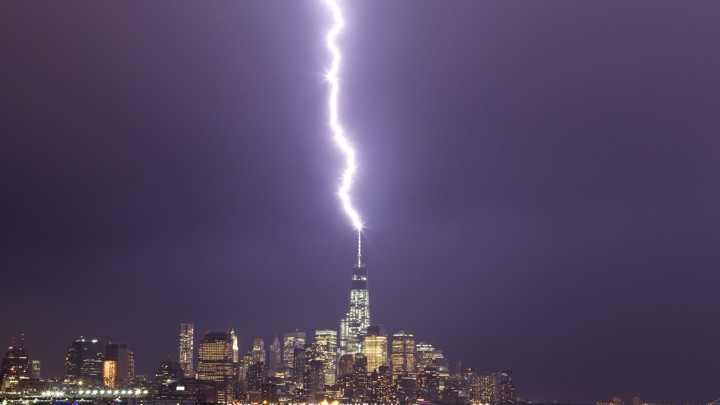
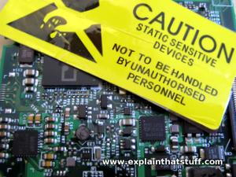
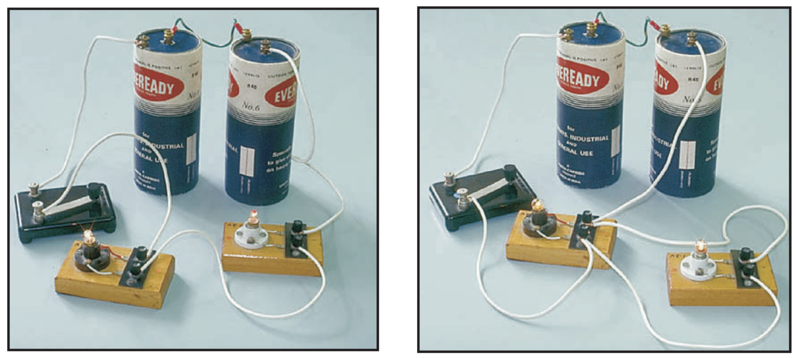
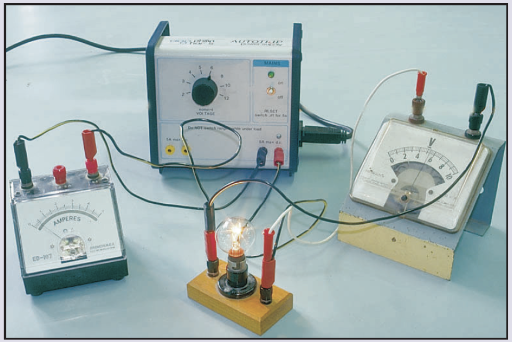
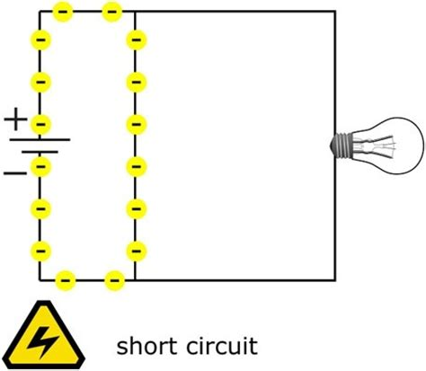
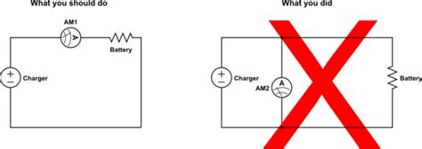
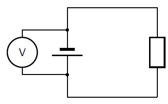

# Starter

Play with the simulation linked in Google Classroom and __brainstorm situations where static electricity is dangerous and how to minimise the danger.__

[PhET: Balloons & Static Electricity](https://phet.colorado.edu/en/simulation/balloons-and-static-electricity)

---

## Do You Remember:

1. How do you make something positively charged or negatively charged?
2. Explain why the hair sticks to the ballooon
3. Explain why the hair stands up when you are touching a Van der Graaf Generator
4. Draw a charge diagram showing how a piece of paper is attracted to a positively charged rod

---

---

### Protecting Buildings

---

### Protecting Electrical Devices

---

<iframe width="560" height="315" src="https://www.youtube.com/embed/ve6XGKZxYxA" frameborder="0" allow="accelerometer; autoplay; encrypted-media; gyroscope; picture-in-picture" allowfullscreen></iframe>

---

What is needed for a circuit to work?

1. A source of energy
2. A complete loop
3. A component
4. No short circuits

---

Sketch these symbols on your whiteboard in pairs:

Wire, open switch, closed switch, single battery, two batteries, power supply, resistor, variable resistor and a fuse.

---

Draw the circuit diagram:

---

---

A light bulb and a variable resistor are placed in a series circuit. They are powered by a 12V power supply. A fuse protects the circuit. An ammeter measures the current in the circuit and a voltmeter measures the voltage across the light bulb as the resistance in the circuit is changed.

---

### Short Circuits

A short circuit is an unintended path with little or no electrical resistance, causing a large amount of current to flow which can cause overheating, fire or explosions.

---

## Ammeters

An ammeter measures the flow of charges (current). They __must__ be connected in series to measure the current, otherwise their low resistance will create a short circuit.

---

## Voltmeters

Voltmeters measure the potential difference between two points (e.g. before and after a bulb) to find how many volts the component has used. They should therefore be connected in parallel.

