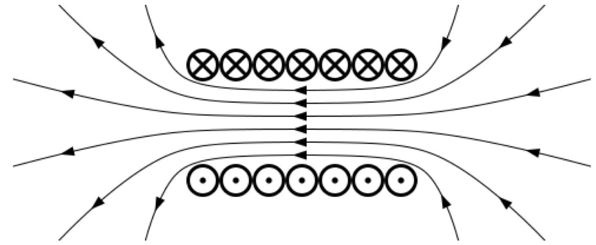
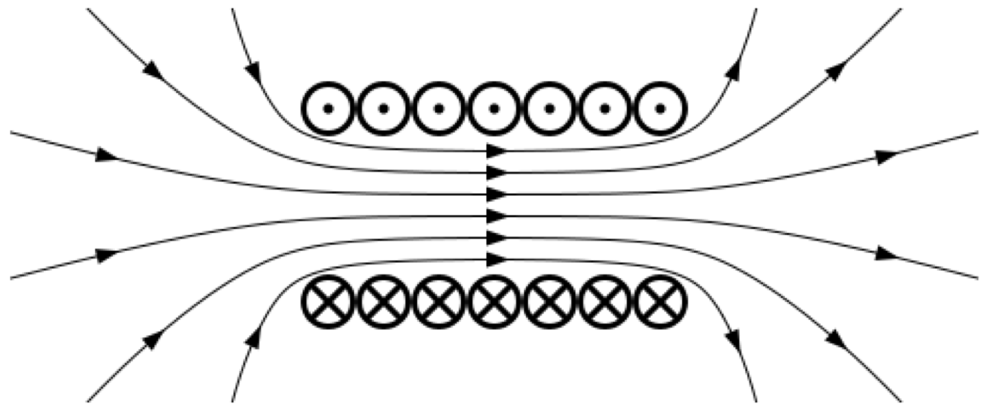
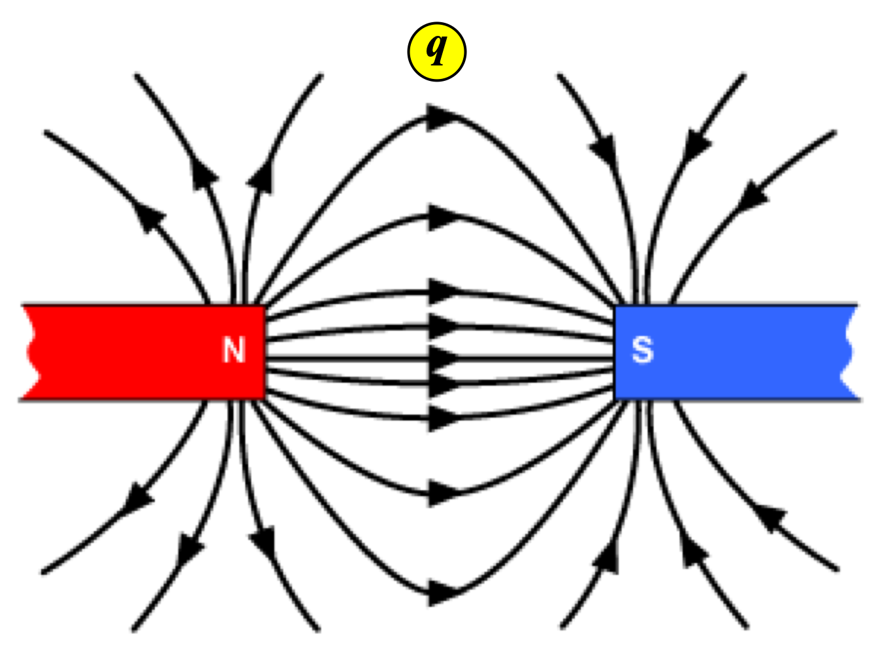
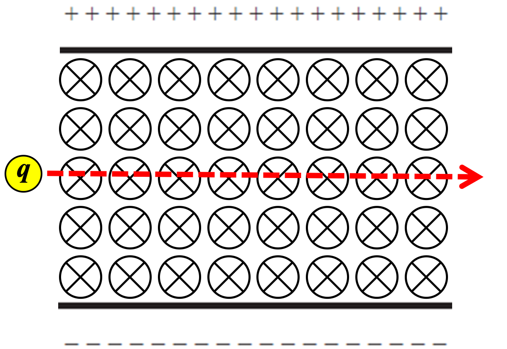

## Starter 1

If an object has a charge of $0.03C$, how many electrons has it lost?

__Hint:__ Charge of one electron $=-1.6\times10^{-19}C$

---

## Starter 1 Answer

\begin{align*}
    & n = \frac{0.03}{1.6\times10^{-19}} \\\\\\\\
    & n = 1.875\times10^{17}
\end{align*}

---

## Starter 2

There is $80mA$ of current flowing through a $2k\Omega$ resistor.

1. How many electrons are going through the resistor in one second?
2. What is the power output of the resistor?

---

## Starter 2 Answer

\begin{align*}
    & I = \frac{q}{t} \\\\
    & It = q \\\\
    & q = 0.08 \times 1 = 0.08C \\\\
    & n = \frac{0.08}{1.6\times^{-19}} = 5\times10^{17}
\end{align*}

---

\begin{align*}
    & P = IV, V = IR\\\\
    & P = I^{2}R \\\\
    & P = 0.08^{2} \times 2000 = 12.8W (Js^{-1})
\end{align*}

---

## Recall: Right Hand Grip Rule 1

{width=50%}

---

## Recall: Right Hand Grip Rule 2

{width=50%}

---

### Apply right hand grip rule 2 to this solenoid

{width=50%}

---

### Apply right hand grip rule 2 to this solenoid

{width=50%}

---

## What is an electric field?

Think, pair and share!

- _A region in which a charged object experiences a force_

---

## What is a magnetic field?

Think, pair, and share!

- _A region in which a moving charged object experiences a force_

---

{width=75%}

---

The force (F) that the charge experiences as it moves through the field depends on three things:

- Magnetic field strength (B, measured in Tesla (T))
- Charge of the object (q, measured in Coulombs (C))
- Velocity of the object (v, measured in $ms^{-1}$)

\begin{align*}
    F = Bqv
\end{align*}

---

Let's summarise:

__Electric Field:__ A region in which a charged object experiences a force $F=Eq$

__Magnetic Field:__ A region in which a moving charged object experiences a force $F=Bqv$

---

### Question

A narrow beam of protons ($1.6\times10^{-19}C$) moving at a speed of $2.0\times10^{-6}ms^{-1}$, enters a uniform magnetic field of strength $0.20T$.

Calculate the magnetic force applied on each proton.

---

#### Answer

\begin{align*}
    & F = Bqv \\\\
    & F = 0.2 \times 1.6\times10^{-19} \times 2.0\times10^{-6} \\\\
    & F = 6.4 \times 10^{-26}N
\end{align*}

---

## Right Hand Slap Rule

_If you use your left hand, the particle is negatively charged_

{width=50%}

---

## Starter

A charged object ($q=1.6\times10^{-19}C$) moves across a magnetic field with a speed of $4.0\times10^{3}ms^{-1}$. The magnetic field strength is $12T$.

1. Draw a diagram and illustrate the magnetic field lines
2. Calculate the force applied to the charged object
3. Describe/draw the direction of the force applied

---

## Recall: Right Hand Grip Rule 1

{width=50%}

---

## Recall: Right Hand Grip Rule 2

{width=50%}

---

## Right Hand Slap Rule

_If you use your left hand, the particle is negatively charged. Or use you right hand with the backhand slap rule_

{width=50%}

---

Which direction is the force acting in?

{width=75%}

---

## Demo: Cathode Ray Tube

{width=75%}

---

- Worksheet 7 Q4 and 5
- Homework booklet Q12 and Q14

