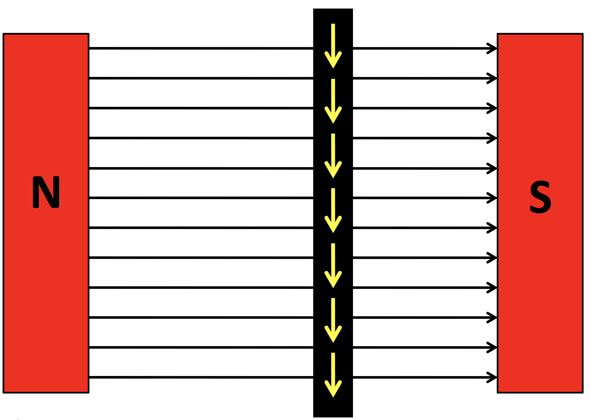
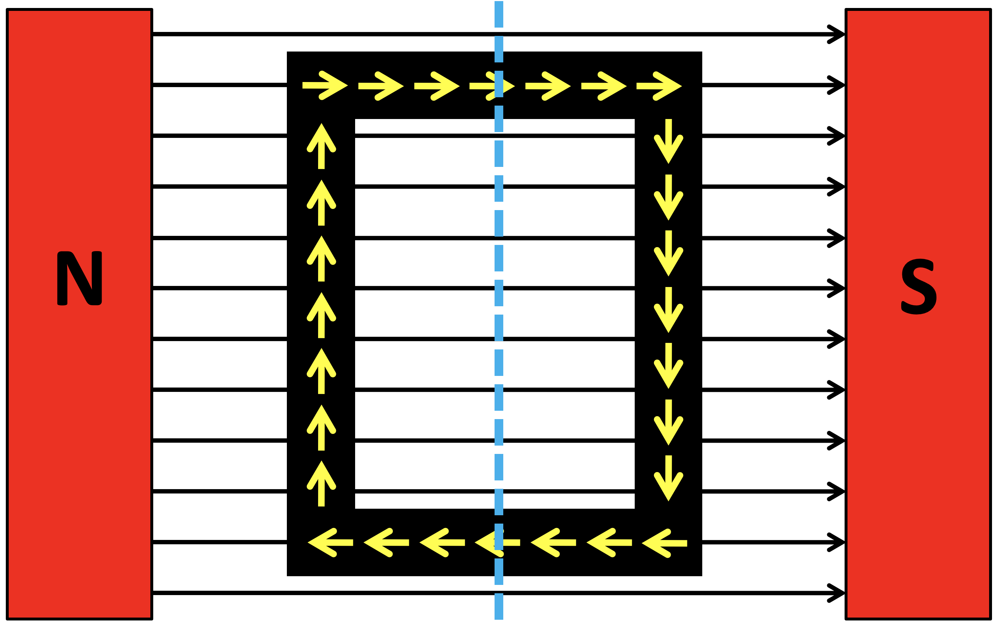
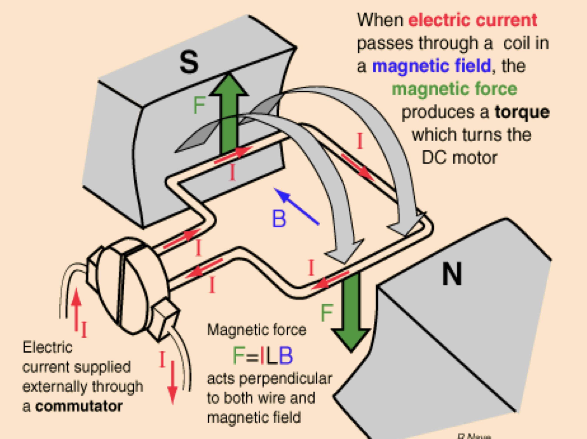
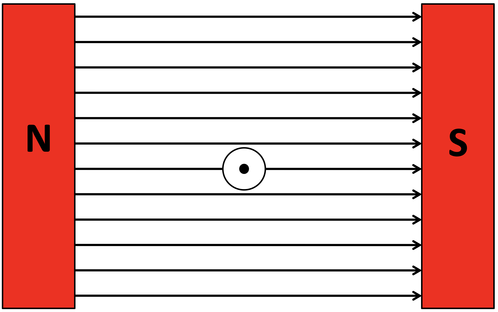

## Starter

1. What is a magnetic field?
2. What is the symbol and unit for magnetic field?
3. What formula is used to calculate the size of the force?
4. How can you determine the direction of the force?

---

\begin{align*}
    & F = BIL
\end{align*}

Force on a current carrying wire in a magnetic field is given by this equation.

- Write what each letter stands for and its unit

---

1. What direction is the force on this current carrying wire?
2. What is the force if the field is $0.02T$, the current $2A$ and the length of wire $10cm$?

{width=60%}

---

What do you think happens to the force if the wire is on an angle?

{width=80%}

---

\begin{align*}
    & F = BILsin(\theta)
\end{align*}

- $\theta$ is the angle between the current and the magnetic field
- Force is maximum when perpendicular
- Force is zero when parallel
- You are not required to do calculations with this equation, but need to know the previous two points.

---

## DC Motors

- What does a motor do?
- It takes power and turns it into rotational energy! How?

---

What direction is the force acting upon the four sides of this loop? What does this tell you?

{width=80%}

---

{width=80%}

---

## Starter 1

What direction is the magnetic force in these examples?

---

## Starter 2

---

## Starter 3

---

## Starter 4

---

### Starter Answers

Up, down, into the board, out of the board

---

### What happens if we pass a wire through a magnetic field?

---

We induce a voltage!

And if the circuit is complete, we induce a current!

---

__Induced voltage__ in a wire moving through a magnetic field:

\begin{align*}
    & V=BvL
\end{align*}

- $B$ is the magnetic field strength (T, Tesla)
- $v$ is the velocity of the wire ($ms^{-1}$)
- $L$ is the length of wire in the field ($m$)

---

### Example

A metal rod is moved in a magnetic field. The rod is $24cm$ long and moves at $8ms^{-1}$ through a magnetic field with strength $0.7T$. __Calculate the induced voltage and induced current__. Use $V=BvL$ first, and then Ohm's Law.

---

\begin{align*}
    & V = BvL \\\\
    & V = 0.7 \times 8 \times 0.24 \\\\
    & V = 1.344V
\end{align*}

\begin{align*}
    & V = IR \\\\
    & I = \frac{V}{R} \\\\
    & I = \frac{1.344}{10} = 0.1344A
\end{align*}
---

### Thought Experiment

- Dragging a piece of wire through a magnetic field creates an __induced voltage__
- If the circuit is complete it creates an __induced current__
- What does a current in a magnetic field experience?
- Yes, a force! $F=BIL$

---

__Think, pair, share:__ If we drag the coil to the right, what will we observe?

---

- A current will be induced,
- That current will experience a force ($F=BIL$)
- That magnetic force will __oppose__ the externally applied force

---

## Lenz's Law

- __The induced current (and magnetic force) always opposes the change/action producing it__
- In our previous example the induced current causes a force which opposes the externally applied force
- This law is a result of __the conservation of energy__. Work must be done to generate electrical energy.

---

Continuing our example from earlier: a metal rod is moved in a magnetic field. The rod is $24cm$ long and moves at $8ms^{-1}$ through a magnetic field with strength $0.7T$. __Calculate the magnitude and direction of the opposing force acting upon the rod__.

---

## Lenz' Law in Solenoids

- __Recall__: A solenoid is a coil of wire used as an electromagnet.
- __Question__: What happens if we pass a magnet through solenoid?
- __Answer:__ We induce a current in the coil.

---

- __Question__: What does that current do?
- __Answer__: It creates a magnetic field that opposes the original field.

---

## Lenz' Law in Solenoids

A magnet moving inside a solenoid will induce and current and therefore, magnetic field, which will oppose the original field. We can use our right hand rule to deduce the direction of the current flow.

{width=50%}
