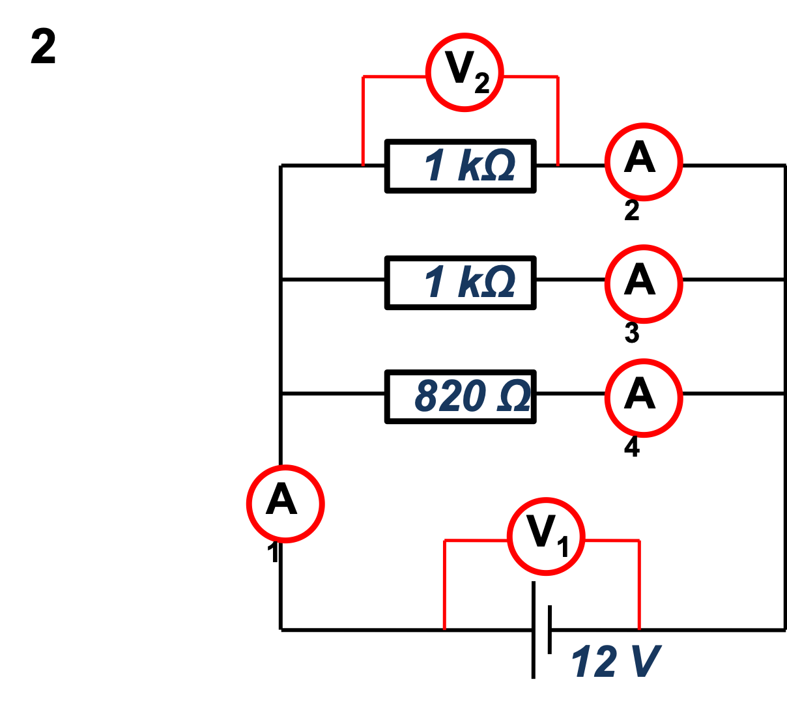

# Starter

A circuit has current $1.2A$ and voltage of 12V and has a single bulb.

1. Draw the circuit and indicate current and conventional current directions.
2. How many Coulombs of electrical charge flow through a point in every second?
3. How much energy is used by the bulb in 5 seconds?
4. What is the resistance of the bulb?

---

# Series Circuits

- The current has only one path to flow around
- The current is constant around the circuit
- The voltage is shared between the components in the loop

---

# Parallel Circuits

- The current has multiple paths to flow around
- The current is shared between paths
- The voltage is shared between components on each separate path

---

## Constructing Circuits

Use the [PhET simulation](https://phet.colorado.edu/sims/html/circuit-construction-kit-dc/latest/circuit-construction-kit-dc_en.html) to build these circuits:

1. Create a series circuit with a bulb and a switch
2. Create a parallel circuit with a bulb and a switch on each path, and one switch that controls the whole circuit.
3. Measure the resistance of the circuit in PhET when you add resistors to the different circuit and try make a rule for what happens.

---

## Resistance in Circuits

- When you add resistors in series, the resistance __increases__
- When you add resistors in parallel the total resistance __decreases__

---

## Calculating Resistance

In series we can use this equation:

\begin{align*}
    & R_{T} = R_{1} + R_{2} + R_{3} + ...
\end{align*}

In parallel we can use this equation:

\begin{align*}
    & \frac{1}{R_{t}} = \frac{1}{R_{1}} + \frac{1}{R_{2}} + \frac{1}{R_{3}} + ...
\end{align*}

---

### Question 1

---

### Question 2

---

Calculate the values for each voltmeter and ammeter.

{width=75%}

---

{width=75%}

---

{width=75%}

---

{width=75%}

---

{width=75%}

---

{width=75%}

---

{width=75%}

---
