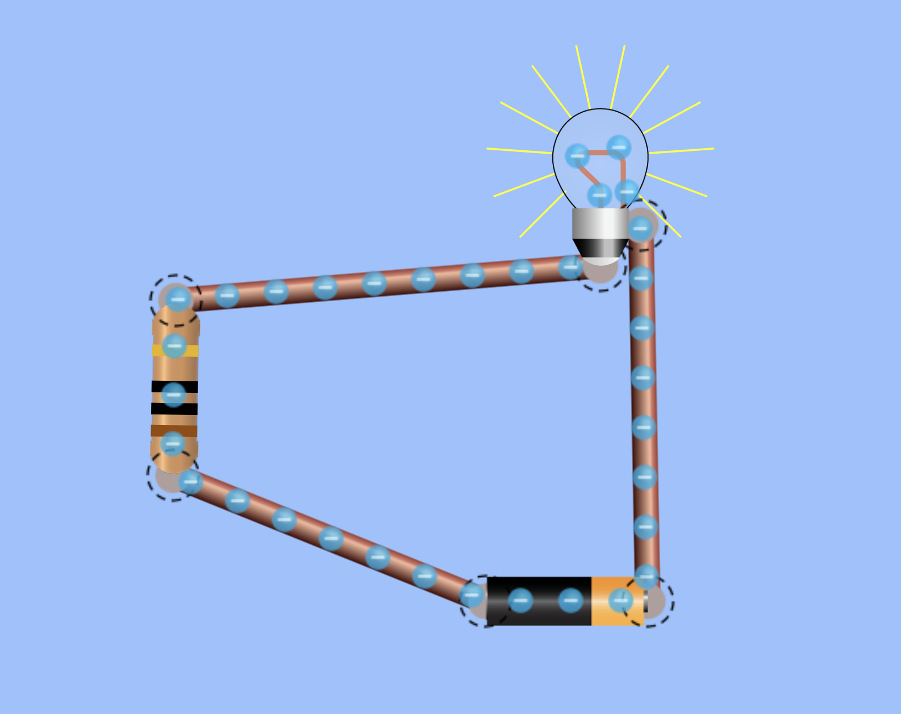

# Mahi Tuatahi

1. Draw a series circuit with 6V power supply, a bulb and a resistor. Indicate the positive and negative terminals on the power supply, and indicate the direction of conventional current and the actual movement of electrons.
2. What is the definition of current?
3. Give an equation that relates to the definition.
4. A circuit draws 0.4A and in total 2.5C goes past a certain point. How long did was the circuit on for?

---

## Circuit Diagram Symbols

You can find more symbols in your textbook (197-198) but here is the most basic few.

{width=50%}

---

Yesterday we talked about current and how it is the rate of transfer of charge per unit time.

\begin{align*}
    & I = \frac{q}{t}
\end{align*}

---

## Current Question

A current of $1.2A$ flows for $0.25s$. How much charge was transferred in that time?

---

### Answer

\begin{align*}
    & I = \frac{q}{t} \newline
    & q = I \times t \newline
    & q = 1.2 \times 0.25 \newline
    & q = 0.3 Coulombs (C)
\end{align*}

---

# What is a circuit?

{ width=50% }

---

## Answer

A circuit is a way to deliver energy to different components!

Open this link and build a circuit with a power supply, light bulb, resistor and switch in series. What happens when you take out the resistor?

[PhET DC Circuit Construction Simulation](https://phet.colorado.edu/sims/html/circuit-construction-kit-dc/latest/circuit-construction-kit-dc_en.html)

---

# Voltage

- The __charge carriers__ flowing around a circuit are __energy carriers__
- The __charge carriers__ carry __electrical energy__ which comes from the power supply
- __Voltage is the amount of energy in one coulomb of charge__

\begin{align*}
    & V = \frac{E_{p}}{q} \newline
    & V = \text{ voltage measured in...} \newline
    & E_{p} = \text{ electrical energy measured in... } \newline
    & q = \text{ charge measured in...}
\end{align*}

---

## Voltage Question 1

A system has electrical potential energy of $25J$ and has $0.5C$ of charge. What is the voltage of the system?

---

### Answer

\begin{align*}
    & V = \frac{E_{p}}{q} \newline
    & V = \frac{25}{0.5} \newline
    & V = 12.5V \newline
\end{align*}

---

## Voltage Question 2

A system has a voltage of $12V$ and has $1.75C$ of charge inside it. What potential energy does the system have?

---

### Answer

\begin{align*}
    & V = \frac{E_{p}}{q} \newline
    & E_{p} = V \times q \newline
    & E_{p} = 12 \times 1.75 \newline
    & E_{p} = 21J \newline
\end{align*}

---

# Power

- The amount of energy transferred/transformed per second
- E.g. A 100W ($100 J/s, 100JS^{-1}$) light bulb transforms 100J of electrical energy per second into light and heat energy.

\begin{align*}
    & P = IV \newline
    & P = \text{ power measured in...} \newline
    & I = \text{ current measured in...} \newline
    & V = \text{ voltage measured in...}
\end{align*}

---

## Power Question 1

A system has a current of $0.5A$ and voltage, $6V$. What is the power consumed by the system?

---

### Answer

\begin{align*}
    & P = IV \newline
    & P = 0.5 \times 6 \newline
    & 3W = 3J/s = 3Js^{-1} \newline
\end{align*}

---

## Power Question 2

A washing machine has a power rating of 65W and the house is using a 12V system. What current is the washing machine drawing?

---

### Answer

\begin{align*}
    & P = IV \newline
    & I = \frac{P}{V} \newline
    & I = \frac{65}{12} \newline
    & I = 5.42A \newline
\end{align*}

---

# Voltage & Power Summary

By substituting these equations into each other we can begin to see how intertwined all of these concepts are.

\begin{align*}
    & I = \frac{q}{t} \newline
    & V = \frac{E_{p}}{q} \newline
    & \newline
    & P = I \times V = \frac{q}{t} \times \frac{E_{p}}{q} = \frac{E_{p}}{t}
\end{align*}