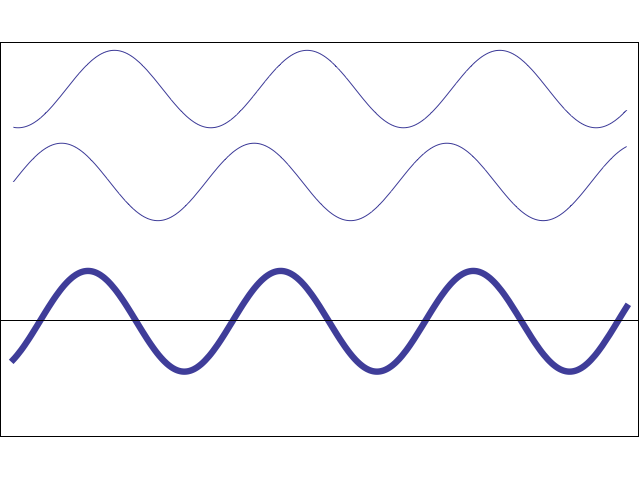
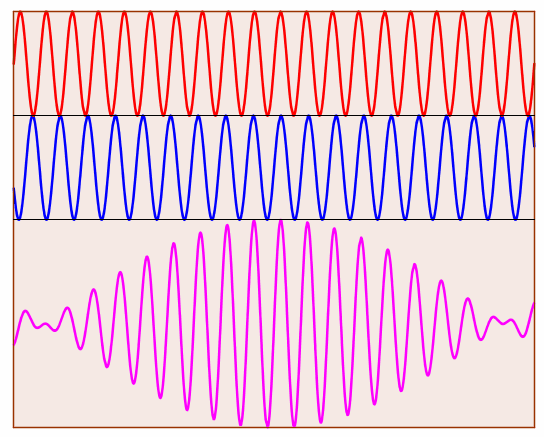

## Learning Outcomes

- Be able to calculate the frequency of beats
- Be able to calculate the velocity of a source using the beat frequency

---

## Sound Recap

- Recall that sound is the compression and rarefaction of air causing your eardrum to vibrate and you to hear sound!
- When compression (peak) meets compression, their amplitudes are combined (__constructive interference__)
- and when rarefaction (trough) meets compression, their amplitudes cancel out (__destructive interference__)

---

<iframe width="657" height="370" src="https://www.youtube.com/embed/uKrvTA4SKVU" frameborder="0" allow="accelerometer; autoplay; encrypted-media; gyroscope; picture-in-picture" allowfullscreen></iframe>

---

---

<iframe width="1920" height="800" src="https://www.youtube.com/embed/yia8spG8OmA" frameborder="0" allow="accelerometer; autoplay; encrypted-media; gyroscope; picture-in-picture" allowfullscreen></iframe>

---

## Beats

By changing the position of the waves over time, we can cause the interference to change.

This changing interference _can_ give rise to periodic changes in volume (amplitude)

---

---

### Beat Frequency

For beats to occur we need:

1. The amplitude to be the same
2. The difference in frequency to be small

\begin{align*}
    f_{b} = | f_{2} - f_{1} |
\end{align*}

This equation is not given to your in your formula sheet.

---

#### Example Calculation

Zak is standing still and holding a device emitting a frequency of $100Hz$. Josh walks past him holding a device emitting a frequency of $107Hz$.

Calculate the frequency of the beats observed by Anton.

---

##### Answer

\begin{align*}
    & f_{b} = | 100 - 107 | = | - 7 | = 7Hz \\
    & f_{b} = | 107 - 100 | = | 7 | = 7Hz
\end{align*}

> The $|$ symbol means absolute value. Which in practice means, make it positive.

---

### Question: Piano Key

Jules is tuning the middle C key on a piano. He is using a tuning fork which produces a frequency of $257Hz$ as a reference. The key is slightly out of tune and a beat frequency of $4Hz$ is heard.

Calculate the frequency of the out of tune key.

---

#### Answer

\begin{align*}
    & f_{b} = f_{2} - f_{1} \\
    & 4 = 256 - f_{k} = 252Hz \\
    & 4 = 256 + f_{k} = 260Hz
\end{align*}

---

Josh changes his device to be $100Hz$, the same as Zak. He walks past him again while Anton listens. Anton observes a beat frequency of $10Hz$.

1. __How fast is Josh walking ($v_{s}$)?__
2. We know $f$ and $f_{b}$, so we should use $f_{b} = | f_{2} - f_{1} |$
3. We don't know $f'$, but we don't need to, we can substitute in the Doppler equation $f' = f\frac{v_{w}}{v_{w} \pm v_{s}}$ and re-arrange to find $v_{s}$

---

\begin{align*}
    & f_{b} = | f' - f | \\
    & f_{b} = | f\frac{v_{w}}{v_{w} \pm v_{s}} - f | \\
    & 10 = 100 \times \frac{330}{330 - v_{s}} - 100 \\
    & 110 = 100 \times \frac{330}{330 - v_{s}} \\
    & 110 \times (330 - v_{s}) = 100 \times 330 \\
    & 330 - v_{s} = \frac{100 \times 330}{110} \\
    & v_{s} = \frac{100 \times 330}{110} - 330 = 30ms^{-1} \\
\end{align*}

---

## Homework

- Homework Booklet Question 8, due Monday August 3rd
- Tutorials Tuesday & Friday lunchtime in A3

---

## Starter

Josh is back holding his device. It is now emitting a frequency of $125Hz$, and Zak is running past him. He hears a beat frequency of $5.5Hz$.

1. Calculate the frequency of Zak's device that Josh observes ($f_{b} = f' - f$)
2. Use your answer to calculate how fast Zak is running. ($f' = f \frac{v_{w}}{v_{w} \pm v_{s}}$)

---

### Answer

\begin{align*}
    f_{b} &= f' - f \\
    f_{b} - f &= f' = 130.5Hz \text{ OR } 119.5Hz
\end{align*}

Because Zak is running __away__, the frequency should be decreased: $f' = 119.5Hz$

---

\begin{align*}
    f' &= f\frac{v_{w}}{v_{w} \pm v_{s}}\\
    119.5 &= 125 \frac{343}{343 + v_{s}} \\
    \frac{119.5}{125} &= \frac{343}{343 + v_{s}} \\
    343 + v_{s} &= \frac{343}{0.956} \\
    v_{s} &= \frac{343}{0.956} - 343 \\
    &= 15.7ms^{-1}
\end{align*}

---

## Tasks

1. Worksheet (glue it in)
    - Practical
    - Exercise Q1
    - Exercise Q3
2. Homework booklet Question 10

---

## Homework

- Homework Booklet Question 8, due Monday August 3rd
- Tutorials Tuesday & Friday lunchtime in A3
