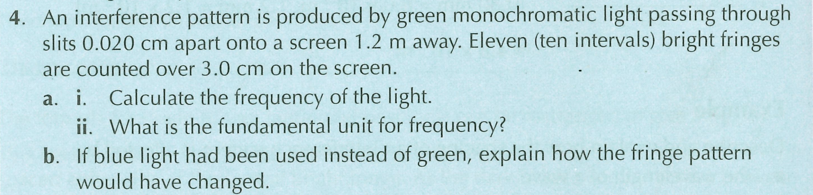

## Mahi Tuatahi

---

## Mahi Tuatahi Answers

1. $6\times^{14}Hz$
2. $s^{-1}$
3. Blue has a shorter wavelength than green light, and using the equation we can see that the fringes would be closer together.

---

## Diffraction {.c2}

- Light diffracts just like sound or matter waves
- The longer the wavelength, the greater the diffraction
- Therefore, red diffracts the most, and blue/purple, the least.

---

## Diffraction Gratings {.c2}

- Instead of having two slits, diffraction gratings often have tens, hundreds or thousands
- Their spacing is typically extremely small, this means the spacing between fringes is much larger than double-slits.

---

## Diffraction Gratings {.c2}

- The slits are extremely thin, so the light is diffracted over almost 180 degrees
- There are a large number of slits, so the fringes are bright
- Within each fringe (n), the wavelengths are all split up

---

## Doing Calculations

- We still use $n\lambda = dsin(\theta)$ where $d$ is slit separation
- Diffraction gratings are typically described like so: "2000 lines per cm" and you need to find slit spacing ($d$) from this

\begin{align*}
    d &= \frac{1cm}{2000 lines} = 5\times10^{-4}cm \newline
    d &= 5\times10^{-6}m
\end{align*}

---

## Task

Homework Booklet Q16 and Q17
